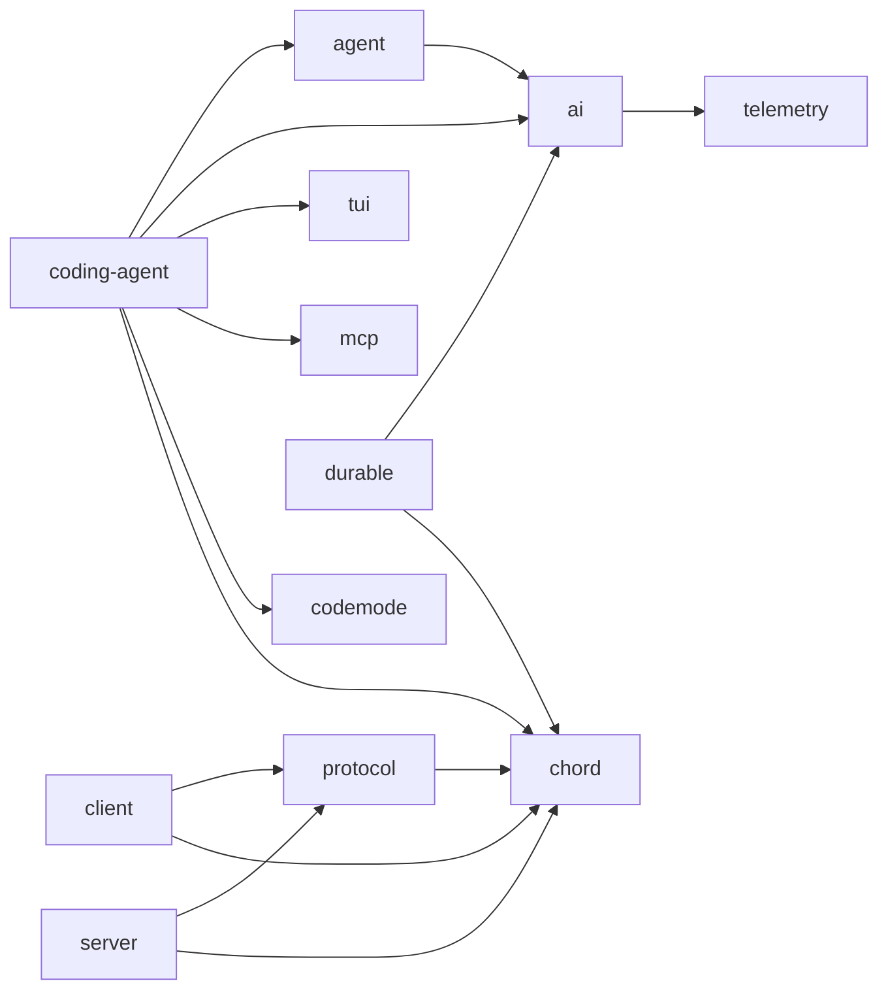
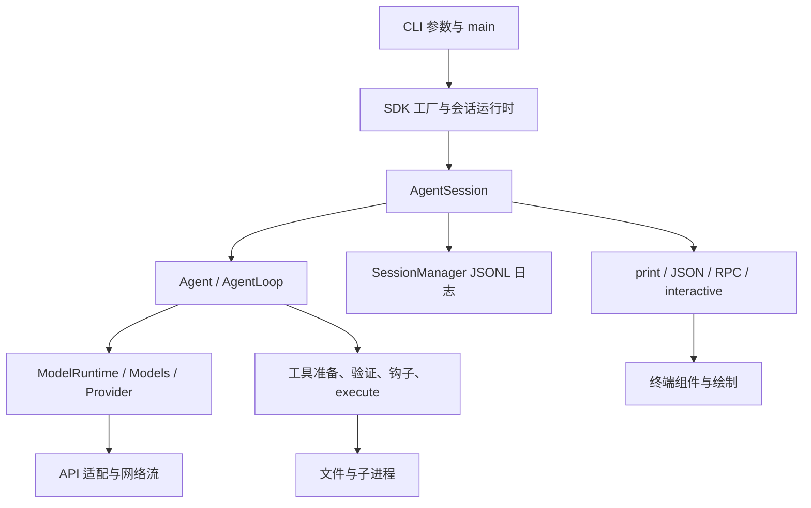

# 第三章项目全景、模块边界与代码地图

理解一个文件之前，先确定它属于哪条执行路径。当前仓库既有经典命令行编码代理，也有基于 Durable 的新代理运行时和实验性客户端／服务器。它们复用模型、终端和配置能力，但会话状态与恢复机制不同。

本章的包依赖以各包 `package.json` 为依据，功能入口以公开导出、启动调用和对应模块为依据。后面的专章再深入模块内部算法；设计文档中的未来扩展不视为当前已实现功能。

## 3.1 单仓库、多包意味着什么

根仓库通过 npm workspaces 管理 `packages/*`。每个包有自己的源码、类型入口、构建和测试配置，包之间通过 `@earendil-works/...` 名称引用。

开发时阅读的是 `src/*.ts`；发布入口常指向 `dist/*.js` 与 `dist/*.d.ts`。部分新包提供 `source` 导出条件，但并非所有包都提供。实验性应用还使用源码解析器把工作区依赖定向到源码。

因此，改了源码却仍运行旧 dist 时，可能看不到变化。反过来，源码直跑也不能自动模拟 npm 发布物的资产布局；第四章会分析统一路径助手如何处理不同安装方式。

## 3.2 十三个包的职责

| 包目录 | 职责 | 主要入口与内部定位 |
| --- | --- | --- |
| `ai` | 模型目录、认证、协议适配、流式消息、图像和分类操作 | `src/models.ts`、`src/types.ts`、`src/api/`、`src/auth/` |
| `agent` | 与界面无关的经典代理循环、工具调度和输入队列 | `src/agent.ts`、`src/agent-loop.ts` |
| `coding-agent` | CLI、应用会话、文件工具、资源与扩展、模式和交互界面 | `src/main.ts`、`src/core/`、`src/modes/` |
| `tui` | 终端输入、布局、差分绘制、编辑器、图像与原生平台集成 | `src/tui*.ts`、`src/terminal.ts`、`src/components/` |
| `telemetry` | 与厂商无关的遥测接口、类型模式和内存记录 | `src/index.ts`、`src/memory.ts` |
| `mcp` | 独立 MCP 客户端、JSON-RPC、stdio／HTTP 传输和 OAuth | `src/client.ts`、`src/protocol/`、`src/transports/` |
| `codemode` | QuickJS/WASM 中的 JavaScript 执行与注入工具调用 | `src/runtime/host.ts`、`src/runtime/worker.ts`、`src/declarations.ts` |
| `chord` | 服务与插件组合、取消上下文、状态复制和 Delta 操作 | `src/api.ts`、`src/services/`、`src/delta/`、`src/context/` |
| `durable` | 持久会话、文档事务、任务状态机和代理 Harness | `src/session/`、`src/harness/`、`src/storage/`、`src/env/` |
| `protocol` | 实验性远程协议信封、CBOR 编解码和字节分帧 | `src/protocol.ts`、`src/codec.ts`、`src/framing.ts` |
| `client` | 字节传输之上的远程请求、订阅、连接和路由状态 | `src/client.ts`、`src/transport.ts` |
| `server` | 实验性连接与会话附着、服务路由、监听器和 Unix 传输 | `src/server.ts`、`src/types.ts`、`src/transports/` |
| `evals` | 私有评估工程、宿主评估和文档评估命令 | `package.json`、`src/cli.ts` |

Chord 是可独立使用的应用组合运行时，不依赖其他 Pi 工作区包。Durable 依赖 AI 与 Chord，构建自己的代理 Harness，并不以经典 `AgentSession` 作为持久化实现。

## 3.3 依赖图与实际调用图不同

下图展示主要运行库的依赖方向；箭头表示左侧使用右侧。工程评估和实验性源码入口不在这张简图中展开。



一个包声明依赖，不表示每次运行都会初始化其中所有功能。经典 print 模式不需要整套交互界面生命周期；只有启用相应扩展时，MCP 或 codemode 才进入具体调用路径。

发布依赖和源码实验也有区别。编码代理的 `client`、`experimental` 等目录被排除出常规 npm 发布文件列表；实验性源码入口可能引用开发依赖和其他工作区源码。

## 3.4 经典 CLI 的完整纵向分层



这张图的价值在于定位问题。例如“模型返回了 edit，磁盘没有变化”应继续检查工具准备、参数验证、执行结果和文件路径；单看模型文本不足以定位原因。

“界面里工具显示完成，但会话还不能接受新任务”则要检查代理事件、应用重试或压缩，以及最终 settled 边界。第七、八章分析这些状态区别。

## 3.5 一次文件修改跨过哪些模块

以“改配置文件的一段文字”为例：

1. `AgentSession.prompt` 处理输入、模板、扩展和上下文。
2. 代理循环通过请求准备函数选择本轮模型与消息。
3. 提供商适配层将工具声明和历史转成网络请求。
4. 流式事件最终形成助手工具调用。
5. 代理准备参数、校验模式、运行调用前钩子。
6. `edit` 解析路径，加入该文件的修改队列。
7. 队列内重新读文件、定位旧文本、计算新文本并写入。
8. 执行结果进入下一轮模型上下文，事件供界面显示。
9. 会话层记录完成消息和相关应用状态。

这里存在多种边界：模型结束、工具结束、文件队列释放、日志追加、应用空闲。它们不是同一次原子提交。

特别是文件写入成功后，结果发送或日志保存仍可能失败。经典链路不能因此承诺“模型、文件和聊天记录一起成功或一起回滚”。

## 3.6 coding-agent 的内部模块地图

| 功能 | 代码 | 后续章节 |
| --- | --- | --- |
| 参数、早期命令、输出通道 | `src/cli/`、`src/main.ts`、`src/config.ts` | 第四章 |
| 会话创建、切换、依赖注入 | `core/sdk.ts`、`agent-session-services.ts`、`agent-session-runtime.ts` | 第四、八、二十一章 |
| 应用任务、动态工具、恢复 | `core/agent-session.ts`、`nested-tool-calls.ts` | 第八章 |
| 模型选择和提供商组合 | `model-config.ts`、`model-runtime.ts`、`provider-composer.ts`、`model-resolver.ts` | 第六章 |
| 文件、查找、命令工具 | `core/tools/`、`core/bash-executor.ts` | 第九至十二章 |
| 会话树和上下文投影 | `core/session-manager.ts`、`messages.ts` | 第十三章 |
| 历史压缩与分支总结 | `core/compaction/` | 第十四章 |
| 配置、凭据、信任存储 | `settings-manager.ts`、`auth-storage.ts`、`trust-manager.ts` | 第十五章 |
| 扩展加载与事件处理 | `core/extensions/` | 第十六章 |
| 资源、包、技能与提示 | `resource-loader.ts`、`package-manager.ts`、`skills.ts`、`system-prompt.ts` | 第十七章 |
| 模式和界面 | `modes/`、`modes/interactive/components/`、`theme/` | 第十八至二十一章 |
| 内置 MCP 与代码执行扩展 | `extensions/mcp/`、`extensions/codemode/`、`extensions/tool-search/` | 第二十二、二十三章 |
| 新运行时宿主与服务 | `experimental/`、`client/` | 第二十九章 |

模块不是按“一个功能对应一个文件”划分。文件工具本身还分执行、路径、文本算法和渲染；扩展也可能改变输入、模型请求、工具行为和显示，需沿调用链阅读。

## 3.7 经典会话与 Durable 会话的区别

| 维度 | 经典路径 | Durable 路径 |
| --- | --- | --- |
| 代理组织 | Agent＋AgentSession | Harness＋generation/tool 等任务 |
| 对话记录 | SessionManager 的 JSONL 树 | Storage 中的会话和 immutable entries |
| 应用状态 | 对象字段、配置、日志项 | 与 entries 一起提交的 typed documents |
| 流式观察 | 直接代理／应用事件 | 从已提交状态派生视图与事件 |
| 中断恢复 | 恢复消息、重试和继续 | 从任务状态及检查点恢复 |
| 分支 | 同一日志树的叶节点 | fork 成新的 conversation |
| 副作用恢复 | 各工具取消与错误处理 | 工具意图、replay 策略和任务恢复 |

Durable 名称不能解释为任意外部副作用恰好发生一次。它的存储事务、任务恢复与外部文件／网络操作之间仍有边界，第二十五至二十七章会分别核验。

例如一个工具在调用支付接口后、保存结果之前崩溃，需要接口幂等键或恢复协议才能安全重放。仅把工具声明成可重放，不会自动撤销已经发生的支付。

## 3.8 新远程架构的各层分别知道什么

实验性远程路径可以按以下职责阅读：

```text
presentation / client
  → protocol：路由信封、请求关联、CBOR 与分帧
  → server：验证 server/session/attachment 路由
  → Session worker：本地拥有 Harness 与 Storage
  → Chord service：解释服务、成员、参数和状态订阅
```

`protocol` 处理严格 JSON 边界，但应用服务内容保持 opaque；Chord 定义服务调用、订阅和状态操作的语义；编码代理的 services 定义 Models、AgentController、Transcript 等产品契约。

Session 和 Harness 保留在所属 worker，不能把它们当成跨进程传递的 JavaScript 对象。远程界面消费复制状态并发起服务调用。

这也和经典 `--mode rpc` 不同：经典模式用逐行 JSON 命令驱动本地应用会话；新协议使用带长度的 CBOR 字节帧与服务路由。两者不能复用同一个解析器。

## 3.9 三种实验性宿主

当前 `coding-agent/src/experimental/` 包含：

| 宿主 | 组织方式 | 学习重点 |
| --- | --- | --- |
| `durable/` 本地编码代理 | 一个进程拥有模型运行时、SQLite、Harness 与 TUI | 视图驱动界面、恢复与会话目录锁 |
| `vacation/` 示例应用 | 复用 Durable/TUI，替换领域提示、工具和后台研究任务 | 同一运行时如何支持其他领域 |
| 客户端／服务器服务切片 | 协调器、可替换服务器、Session worker 与独立 presentation | 路由、附着、服务组合与插件代次 |

示例应用中的搜索返回预设结果，不应当作接入了真实旅行搜索服务。服务切片中的未来认证、更多会话操作等 TODO，也不能被教材写成已有产品能力。

## 3.10 读代码时如何建立证据链

从一个功能入口出发，记录“调用者→输入类型→状态持有者→外部副作用→错误处理→测试”。不要只搜索某个名词后把周边注释拼成设计结论。

对并发问题，再补四项：排队或加锁的 key 是什么；何时取得；覆盖了哪些操作；何时真正释放。第十一章按这个方法证明同文件修改的串行边界，也指出跨进程与硬链接仍不受该队列保护。

对恢复问题，记录提交点和崩溃点。例如“写文件后、保存工具结果前”与“保存工具意图后、开始写文件前”需要不同恢复行为。

## 3.11 入口与练习

| 全景入口 | 内容 |
| --- | --- |
| [根 package.json](https://github.com/earendil-works/pi/blob/11449730c8a733953ce1bcce70e066bccaa778a5/package.json) | workspaces 与全局工程命令 |
| [编码代理入口](https://github.com/earendil-works/pi/blob/11449730c8a733953ce1bcce70e066bccaa778a5/packages/coding-agent/src/index.ts) | SDK、会话、工具、扩展和模式公开接口 |
| [AI 入口](https://github.com/earendil-works/pi/blob/11449730c8a733953ce1bcce70e066bccaa778a5/packages/ai/src/index.ts) | 核心类型与模型集合 |
| [Durable 入口](https://github.com/earendil-works/pi/blob/11449730c8a733953ce1bcce70e066bccaa778a5/packages/durable/src/index.ts) | 文档、任务、Harness、Session、Storage |
| [Chord 入口](https://github.com/earendil-works/pi/blob/11449730c8a733953ce1bcce70e066bccaa778a5/packages/chord/src/index.ts) | 服务、状态复制、facet 与远程边界 |
| [实验性服务说明](https://github.com/earendil-works/pi/blob/11449730c8a733953ce1bcce70e066bccaa778a5/packages/coding-agent/src/experimental/services/README.md) | 应用服务切片、进程职责与当前 TODO |

练习：需要改精确文本替换算法，应先定位哪个文件？`core/tools/edit-diff.ts`，然后追踪 `edit.ts` 的读取、排队和写入。

练习：想证明一个远程调用发生了几次，应只读 CBOR 解码器吗？不够，还要追踪请求关联、断连行为、服务处理与应用幂等或持久提交。

练习：经典分支切换能否等同于 Durable fork 或 Git checkout？不能，它们分别改变日志活动分支、新建持久 conversation 和切换仓库文件状态。
