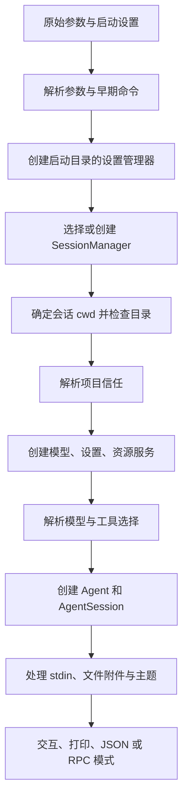

# 第四章：从命令行启动到一个可用会话

本章解决一个容易被忽略的问题：配置属于哪个工作目录？例如，你在项目 A 中运行 `pi --session <项目 B 的会话>`。如果先加载 A 的扩展，再恢复 B 的会话，B 的消息就可能使用 A 的工具与设置。Pi 因此先确定会话和最终工作目录，再创建绑定这个目录的服务。

阅读本章需要第一章的 `process`、Promise 和文件路径知识，以及第二章的接口与联合类型知识。这里暂不展开模型适配器和扩展执行；先建立完整的启动顺序。

## 4.1 三个层次的入口

[cli.ts](https://github.com/earendil-works/pi/blob/11449730c8a733953ce1bcce70e066bccaa778a5/packages/coding-agent/src/cli.ts) 很短：调用 `setupCli()`，然后把 `process.argv.slice(2)` 交给 `main()`。前两个参数通常是运行时和入口文件，后面才是用户提供的参数。

[setup.ts](https://github.com/earendil-works/pi/blob/11449730c8a733953ce1bcce70e066bccaa778a5/packages/coding-agent/src/cli/setup.ts) 设置进程标题、`PI_CODING_AGENT` 与 `AI_AGENT` 标记，并提前配置 HTTP 请求所用的 dispatcher。Dispatcher 是管理连接、代理和请求发送的对象。这个入口也替换了 `process.emitWarning`；这是本版本的实际启动行为，不应推广成所有 Node.js 应用的惯例。

[main.ts](https://github.com/earendil-works/pi/blob/11449730c8a733953ce1bcce70e066bccaa778a5/packages/coding-agent/src/main.ts) 是应用装配层。它决定执行哪个命令、创建什么运行模式，并把界面所需的参数交给对应模块。模型请求循环的实现位于 `packages/agent`，文件编辑算法位于工具模块，均不直接写在 `main()` 中。

## 4.2 参数解析先保留问题，再集中诊断

[args.ts](https://github.com/earendil-works/pi/blob/11449730c8a733953ce1bcce70e066bccaa778a5/packages/coding-agent/src/cli/args.ts) 的 `parseArgs()` 返回 `Args`，其中除了模型、工具、会话等字段，还包含：

- `messages`：位置参数形式的提示词。
- `fileArgs`：以 `@` 开头的文件参数，存储时去掉 `@`。
- `unknownFlags`：可能由扩展注册的长选项。
- `diagnostics`：解析时发现的错误和警告。

例如，`--mode invalid` 产生错误诊断；无效的 `--thinking` 产生警告。未知短选项直接记为错误，未知长选项则暂存，等扩展加载并注册参数后再判断。这解决了“解析器启动时还不知道扩展有哪些选项”的问题。

`--` 结束选项解析，但它之后以 `@` 开头的参数仍被当作文件。`-p` 后面的参数有额外的吞入规则，因此带连字符的提示词可以明确写成 `pi -p -- "- 请解释这些条目"`。这些细节应从解析函数判断，不能仅根据帮助文本推断。

`--offline` 在完整解析前就通过原始参数检查生效，并设置 `PI_OFFLINE` 和 `PI_SKIP_VERSION_CHECK`。它控制启动阶段的联网行为；不能据此认为后续主动发起的模型请求也被网络层统一禁止。

## 4.3 不是所有命令都会创建代理

`main()` 提前处理认证、包管理、配置选择和 MCP 管理命令。`--version` 和会话导出也有提前返回路径。

认证命令有自己的解析层。`auth check` 可以检查提供商是否配置，`--no-refresh` 使用只读凭据存储，避免通过正常刷新路径写回凭据。打印 API key 或 bearer token 则明确走凭据解析路径。教材不需要运行这些命令来观察源码，也不应把凭据写入示例输出。

其他普通启动继续执行以下流程：

图中省略了迁移、首次设置和诊断展示，源码中这些步骤仍有明确的位置。例如，首次设置在服务创建前执行，使刚保存的主题和遥测设置能够用于本次启动。

## 4.4 运行模式由参数和终端状态共同决定

`resolveAppMode()` 先判断显式 RPC，再判断 JSON；随后，如果有 `--print`，或者 stdin、stdout 任意一端不是终端，就选择打印模式。只有剩余情况进入交互模式。

因此，`echo "解释这段文字" | pi` 会走非交互路径。RPC 使用 stdin 接收协议命令，不能把 stdin 同时当作提示词读取，且当前启动层拒绝 RPC 的 `@file` 参数。

非交互模式会接管普通 stdout，把普通 `console.log` 等输出导向 stderr。协议和最终结果通过单独保存的原始 stdout 通道发送，防止扩展的日志污染机器可读输出。

[output-guard.ts](https://github.com/earendil-works/pi/blob/11449730c8a733953ce1bcce70e066bccaa778a5/packages/coding-agent/src/core/output-guard.ts) 还维护一个 Promise 尾链：每次原始输出接在上一次后面，等待 write 回调，遇到 `ENOBUFS`、`EAGAIN`、`EWOULDBLOCK` 时延迟 10 ms 后重试。`waitForRawStdoutBackpressure()` 会检查等待期间有没有新的尾链加入。这是进程内的输出顺序控制，与第十一章的文件修改队列解决的问题相似，但不是文件锁。

## 4.5 会话选择决定最终 cwd

`createSessionManager()` 根据参数选择以下路径：

| 输入 | 主要行为 |
| --- | --- |
| `--no-session`、帮助、模型列表 | 创建内存会话 |
| `--fork` | 解析来源并复制为新会话 |
| `--session` | 按路径或 ID 查找并打开；跨项目匹配有分叉确认路径 |
| `--resume` | 用选择器选择现有会话 |
| `--continue` | 继续最近会话 |
| `--session-id` | 打开当前项目相同 ID；不存在则创建 |
| 无上述参数 | 创建新会话 |

路径、精确 ID、前缀匹配和跨项目搜索是不同查找分支。不能把会话 ID 当作一个直接拼接出来的文件名。

会话保存的 cwd 不存在时，交互启动提供继续到当前目录或取消的选择；非交互启动报错。对应检查在 [session-cwd.ts](https://github.com/earendil-works/pi/blob/11449730c8a733953ce1bcce70e066bccaa778a5/packages/coding-agent/src/core/session-cwd.ts)。这一步在加载最终项目资源前完成。

用户通过 CLI 指定的扩展、技能、提示模板和主题路径，提前相对于最初 cwd 解析。以后切换会话目录时，同一个 CLI 参数不会被重新解释为另一个项目的同名文件。

## 4.6 服务、会话与运行时各管理什么

这三个名称容易混淆，应通过字段和生命周期区分：

| 对象 | 管理内容 | 源码 |
| --- | --- | --- |
| `AgentSessionServices` | cwd、agentDir、模型运行时、设置、资源加载器、诊断 | [agent-session-services.ts](https://github.com/earendil-works/pi/blob/11449730c8a733953ce1bcce70e066bccaa778a5/packages/coding-agent/src/core/agent-session-services.ts) |
| `AgentSession` | 一次应用会话的代理状态、历史、工具、扩展与操作 | [agent-session.ts](https://github.com/earendil-works/pi/blob/11449730c8a733953ce1bcce70e066bccaa778a5/packages/coding-agent/src/core/agent-session.ts) |
| `AgentSessionRuntime` | 当前会话和服务，以及替换整套会话的工厂 | [agent-session-runtime.ts](https://github.com/earendil-works/pi/blob/11449730c8a733953ce1bcce70e066bccaa778a5/packages/coding-agent/src/core/agent-session-runtime.ts) |

服务创建时先加载资源，再把扩展暂存的提供商、原生提供商和虚拟模型注册到 `ModelRuntime`，随后执行不联网的目录刷新。CLI 扩展参数也在这时与已注册参数核对。

服务函数返回诊断，而不是自己打印并退出。是否终止启动由应用层决定。这使 SDK、RPC 和交互模式能够共享装配过程，同时采用各自的错误展示方式。

## 4.7 SDK 如何装配 Agent

[sdk.ts](https://github.com/earendil-works/pi/blob/11449730c8a733953ce1bcce70e066bccaa778a5/packages/coding-agent/src/core/sdk.ts) 的 `createAgentSession()` 接受依赖注入：调用者可以提供模型运行时、资源加载器、设置管理器、会话管理器和自定义工具。依赖注入就是把一个对象需要的协作对象从外部传入，避免它总是自行创建固定实现。

没有提供对象时，SDK 使用默认目录和默认实现。之后它构建已有会话上下文，恢复或选择模型，恢复思考级别，并把思考级别限制到模型支持的范围。

模型选择优先考虑显式指定；已有会话可从分支记录中恢复模型选择，并检查是否有配置的认证。恢复失败才继续寻找默认模型，并返回回退诊断。虚拟模型的选择保存在 `model_change` 条目中，因为 assistant 消息记的是实际回答的物理模型。

思考级别则有独立顺序：显式参数、已有会话记录、每模型设置、全局默认，最终再按模型能力收敛。当前默认值为 `medium`；无模型时为 `off`。

创建底层 `Agent` 时，工具列表先为空，由上层 `AgentSession` 装配实际工具。SDK 注入模型流函数和上下文转换器，还把提供商请求前后的扩展钩子接到对应接口。这解释了为什么底层 `packages/agent` 可以不依赖某个具体的模型目录。

注意源码示例可能落后于接口。例如本版本 SDK 注释仍出现 `continueSession` 示例，但 `CreateAgentSessionOptions` 没有这个字段。正确做法是自行创建要继续的 `SessionManager` 并传入，或者使用 CLI 的继续逻辑。教材以执行代码和类型接口为准。

## 4.8 HTTP 配置同时涉及全局连接与单次请求

[http-dispatcher.ts](https://github.com/earendil-works/pi/blob/11449730c8a733953ce1bcce70e066bccaa778a5/packages/coding-agent/src/core/http-dispatcher.ts) 设置基于环境变量的代理、header/body 空闲超时和连接策略。默认空闲超时是 300000 ms；值 `0` 表示禁用。这种空闲超时不等于从请求开始计算的总截止时间。

`applyHttpProxySettings()` 仅在现有 `HTTP_PROXY`、`HTTPS_PROXY` 未设置时填入配置值。`configureHttpDispatcher()` 使用 npm 安装的 Undici 同时设置 dispatcher 与 fetch，避免不同 Undici 实现之间的配合问题；如果调用者自行替换了全局 fetch，它会保留这个替换。

SDK 还根据设置构建每次模型请求的重试、超时、WebSocket 连接超时及请求头转换选项。单次传入的选项优先于设置。请求头经过提供商归属信息合并，再交给扩展钩子处理。全局 dispatcher 与模型适配器中的超时逻辑是两个层次，不能只检查其中一个就断言整个请求一定何时结束。

## 4.9 切换会话是一套明确的生命周期

`AgentSessionRuntime.switchSession()` 的主要顺序是：

1. 发出 `session_before_switch`，允许扩展取消。
2. 打开目标日志并检查 cwd。
3. 等待当前会话 `abort()`，使正在执行的回合和工具结果收束到原会话。
4. 等待 `session_shutdown` 钩子。
5. 执行同步的 UI 解绑回调，然后使旧会话失效。
6. 用保存的工厂创建目标 cwd 的服务与会话。
7. 更新当前引用，重新绑定界面，并提供替换后的扩展上下文。

为什么 UI 解绑被要求同步？旧扩展提供的组件可能还持有旧上下文。在上下文失效的临界位置让出事件循环，会让这些组件有机会再次被调用。

这不是带自动回滚的事务。源码明确先拆除旧运行时，再创建新运行时；创建失败时错误交给调用者，并没有在这个类中恢复旧实例。教材中的“切换成功”不能隐含“任意失败都会自动回到原会话”。

导入 JSONL 文件时，候选目标名称通过存在检查避让，真正复制使用 `COPYFILE_EXCL`。检查和复制之间仍可能有人创建同名文件，但排他复制会使本次复制失败，而不会覆盖该文件。它保护的是这次目标文件创建，不是整个导入、资源加载和会话替换过程的原子性。

## 4.10 配置路径与包资产路径是两回事

[config.ts](https://github.com/earendil-works/pi/blob/11449730c8a733953ce1bcce70e066bccaa778a5/packages/coding-agent/src/config.ts) 集中提供路径函数。用户数据默认位于 `~/.pi/agent`，包括 settings、auth、models、sessions、themes 等；环境变量和部分 CLI 参数可以覆盖路径。

包资产则包括内置主题、HTML 导出模板、文档、示例、QuickJS WASM 和 worker 入口。源码检出、npm 安装和独立二进制的目录结构不同，路径函数会根据运行方式寻找对应位置；例如 `PI_PACKAGE_DIR` 可以指定包目录。

所以修改 `packages/coding-agent` 时，应通过这些函数访问包资产。把某个源码目录旁的相对路径硬编码进去，可能在本地开发时有效，安装或打包后却找不到文件。

## 4.11 首次设置为什么使用单独的启动界面

[startup-ui.ts](https://github.com/earendil-works/pi/blob/11449730c8a733953ce1bcce70e066bccaa778a5/packages/coding-agent/src/cli/startup-ui.ts) 在完整 AgentSession 尚未创建时提供主题、遥测和选择器 UI。它先按不信任项目的设置寻找全局主题，包解析跳过缺失包，不为显示启动页面自动安装包；坏主题可以被忽略，同名主题以首先找到的为准。

启动 UI 使用主屏幕 TUI，提前装入终端能力、主题与键绑定。终端颜色查询可异步返回；清理 startup UI 时短暂等待二十五毫秒并不构成“所有能力查询都已结束”的握手。应区分给终端处理留时间和收到明确就绪结果。

首次设置只在特定官方运行方式、没有既存 settings 文件等条件下出现。完成操作先设置 settled 标记，防止连续按键重复提交，再保存主题与 analytics 设置、等待 flush 并停止界面。完整服务稍后创建，因此本次会话可以使用刚写入的设置。

[session-picker.ts](https://github.com/earendil-works/pi/blob/11449730c8a733953ce1bcce70e066bccaa778a5/packages/coding-agent/src/cli/session-picker.ts) 也用完成标记防止重复关闭。它把会话列表的部分结果与进度交给组件；列表扫描的并发限制在第十三章解释。`--list-models` 的 [list-models.ts](https://github.com/earendil-works/pi/blob/11449730c8a733953ce1bcce70e066bccaa778a5/packages/coding-agent/src/cli/list-models.ts) 则读取运行时可用目录、模糊匹配 provider/id 并排序显示，不能只根据表格出现一项就推断某次真实 completion 已成功。

## 4.12 启动迁移不是日常存储事务

[migrations.ts](https://github.com/earendil-works/pi/blob/11449730c8a733953ce1bcce70e066bccaa778a5/packages/coding-agent/src/migrations.ts) 依次处理旧认证文件、误放在 agent 根目录的日志、托管工具二进制、旧键绑定，以及 commands 到 prompts 的目录改名。多项迁移采用存在检查和 best effort；坏文件通常跳过，兼容提示再交给启动层显示。

具体例子：旧 `oauth.json` 解析后先改名为 `.migrated`，旧 settings 中的 apiKeys 也可能先被删除，最后才写新的 auth.json。如果最后一次写入失败，前面的文件修改没有共同回滚。目标 auth.json 已存在时整项认证迁移直接跳过。这与第十五章正常凭据更新的锁内重读路径不同。

旧日志迁移按 header.cwd 计算目录，目标已存在则跳过，再调用 rename。存在检查与 rename 之间没有跨进程迁移锁，不能把它描述为多个启动进程共同完成的一笔排他事务。正常单次启动的兼容迁移与强并发存储保证应分别分析。

## 4.13 检查理解

1. 在项目 A 中恢复项目 B 的会话，为什么不能先用 A 的资源加载器完成工具装配？
2. 为什么未知长参数在第一次解析后还不能立即判错？
3. stdout 接管保护了什么？它是否阻止所有扩展进行进程级操作？
4. 会话切换创建失败时，哪一步已经不可自动撤回？
5. 导入文件的 `COPYFILE_EXCL` 与第十一章的文件修改队列，各自保护哪一种竞争？

完成这些问题后，再读第五至第八章，追踪装配后的模型请求和应用会话。
