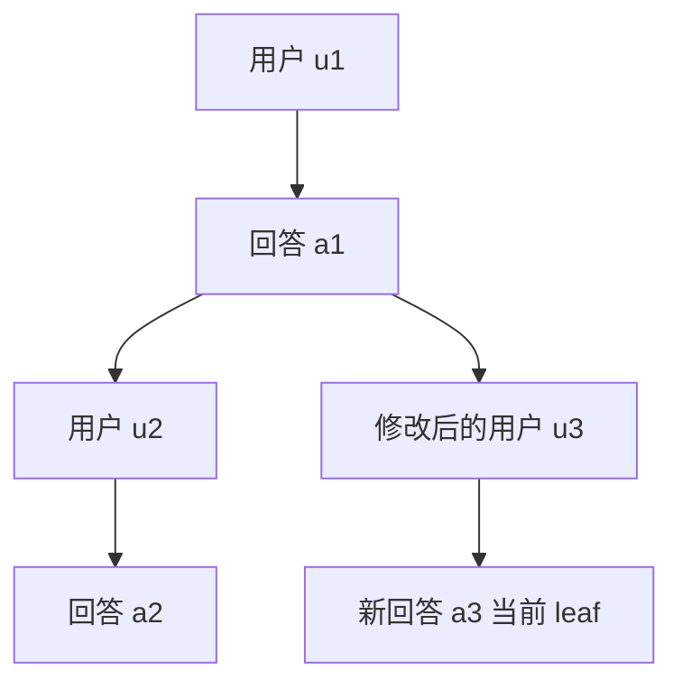

# 第十三章：会话日志、分支树与模型上下文

用户回到旧消息后重新提问，原来的回答应该保留在哪里？如果把聊天数组直接截断，历史会丢失；如果把所有历史全部发给模型，模型又会同时看到两条互相矛盾的对话。Pi 使用一个日志保存全部条目，再沿当前分支生成模型上下文。

本章主要对应 [session-manager.ts](https://github.com/earendil-works/pi/blob/11449730c8a733953ce1bcce70e066bccaa778a5/packages/coding-agent/src/core/session-manager.ts)。这是经典编程代理的 JSONL 会话存储；后面的 Durable 运行时使用另一套数据与恢复机制。

## 13.1 JSONL：每一行一个 JSON 对象

JSONL 文件把对象分别写在独立行上。第一条有效记录是 session header，保存会话 ID、版本、创建时间、cwd 和可选的父会话路径。后续每个条目有自己的 `id`、`parentId` 和时间戳。

教学简化日志如下：

```json
{"type":"session","version":3,"id":"session-demo","timestamp":"2026-10-03T00:00:00.000Z","cwd":"/work/demo"}
{"type":"message","id":"u1","parentId":null,"timestamp":"2026-10-03T00:00:01.000Z","message":{"role":"user","content":"解释配置","timestamp":1790985601000}}
{"type":"message","id":"a1","parentId":"u1","timestamp":"2026-10-03T00:00:02.000Z","message":{"role":"assistant","content":[]}}
```

示例只展示树所需字段；生产 assistant 消息还必须包含模型、用量、结束原因等消息字段。不能把教学片段当作完整模型消息构造器。

会话 ID 与条目 ID 是不同身份。新会话使用 UUIDv7；条目一般使用随机 UUID 的前 8 个十六进制字符，并检查本会话索引中的冲突，重复尝试失败后使用完整 UUID。

## 13.2 四个数据结构各有用途

`SessionManager` 在内存中主要维护：

| 字段 | 用途 |
| --- | --- |
| `fileEntries` | 文件顺序的全部条目，包括 header |
| `byId` | 按 ID 找条目，避免每次遍历日志 |
| `leafId` | 当前分支的末端位置 |
| `labelsById`、`labelTimestampsById` | 每个目标条目的最新标签 |

追加一条记录时，它的父 ID 是当前 `leafId`，然后它自身成为新 leaf。文件中的后写顺序与树中的父子顺序有关，但不是同一个概念。



若 leaf 为 a3，`getBranch()` 从 a3 沿父 ID 回到根，再反转顺序，得到 u1、a1、u3、a3。u2、a2 仍在日志中，却不在当前分支中。

## 13.3 branch 只移动指针，下一次追加才记录新路径

`branch(id)` 检查目标存在，然后移动 `leafId`；不会删掉旧条目，也不会单独追加一条“指针改变”记录。`resetLeaf()` 则移动到没有条目的位置。

因此，仅调用 `branch()` 后关闭进程，不能假设新的 leaf 已经独立持久化。重新加载时，`_buildIndex()` 按文件顺序把最后一个非 header 条目设为 leaf。后续新增条目通过父 ID 才把新的路径关系记录下来。

`branchWithSummary()` 移动 leaf 后追加 `branch_summary`，保存被离开路径的来源 ID 和摘要。该条目既推进新分支，也能向模型提供旧路径的必要信息。

## 13.4 不是所有日志条目都进入模型请求

`sessionEntryToContextMessages()` 区分以下条目：

| 条目 | 是否贡献模型消息 |
| --- | --- |
| `message` | 是，保存真实运行时消息 |
| `custom_message` | 是，投影为扩展自定义消息 |
| `branch_summary` | 摘要非空时贡献一条分支摘要消息 |
| `compaction` | 贡献压缩摘要，以及可选 system 检查点 |
| `custom` | 否，仅用于扩展状态 |
| 模型、思考级别、标签、会话名称、usage | 不直接贡献聊天消息 |
| `context_edit` | 自身不贡献消息，影响目标条目的内容 |

例如扩展想保存一个内部计数，应使用 `custom`；想让模型知道某个检查结果，则需要 `custom_message` 或相应消息接口。把“能保存”误解为“会发给模型”，会导致扩展看似正常工作但模型始终不知道它的状态。

[messages.ts](https://github.com/earendil-works/pi/blob/11449730c8a733953ce1bcce70e066bccaa778a5/packages/coding-agent/src/core/messages.ts) 再把应用消息转换成提供商支持的消息：custom、分支摘要、压缩摘要主要转换成 user 消息；普通 system、user、assistant、toolResult 保留。`bashExecution` 会变成包含命令与输出的用户消息，除非设置了 `excludeFromContext`。

custom 消息的 `display:false` 只控制显示，不能据此认为它对模型隐藏。显示和上下文参与是两个不同维度。

## 13.5 压缩改变投影，不删除原始历史

`buildContextEntries()` 先沿当前 leaf 找路径，再找这条路径上最新的 compaction。没有压缩时，保留整条路径；有压缩时，构建：

```text
最新压缩条目
→ 从 firstKeptEntryId 开始、位于压缩条目之前的保留段
→ 压缩条目之后的所有条目
```

例如原路径为 `u1,a1,u2,a2,u3,a3,c1,u4`，c1 声明从 u3 开始保留，则上下文条目为 `c1,u3,a3,u4`。原来的 u1 到 a2 仍在磁盘日志和分支树中，但模型当前只通过 c1 的摘要了解它们。

旧保留段中的 system 消息被跳过，最新 compaction 自身保存当时的完整 system 检查点。保留段如果碰巧包含更早的 compaction，投影时这些旧 compaction 不再重复贡献摘要。否则模型可能同时收到多份重复压缩历史。

`firstKeptEntryId` 找不到时，代码不会凭空猜一个索引来恢复保留段。构造和迁移逻辑必须维持这个引用。第十四章会解释选择保留边界时怎样处理一个回合中的工具结果。

## 13.6 context_edit：追加一条修改记录

`appendContextEdit(targetId,replacement)` 不改写目标的原始内容。它验证目标位于当前分支且属于可编辑的消息类型，然后追加 `context_edit`。

`replacement:null` 表示从模型上下文中省略目标；有 content 的对象表示替换它的内容。消息角色、toolCallId、模型和其他元数据不在这次替换范围内。assistant 与 toolResult 的字符串替换会规范成 text block 数组。

`buildSessionProjection()` 收集当前上下文条目中的修改记录，对同一目标使用最后一次修改，再生成对应消息。每个投影项保留 `sourceEntry`，因此调用者能知道模型可见内容源自哪条原始日志。

具体轨迹：

```text
u1 原始内容：“旧需求”
a1 回答
e1：targetId=u1，replacement.content=“新需求”
```

当前分支的模型上下文看到“新需求”，原日志里的 u1 仍是“旧需求”。若另一分支在 e1 之前分叉且没有继承 e1，它仍看到原始需求。

修改记录只从压缩后的上下文条目中收集。因此压缩时需要已经把历史修改反映到摘要和保留内容中；被省略段里的修改不会无限期独立重放。

## 13.7 第一次用户消息触发实际落盘

创建持久化会话不等于立即创建文件。模型、思考级别和系统提示等初始化条目先留在内存；只启动然后退出，不会因此留下空聊天日志。

`_hasConversation()` 检查是否已经有 user 或 assistant 消息。一旦出现，`_persist()` 使用 `openSync(path,"wx")` 排他创建文件，并写出所有积累条目。之后使用 `appendFileSync()` 每次追加一行。

触发点是第一条用户消息，不必等第一条模型回答。这能保留第一次请求失败或未完成时的用户输入。

`"wx"` 防止首次创建时覆盖已存在目标。它不意味着后续每次追加都取得跨进程会话锁。

## 13.8 日志写入的失败与多进程边界

正常 `_appendEntry()` 顺序是先更新内存数组、索引和 leaf，再执行持久化。若磁盘写入抛错，本方法没有回滚前面的内存修改。因此内存与磁盘可能暂时不一致，调用者不能把抛错理解为“完全没有追加过”。

会话模块没有凭据存储那样的 `proper-lockfile` 调用，也没有每次追加前重新加载其他写入者的分支。因此两个实例同时打开同一日志时，各自的索引与 leaf 可能过时。即使某些操作系统的追加行为避免了字节位置覆盖，也不能保证逻辑父子关系、索引和迁移重写都正确协调。

`_rewriteFile()` 使用 `"w"` 重写，用于迁移和某些分叉操作。这里没有临时文件重命名、事务日志或显式 fsync。通常的追加保存、数据迁移和首次创建有不同的保护范围，不应统一叫作“原子保存”。

会话分支也不会回滚文件系统。例如你在 a2 中修改了 `src/app.ts`，再回到 a1，分支树改变的是聊天上下文；磁盘上的 `src/app.ts` 仍保持修改后的内容。

## 13.9 怎样读取大文件和损坏行

完整加载使用 1 MiB 缓冲区和 `StringDecoder("utf8")`。decoder 保留跨块的 UTF-8 字节序列，pending 保留跨块的半行，再按换行解析。整个日志最终仍累积成内存条目数组；流式读取不代表整个会话只占固定内存。

空行和 JSON 解析失败的行被跳过。解析完成后，第一条有效记录必须是带字符串 ID 的 session header，否则返回无效结果。这里没有对每个消息和 parentId 执行完整 schema 验证，也没有普遍检测任意父链环。树遍历主要以正常生成的日志为前提。

如果有效会话文件末尾没有换行且仍有 pending 内容，加载器会追加换行，避免下次追加直接粘到旧行后面。这是一种读取时的修复写入。它不删除损坏尾行，也不从被跳过的 JSON 片段恢复消息。

打开非空但无有效会话的文件会报错；空文件可以初始化。读取旧版本会迁移条目结构并重写，因此“打开日志”不一定是纯只读操作。

## 13.10 快速发现 header 与完整打开不同

查找精确 ID 和最近会话时，Pi 先用 4096 字节块扫描 header，最多扫描 1 MiB。损坏或超限文件在发现阶段被跳过，避免一个文件拖垮整个列表。

用户显式打开超出 header 扫描限制的文件时，`open()` 可以退回完整加载，以支持较大的旧 header。这说明发现阶段的性能上限不能被描述成会话格式的绝对大小上限。

最近会话的快速发现按文件 mtime 排序；完整列表的 `modified` 则优先采用 user/assistant 的消息活动时间。给日志加标签或其他状态条目，并不总会使它像新增聊天一样被排序到最前。

默认会话目录将 cwd 中的路径分隔符和冒号替换为连字符。这不是密码学哈希，也不是能保证不同 cwd 必然得到不同编码的方案。自定义共享会话目录还有按 header cwd 过滤的路径，应按实际调用判断。

## 13.11 列表加载为什么要限制并发

一次打开数千个文件会消耗文件描述符和 I/O 资源。`mapWithConcurrency()` 启动有限数量的 worker，共享递增索引，把结果放回原输入位置。

每个 worker 在 await 之前同步取走一个索引；JavaScript 在这段同步代码中不会被另一个 worker 插入，所以同一索引不会正常分配两次。I/O 则可以并发进行。

当前限制为：会话信息读取最多 10 个并发任务，跨目录发现与 stat 最多 64 个。进度回调周期性返回已经排序的部分结果，使选择器可以逐步显示内容。取消信号在分配任务和读取路径中检查，普通文件错误则允许跳过个别文件。

完整列表的消息统计和搜索文本扫描整份日志，不等于只扫描当前分支。应区分“列表摘要”“原始日志”“当前分支”“模型上下文”四种视图。

## 13.12 把分支导出成新会话

`createBranchedSession(leafId)` 抽取根到指定 leaf 的一条路径，创建新 session header，并保存来源会话路径。

标签本身是树条目，后续消息可能以标签为父节点。抽取时先移除旧标签条目，再重新连接保留条目的 parentId；还要修正压缩的 firstKept 引用，最后按最新标签映射重新追加标签。这是防止分叉文件出现孤立子树的必要处理。

`forkFrom()` 是另一种操作：把来源会话的全部非 header 历史复制到目标项目，保留整棵历史。它先排他创建 header，再逐条追加；中途失败没有自动删除或回滚目标文件。

## 13.13 用量统计与上下文不同

[usage-totals.ts](https://github.com/earendil-works/pi/blob/11449730c8a733953ce1bcce70e066bccaa778a5/packages/coding-agent/src/core/usage-totals.ts) 统计 assistant、独立 usage、工具和摘要记录的用量，并按模型或摘要类别分组。花费发生过就应被统计，即使对应消息现在不在模型上下文中。

[cache-stats.ts](https://github.com/earendil-works/pi/blob/11449730c8a733953ce1bcce70e066bccaa778a5/packages/coding-agent/src/core/cache-stats.ts) 根据前后请求的 token 用量估算缓存未命中，跳过 1024 token 以内的噪声，并在压缩和分支摘要后重置比较基准。该统计来自已报告用量和价格字段，不是服务器返回的“确切丢失缓存原因”。模型切换和空闲时间可以辅助解释，但仍是实现中的估算。

## 13.14 HTML 导出保存的是整棵树

[export-html/index.ts](https://github.com/earendil-works/pi/blob/11449730c8a733953ce1bcce70e066bccaa778a5/packages/coding-agent/src/core/export-html/index.ts) 的 `exportSessionToHtml()` 读取 `getEntries()`、header 与 leaf，不使用压缩后的模型上下文投影。它还可接收当时 AgentState 的系统提示词、工具描述和 schema。因此从当前分支发起导出，仍会把其他分支的条目放进导出数据。

独立 `exportFromFile()` 打开指定日志，但没有传入 AgentState，因此没有这些运行时系统提示词与工具定义。`exportSessionToHtml()` 要求已有持久化日志；内存会话或尚未发生对话的会话会被拒绝。

导出器通过 config 的 `getExportTemplateDir()` 找到 HTML、CSS、JavaScript、marked 和 highlight.js，将资源嵌在一个 HTML 中。会话 JSON 先转 UTF-8 字节再编码为 Base64，浏览器用 atob、Uint8Array 和 TextDecoder 还原。

```text
全部条目 + 当前 leaf + 可选运行时信息
→ JSON → UTF-8 → Base64
→ 嵌入 HTML → 浏览器还原对象
→ 按所选 leaf 显示某条父链
```

Base64 解决的是在脚本标签中嵌入数据的转义问题，不是加密、匿名化或秘密过滤。终端隐藏的 custom message 仍在数据里，浏览器的隐藏开关只改变展示。

## 13.15 浏览器如何重建树与定位工具结果

[template.js](https://github.com/earendil-works/pi/blob/11449730c8a733953ce1bcce70e066bccaa778a5/packages/coding-agent/src/core/export-html/template.js) 建立 entry ID、工具调用和标签索引，再按 parentId 连接节点。子节点按时间排序，活跃分支在树显示中优先；点击中间节点会沿最新子节点找到该子树的叶，再显示整条路径并滚动到点击位置。

过滤隐藏中间条目时，后代连接到最近的可见祖先，重新计算缩进与连接线，避免一条没有实际分叉的链越缩越深。搜索按多个词全部包含处理，当前 leaf 始终保留；它不是向服务器重新查询日志。

工具结果不单独绘制为聊天卡片，而显示在 assistant 的工具调用内部。深链接遇到 toolResult 时，`getScrollTargetElementId()` 转到 `tool-call-<toolCallId>`；否则只寻找 result 的 entry DOM ID 会找不到可见元素。工具结果查找遍历全部 entries，依赖正常日志中工具 ID 的对应关系，不构成独立的分支事务验证。

`entryCache` 保存初次解析的 DOM 节点，导航时克隆到 DocumentFragment，再统一替换消息区域。缓存节点带的是初始折叠状态，因此导航后重新应用 thinking、tool output 和 hidden-message 开关。异步滚动用 `setTimeout(0)` 等待布局，不会改变原日志。

## 13.16 自定义工具如何复用终端 renderer

[tool-renderer.ts](https://github.com/earendil-works/pi/blob/11449730c8a733953ce1bcce70e066bccaa778a5/packages/coding-agent/src/core/export-html/tool-renderer.ts) 为每个工具调用保存参数、状态和前一组件，分别渲染折叠与展开结果。它采用默认宽度 100，并设置 `showImages:false`、空 invalidate 回调等静态上下文。

[ansi-to-html.ts](https://github.com/earendil-works/pi/blob/11449730c8a733953ce1bcce70e066bccaa778a5/packages/coding-agent/src/core/export-html/ansi-to-html.ts) 将终端 SGR 颜色和粗体等状态转成 span 样式，并转义普通文本。它支持标准色、256 色和 RGB，但不是解释任意终端控制序列的完整模拟器。输出行分别转换，跨行样式状态不会像一个持续终端那样自动保留。

工具 renderer 抛错时返回 undefined，让模板回退到结构化参数与文本。内置 bash、read、write、edit、ls 直接由模板显示；其他工具可使用预渲染 HTML。这个回退保护导出的可读性，不为第三方 renderer 提供隔离执行环境。

## 13.17 Markdown、统计与写出各有边界

模板配置 marked，将 HTML 风格输入按文本处理，代码块走 highlight.js。链接和 Markdown 图片 URL 在输出前去掉控制字符，再限定显式 scheme 为 http、https、mailto、tel 或 ftp；不允许的目标退回文本。消息里的图片内容通过转义字段组成 data URL。这些是不同的渲染路径，不能只检查一个 `escapeHtml()` 就概括整个页面。

浏览器头部 `computeStats(entries)` 统计全部导出历史里的 assistant 用量和成本，未采用经典 `usage-totals.ts` 的完整分类。因此压缩、预热等独立 usage 条目不一定反映在这张头部统计中，也不能把它视为当前分支账单。

下载 JSONL 按 header 和全部 entries 重建行，供重新分析。复制链接主要把 leafId 与 targetId 写入 URL；这个函数本身没有上传文件或发布网络资源。

最后写出使用普通 `writeFileSync(outputPath,html)`。这里没有日志文件锁、临时文件原子替换或避免覆盖同名导出的统一机制；默认名可重复。导出生成成功也不意味着正在被其他进程追加的日志获得了一致的跨进程快照。

## 13.18 检查理解

1. 回到旧回答后重新提问，为何旧分支仍能在树中显示，却不会进入当前模型上下文？
2. 为什么只调用 `branch()` 还不足以保证重启后恢复同一个 leaf？
3. 压缩摘要和 context edit 分别改变什么，原始条目是否被删掉？
4. 首次写入使用 `wx`，为何仍不能保证两个进程共同维护同一棵会话树？
5. 分支提取时为什么不能简单过滤掉 label，然后原样复制其他 parentId？
6. 从会话树回到修改文件之前，磁盘文件会不会恢复？依据在哪一层？

理解这些区别后，才能正确阅读压缩、分叉、恢复和上下文重写的上层实现。
