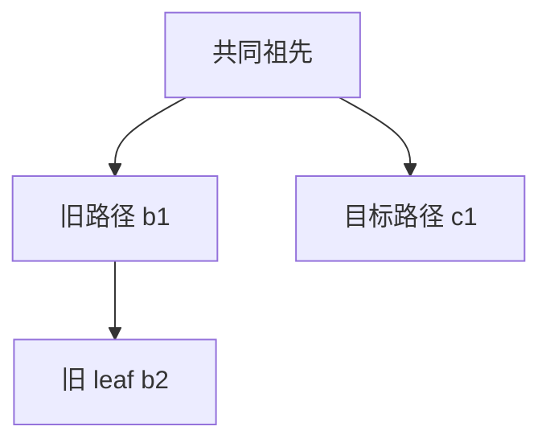

# 第十四章：上下文压缩怎样选择、总结和保存历史

模型只能接收有限上下文。假设聊天已经用了 115000 token，而模型窗口为 128000 token；如果还要留出 16384 token 给后续请求和输出，就不能继续无条件追加。Pi 用摘要替代较早的对话，同时保留近期消息和原始日志。

token 是模型处理文本和其他输入时使用的计量单位，不等于一个汉字、一个英文词或一个 JavaScript 字符。本章不会把字符估算当成精确 tokenizer。

主要源码为 [compaction.ts](https://github.com/earendil-works/pi/blob/11449730c8a733953ce1bcce70e066bccaa778a5/packages/coding-agent/src/core/compaction/compaction.ts)、[branch-summarization.ts](https://github.com/earendil-works/pi/blob/11449730c8a733953ce1bcce70e066bccaa778a5/packages/coding-agent/src/core/compaction/branch-summarization.ts) 和 [utils.ts](https://github.com/earendil-works/pi/blob/11449730c8a733953ce1bcce70e066bccaa778a5/packages/coding-agent/src/core/compaction/utils.ts)。触发和保存由第八章的 `AgentSession` 负责。

## 14.1 压缩包含三个不同问题

1. 是否需要压缩：评估当前上下文大小和窗口。
2. 压缩哪些消息：选择既能缩小输入又不破坏工具序列的保留边界。
3. 怎样压缩并保存：请求摘要，检查结果，追加 compaction 条目。

摘要函数主要返回数据，不直接修改会话文件。`SessionManager.appendCompaction()` 保存摘要和边界，随后通过投影重建模型上下文。这个职责分离使扩展可以替换摘要生成，而不必自行实现整套日志格式。

## 14.2 什么时候越过阈值

`shouldCompact()` 的条件是：

```text
enabled && contextTokens > contextWindow - reserveTokens
```

等于阈值时不会触发。默认 reserveTokens 为 16384，keepRecentTokens 为 20000：前者用于预留请求空间，后者用于选择保留的近期历史。两者不是同一个输出长度限制。

例如窗口 128000、预留 16384，阈值为 111616。上下文 115000 超过阈值，111616 则没有超过。

设置可以按精确 `provider/modelId` 覆盖这两个值。设置管理器检查非负安全整数，但不能仅凭这个验证就认为 reserveTokens 一定小于模型窗口。实际模型限制和设置之间仍可能有不合适组合。

## 14.3 用量报告优先，但有失效条件

`calculateContextTokens()` 优先使用非零 `usage.totalTokens`，否则计算 input、output、cacheRead、cacheWrite 之和。

`estimateContextTokens()` 找最后一条有效 assistant 用量，跳过 aborted、error 和全零用量，然后加上它之后新增消息的估算。没有有效用量时，全部从消息内容估算。

但用量来自一次过去的请求。如果之后通过 context edit 删除大段内容，旧 usage 已不能代表现在的上下文；压缩之后保留下来的旧 assistant 也可能报告压缩前的总大小。

`estimateProjectedContextTokens()` 因此把用量消息映射回原日志条目，检查它是否晚于最新 context_edit 或 compaction。若没有满足条件，就重新估算投影中的非 system 消息，并只计算重放后的当前 system 状态一次。

具体例子：

```text
a1：报告上下文 100000 token
e1：删除早期 60000 token 的工具输出
```

不能继续把 a1 的 100000 当成修改后的大小，否则可能重复触发无意义压缩。

## 14.4 字符估算怎样计算

`estimateTokens()` 主要用 `ceil(chars/4)`：文本按 JavaScript 字符串长度计数，toolCall 加工具名和 JSON 参数长度，thinking 计入内容；图片按 4800 字符即约 1200 token 估算。

system 消息还计算 sections 和 toolsAdded 的序列化长度，bashExecution 计算命令与输出，摘要计算摘要文字。

这是一种启发式估算。不同语言、表情、代码、图片分辨率和提供商都可能偏离该比例。源码注释把它称作保守估计，但实现没有证明它对每一种输入都是上界。因此章节里的预算是近似选择依据，不是严格保证请求一定不会溢出的数学边界。

## 14.5 为什么不能从任意消息位置切开

假设一个用户回合包含：

```text
u1 用户要求修改文件
a1 assistant：toolCall(read)
r1 toolResult(read)
a2 assistant：toolCall(edit)
r2 toolResult(edit)
a3 assistant：完成说明
```

如果从 r2 开始保留，模型会看到没有对应 toolCall 的工具结果，提供商可能拒绝。Pi 允许从 user 类消息或 assistant 切开，不能直接从 toolResult 切开。保留带工具调用的 assistant 时，它后面的工具结果也随之保留。

user 类边界还包括 custom、bashExecution、分支摘要和压缩摘要等可充当输入的消息。system 状态不是普通聊天切点。

## 14.6 从后往前累计保留预算

实际压缩准备使用投影后的条目：

1. 找当前上下文中有效的候选切点。
2. 从最新条目向前累计消息估算。
3. 达到 keepRecentTokens 后，选附近允许的切点。
4. 若末尾单个工具结果已经超过预算，仍保留其前面的调用，而不是把工具结果单独留下。
5. 向前纳入与切点相邻、不贡献模型内容的元数据条目。
6. 判断是否切在一个用户回合内部，并查找该回合的输入起点。

因此 keepRecentTokens 并不是“精确保留这个数量”。为了维持有效消息序列，保留段可以比预算大；某些组合也可能选择到较后的候选位置。应把它理解为保留边界的目标规模。

投影切点函数还识别溢出恢复的封闭尾段：失败 assistant 和其省略记录已经不贡献上下文时，可以推进边界。但任意元数据或对外部目标的替换不能随意被当成“已经没有待发输入”的证据。

## 14.7 prepareCompaction 返回什么

`prepareCompaction()` 首先构建当前分支的投影，识别最新有效 compaction，继承它的 previousSummary，再计算新的切点。

它返回：

| 字段 | 含义 |
| --- | --- |
| `firstKeptEntryId` | 保留段起点的原日志身份 |
| `messagesToSummarize` | 更早、可整体概括的历史 |
| `turnPrefixMessages` | 若切开一个回合，属于该回合较早部分的消息 |
| `isSplitTurn` | 是否需要单独概括回合前缀 |
| `tokensBefore` | 压缩前投影估算 |
| `previousSummary` | 之前摘要，供迭代更新 |
| `fileOps` | 从工具记录收集的文件操作 |
| `settings` | 本次压缩设置 |

system 消息不作为要总结的普通对话，compaction 保存对应 system 检查点。context edit 已通过投影反映到要总结的内容中。

如果最后一个条目已经是 compaction，或者没有任何历史与回合前缀需要总结，则返回 undefined。上层会把它解释成已经压缩或没有足够内容，而不是请求模型生成一个空摘要。

## 14.8 为什么会产生两份摘要

如果在 a2 前切开 u1 的回合，模型还需要知道 u1 的原始要求和 a1/read 已完成的进展，但不能把旧回合前缀完整保留。

Pi 把更早历史与正在进行回合的前缀分开：先生成或更新历史摘要，再生成 turn prefix 摘要，最后合并成一条保存结果。两次调用按顺序执行，usage 相加。

历史摘要默认输出上限约为 `floor(0.8 * reserveTokens)`，回合前缀约为 `floor(0.5 * reserveTokens)`，都再受模型 maxTokens 限制。两次输出合并后的长度不因此自动受一个统一的 reserveTokens 上限约束。

没有分割回合时，只需要一次历史摘要生成。已有 previousSummary 会进入更新提示，要求合并新进展，而不是丢掉过去的关键约束。

## 14.9 把对话转换成被总结的材料

摘要请求没有直接重放原来的多角色对话来让模型继续工作。`serializeConversation()` 把内容转换为带 `[User]`、`[Assistant]`、`[Assistant tool calls]` 等标记的文本，放入一次独立 user 请求。

assistant 的 thinking 和调用参数会进入这份文字材料。toolResult 文本只保留前 2000 个 JavaScript 字符，并附加截断说明。图片主要不以原始图片方式进入这个文字摘要请求。

独立 system 提示要求只总结，不回答材料中的问题，也不继续执行工作。这是通过请求结构与指令降低混淆；它不能保证模型摘要绝无遗漏或错误。

## 14.10 摘要调用复用请求行为，但不进入主聊天循环

`completeSummarization()` 优先使用会话提供的 streamFn，使超时、提供商请求头和 SDK 请求行为保持一致；否则调用 `completeSimple()`。

它设置 `cacheRetention:"none"`，有调用者 sessionId 则复用，无则创建新的路由 ID。然后用 `retryAssistantCall()` 处理允许重试的临时失败。这类请求的目的和路由身份与正常聊天不同，不能把它看成又一条普通 assistant 消息自动进入聊天数组。

摘要也可能产生费用，其 usage 记录在 compaction 或 branch_summary 中。不是所有状态管理操作都只是本地字符串处理。

## 14.11 什么结果不能作为检查点保存

`getSummarizationFailure()` 拒绝 error 和 length：length 可能已经产生文字，但这仍是被 token 上限截断的不完整摘要，不能当作可靠检查点。

摘要结果若包含 toolCall 也被拒绝，因为摘要请求没有被授权继续运行原项目工具。分支摘要对 aborted 返回单独标志；普通压缩由上层 controller 进一步确认取消状态，避免取消后保存半成品。

没有一个严格 schema 验证器检查模型一定输出了全部要求的标题、一定保留了每条约束。输出上限检查与无 toolCall 检查解决的是明显无效响应，不能等同于语义完整性证明。

## 14.12 文件清单来自调用记录，不是文件系统审计

工具调用中的 read、write、edit 且带字符串 path，会加入对应集合。嵌套调用的简要记录也可在 compaction 中提供文件操作线索。

edited 与 written 合并为 modifiedFiles；已经修改的文件不再同时出现在 readFiles，最后排序并以 `<read-files>`、`<modified-files>` 追加到摘要文字和 details。

这不是扫描磁盘产生的修改证明：它可以包含失败调用，忽略通过 bash 修改的文件，同名自定义工具也可能被按名字解释；嵌套参数因记录限制省略时也可能缺少路径。应称作“基于工具记录的文件追踪”，不能称作“所有实际修改的精确列表”。

## 14.13 分支摘要先找到共同祖先

从旧 leaf 转到新目标时，`collectEntriesForBranchSummary()` 取得两条根路径，找最深共同祖先，然后收集旧分支上共同祖先之后的条目。共同部分不需要再作为被离开分支的内容总结。



此时主要总结 b1、b2。收集过程不会在 compaction 处提前停止；旧摘要也能作为材料。

`prepareBranchEntries()` 从新到旧按 `contextWindow - reserveTokens` 的预算选择材料。预算不够时偏向近期消息；遇到摘要条目且已用量不到预算的 90%，可以额外保留它，因而预算也不是严格上限。输出上限最多 4096 token，再受模型 maxTokens 限制。

## 14.14 分支摘要和普通压缩并非同一个投影算法

分支摘要的 `getMessageFromEntry()` 直接转换收集到的原始条目，并跳过 toolResult；普通压缩则使用正式 SessionProjection，包括 context edit 后的消息和工具结果。

因此本版本分支摘要不能被描述为“必然总结修改后的模型上下文”。context_edit 本身不在该转换中形成替换，嵌套调用记录若只存在于被跳过的 toolResult，也不会自然像普通压缩那样被读取。

文件追踪的第一遍继承所有分支摘要 details；原始 assistant 的调用则在预算选择遍历中收集，到达停止边界后不会继续扫描更老的全部调用。源码注释的“所有条目文件追踪”需要结合两遍循环的实际行为理解。

树导航把摘要附到目标位置，用户或 custom_message 目标则移动到其父节点并把原文本返回编辑器。历史仍保留，磁盘文件不会随树导航回滚。

## 14.15 检查理解

1. 128000 窗口和 16384 reserve 下，111616 与 111617 哪个触发阈值？
2. 删除历史工具输出后，为什么旧 assistant usage 会失效？
3. 为什么不能把 toolResult 当作首条保留消息？
4. 在一个用户回合中间切开，为何需要单独的回合前缀摘要？
5. 有部分文字的 length 响应为什么仍不能保存为压缩检查点？
6. modifiedFiles 能否证明这些文件都成功修改过？
7. 分支摘要是否一定应用了原历史中的 context edit？请定位实际转换函数。

下一步将摘要保存、当前 system 检查点与第十三章的上下文投影连接起来，才能完整解释“压缩后模型为什么仍能继续工作”。

## 14.16 用一组数字实际选择投影切点

问题是 14.6 的“选附近切点”究竟向前还是向后。下面是实际使用的 `findProjectedCutPoint()` 中从末尾累计并选候选的位置，原样节录；候选收集、恢复省略尾段处理和元数据回退仍在同函数的前后部分：

源码定位：[packages/coding-agent/src/core/compaction/compaction.ts](https://github.com/earendil-works/pi/blob/11449730c8a733953ce1bcce70e066bccaa778a5/packages/coding-agent/src/core/compaction/compaction.ts#L817)，第 817—829 行。

<!-- source-lines: packages/coding-agent/src/core/compaction/compaction.ts:817-829 -->
```ts
	let accumulatedTokens = 0;
	let exceededBudget = false;
	let cutIndex = cutPoints[0];
	for (let i = endIndex - 1; i >= startIndex; i--) {
		const messageTokens = entries[i].messages.reduce((sum, message) => sum + estimateTokens(message), 0);
		if (messageTokens === 0) continue;
		accumulatedTokens += messageTokens;
		if (accumulatedTokens >= keepRecentTokens) {
			exceededBudget = true;
			cutIndex = cutPoints.find((candidate) => candidate >= i) ?? cutPoints[cutPoints.length - 1];
			break;
		}
	}
```

把保留预算临时设为 15，使用下列最小投影；这只是为了算清算法，默认 keepRecentTokens 仍是 20000。全部消息使用零 usage，逐消息字符估计如下：

| 下标 | 消息内容 | 字符计算 | estimateTokens | 可作为切点 |
| --- | --- | ---: | ---: | --- |
| 0 | user: 32 个 x | 32 | 8 | 是，回合起点 |
| 1 | assistant: read({path:"a"}) | name 长 4 + JSON `{"path":"a"}` 长 12 | 4 | 是 |
| 2 | toolResult: 80 个 x | 80 | 20 | 否 |
| 3 | assistant: 16 个 x | 16 | 4 | 是 |

候选是 `[0,1,3]`。从下标 3 开始累计 4，尚未达到 15；到下标 2 累计变为 24，达到预算。`find(candidate >= 2)` 得到 3，因此选择下标 3，并没有自动退回下标 1。最终保留 4 token，可以少于目标预算；调用和结果都被总结掉，保留段也没有悬空工具结果。

查找回合起点得到 0，所以返回 `{firstKeptEntryIndex:3, turnStartIndex:0, isSplitTurn:true}`。若这是整个历史，messagesToSummarize 没有更早的回合；turnPrefixMessages 是 0、1、2，原样保留 3。若前面还有旧历史，才另形成历史摘要的材料。prepareCompaction 返回的是分段数据，模型生成的摘要文字尚不存在。

现在删掉最后的文字 assistant，让 toolResult 成为末条。从下标 2 开始，20 已达到 15；没有候选 >=2，就用候选数组末项 1。于是保留 read 调用和其结果，共 24 token，多于预算。这个 fallback 正是“末尾大工具输出不能单独留下”的实际分支。

再在原下标 1 之前插入一个不贡献上下文的元数据条目，切点选到 assistant 后，后面的 while 会把相邻元数据一起纳入保留范围，返回的原条目位置可以先于真正首条保留消息。firstKeptEntryId 因此是日志边界身份，不必等于一条 user/assistant 的身份。

## 14.17 实验覆盖与摘要验收的分界

`node labs/run-offline.mjs compaction` 执行完整 `findProjectedCutPoint()` 及其局部辅助函数，验证上表估算、阈值严格大于、两个不同切点和元数据回退。输入已是投影后的条目；实验为 sessionEntryToContextMessages 注入基础 message 转换，没有验证整个树、context_edit 或旧 compaction 的投影。

本实验不调用摘要模型，也不验证摘要语义完整性。验收时应另检查被总结的约束是否保留、失败回复是否省略、摘要是否拒绝 length/toolCall，以及保存后重建的 system 检查点。这样的分层是必要的：算法选对切点，与模型写出正确摘要，是两个独立失败来源。
