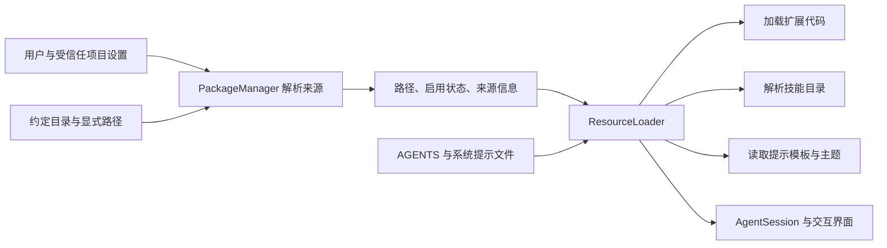

# 第十七章 资源发现、扩展包与项目信任

## 17.1 问题：用户设置、项目目录和扩展包会提供同名资源

假设用户有一个 `/review` 提示模板，项目也提供一个 `/review`，某个 npm 扩展包又带了一份。Pi 必须确定加载哪一个，并且能向用户说明另一份为什么没有生效。更复杂的是，扩展不是普通文字：加载它就可能执行 Node.js 代码，缺失的包还可能触发安装。

这一章追踪“资源从哪里来，以及何时允许加载”。资源加载器支持四类资源：扩展、技能、提示模板、主题；另外读取项目上下文和系统提示文件。扩展事件与 API 的执行细节放在第十六章，主题实际绘制放在终端相关章节。



## 17.2 代码地图

| 源码 | 应读入口 | 负责的行为 |
| --- | --- | --- |
| [`resource-loader.ts`](https://github.com/earendil-works/pi/blob/11449730c8a733953ce1bcce70e066bccaa778a5/packages/coding-agent/src/core/resource-loader.ts) | `DefaultResourceLoader.reload()` | 协调信任、包解析、扩展、技能、模板、主题和上下文 |
| [`package-manager.ts`](https://github.com/earendil-works/pi/blob/11449730c8a733953ce1bcce70e066bccaa778a5/packages/coding-agent/src/core/package-manager.ts) | `DefaultPackageManager.resolve()` | 来源解析、安装目录、发现、筛选、排序和更新 |
| [`pi-manifest.ts`](https://github.com/earendil-works/pi/blob/11449730c8a733953ce1bcce70e066bccaa778a5/packages/coding-agent/src/core/pi-manifest.ts) | `readPiManifest()` | 读取 `package.json` 中的 `pi` 资源声明 |
| [`skills.ts`](https://github.com/earendil-works/pi/blob/11449730c8a733953ce1bcce70e066bccaa778a5/packages/coding-agent/src/core/skills.ts) | `loadSkills()`、`formatSkillsForPrompt()` | 发现和校验技能，生成模型可见目录 |
| [`prompt-templates.ts`](https://github.com/earendil-works/pi/blob/11449730c8a733953ce1bcce70e066bccaa778a5/packages/coding-agent/src/core/prompt-templates.ts) | `expandPromptTemplate()` | 解析命令参数，单次替换占位符 |
| [`source-info.ts`](https://github.com/earendil-works/pi/blob/11449730c8a733953ce1bcce70e066bccaa778a5/packages/coding-agent/src/core/source-info.ts) | `SourceInfo` | 记录路径、来源、范围和包归属 |
| [`project-trust.ts`](https://github.com/earendil-works/pi/blob/11449730c8a733953ce1bcce70e066bccaa778a5/packages/coding-agent/src/core/project-trust.ts) | `resolveProjectTrusted()` | 结合覆盖、扩展、已保存决定和界面确定信任 |
| [`trust-manager.ts`](https://github.com/earendil-works/pi/blob/11449730c8a733953ce1bcce70e066bccaa778a5/packages/coding-agent/src/core/trust-manager.ts) | `ProjectTrustStore` | 路径继承、信任选项和带锁持久化 |
| [`utils/paths.ts`](https://github.com/earendil-works/pi/blob/11449730c8a733953ce1bcce70e066bccaa778a5/packages/coding-agent/src/utils/paths.ts)、[`utils/git.ts`](https://github.com/earendil-works/pi/blob/11449730c8a733953ce1bcce70e066bccaa778a5/packages/coding-agent/src/utils/git.ts) | 路径规范化、`parseGitUrl()` | 处理路径、仓库来源和安装路径校验 |
| [`footer-data-provider.ts`](https://github.com/earendil-works/pi/blob/11449730c8a733953ce1bcce70e066bccaa778a5/packages/coding-agent/src/core/footer-data-provider.ts) | `findGitPaths()` | 识别普通仓库与 linked worktree 的 Git 元数据 |

`SourceInfo` 把三个维度分开：`source` 表示来源标识，`scope` 是用户、项目或临时范围，`origin` 表示资源来自包还是顶层路径。它用于解释来源与冲突，不是权限令牌。

## 17.3 reload 的完整顺序

构造加载器时，会建立包管理器、空资源集合、空诊断列表和扩展运行时。真正加载发生在 `reload()`。

如果调用者要求在加载中解析项目信任，先进行一次特殊引导：把项目设为未信任，重新读取设置，只加载用户资源、临时命令行扩展和显式内联扩展工厂。这样可以让可信的用户扩展参与 `project_trust` 事件，而项目扩展不能先运行再决定自己是否受信任。

内置扩展等到最终阶段才加载，因为项目设置可能禁用它们，已经执行过的扩展不能简单“撤销加载”。引导阶段已经成功加载的扩展按解析路径复用；失败路径也不会在同一轮最终阶段再次加载。

随后按以下顺序读取最终资源：

1. 保留最终信任状态，重新读取设置。
2. 解析配置包与自动发现路径，再解析额外命令行扩展来源。
3. 建立路径元数据和启用状态，加载扩展并处理替代与冲突诊断。
4. 解析技能、提示模板和主题，执行相应覆盖钩子。
5. 读取项目上下文文件。
6. 确定 `SYSTEM.md` 和 `APPEND_SYSTEM.md` 或显式传入的提示文本。
7. 保存这一轮资源状态，设置 `loaded`。

`noExtensions`、`noSkills` 等开关主要排除默认或配置来源，显式命令行和额外路径仍有相应通路。不能把这些开关一律理解为“这个进程绝不加载任何这一类资源”。SDK 覆盖函数也可以主动替换最终结果；它们属于宿主程序的明确控制。

## 17.4 来源解析与相对路径

包来源分为 npm、Git 和本地路径。`npm:` 前缀解析为 npm 包规格，Git 来源交给 `parseGitUrl()`，其余按本地来源处理。这里的“包”不是一个统一格式的压缩文件，而是能提供资源的来源。

相对路径的基准很重要：

| 来源 | 相对路径基准 |
| --- | --- |
| 用户设置中的本地资源或包 | 用户代理目录 |
| 项目设置中的本地资源或包 | `cwd/.pi` |
| 临时命令行来源 | 当前工作目录 |
| 包资源声明 | 包根目录 |
| 技能内部参考文件 | 技能文件所在目录 |

如果当前目录为 `/repo`，项目设置写 `"../shared"`，基准是 `/repo/.pi`，不是 `/repo`。安装后持久化一个本地来源时，包管理器会把输入转换为相对于设置基准的路径，避免下次从另一个工作目录解释成不同文件。

路径规范化可展开 `~`、处理 `file://`、按需要去掉空白或特殊空格，Windows 还适配常见 shell 盘符路径。`canonicalizePath()` 尝试 `realpath`，失败时保留原路径。它主要用于识别已有文件的符号链接别名；不存在的路径没有因此获得真实文件身份。

## 17.5 包声明与自动发现规则

一个包可以在 `package.json` 中声明：

```json
{
  "name": "example-pi-resources",
  "pi": {
    "extensions": ["./extension.ts"],
    "skills": ["./skills"],
    "prompts": ["./prompts"],
    "themes": ["./themes/*.json"]
  }
}
```

`readPiManifest()` 只保留四个已知字段中由字符串组成的数组。没有 `pi` 对象、JSON 无效或无法读取时返回 `null`；有 `pi` 对象但没有有效资源字段时，可以返回空声明。这两种情况会影响是否采用约定目录回退，不能混为一谈。

扩展自动发现先检查该目录的包声明或 `index.ts`、`index.js`；找到入口就使用入口，不再把目录里每个文件都当扩展。否则读取当前目录的 `.ts`、`.js` 文件，以及直接子目录中的声明或 index。它不是对所有 TypeScript 文件无差别递归加载。

提示模板与主题的默认目录扫描主要取直接子文件。包声明中的目录可经过另一条递归收集路径，所以“默认目录发现”和“包资源收集”不总是同样的递归深度。

一般扫描跳过点开头条目与 `node_modules`，应用 `.gitignore`、`.ignore` 和 `.fdignore`。符号链接会通过 `stat` 判断目标类型，坏链接跳过。部分目录读取错误直接被忽略，因此空结果不一定代表目录本来没有任何资源。

glob 是用 `*`、`?` 等通配符选择路径的模式。包声明 glob 展开后按路径排序并过滤点路径；精确声明可以指向点路径或符号链接树。声明中的路径解析没有统一限制为包根目录以内，不能把“按包根解析相对路径”理解为文件系统沙箱。

## 17.6 优先级：先按路径去重，再按名字解决冲突

包管理器为资源计算优先级，数值越小越靠前：

| 顺序 | 资源来源 |
| --- | --- |
| 0 | 项目设置显式指定的本地资源 |
| 1 | 项目自动发现资源 |
| 2 | 用户设置显式指定的本地资源 |
| 3 | 用户自动发现资源 |
| 4 | 包提供的资源 |
| 5 | 内置扩展 |

排序后按 canonical 路径去重，保留最先出现的同一真实文件。加载器还会把显式 CLI 来源放到默认路径之前，并合并额外路径。排序只能决定当前路径序列，最终同名处理要看具体资源类型。

技能用名字作为键，先出现的获胜；模板与主题也采用类似的名字去重，并生成包含胜者、败者路径的冲突诊断。目录枚举不是在所有路径上显式排序，因此同一优先级中的顺序仍要以实际来源序列为准。

扩展更复杂。可替代扩展如果与普通扩展共享一个工具、命令或标志名，会整体被省略，而不是只移除冲突的那一个注册项。例如第三方扩展注册 `/mcp`，可以替代内置 MCP 扩展，避免双方同时连接同一批服务器。

一般扩展的冲突诊断并不会撤销已经执行的工厂。当前检查器实际记录工具和标志冲突；命令冲突还要看运行器的注册与优先处理。不要根据一个注释说“所有冲突都禁止加载”。

包管理器还按包身份去重：npm 身份忽略版本，Git 身份归一为 host/path，忽略配置 ref；同身份项目包通常覆盖用户包。这解决“来源重复”，与 `/review` 这种资源名字重复是两回事。

## 17.7 启用模式与 autoload=false

资源模式有四种，常规模式计算分阶段处理，不是简单按数组最后一项覆盖：

1. 普通匹配模式决定候选包含集合；没有包含模式则从全部候选开始。
2. `!pattern` 按通配匹配排除。
3. `+path` 按精确路径强制加入。
4. `-path` 按精确路径最终排除。

`+` 与 `-` 的精确匹配没有把任意文件 basename 当成完整路径。技能的 `SKILL.md` 还允许用其父目录路径匹配，便于按技能目录启用。

包配置某类资源为 `[]` 时，表示显式禁用该类资源。未提供该字段则可以继续采用默认资源。不能把空数组与省略字段写成同一种语义。

`autoload: false` 使用增量筛选：只写出模式明确命中的资源状态，不自动启用其余资源。在这条路径中，匹配状态按输入模式顺序更新，与常规四阶段计算不同。

若项目对用户已有同身份包配置 `autoload: false`，两份条目保留：项目增量先处理，基础资源可以来自用户已安装位置。项目不需要为了禁用用户包中一项资源，再重复安装整份包。

显式关闭的资源仍可保留元数据用于配置界面展示。先按路径写入累积 Map 的条目不会被后来相同路径覆盖；因此一个已登记的关闭状态可以挡住后来的自动发现启用。

## 17.8 技能目录：发现、诊断与按需读取

技能是带名称、描述和正文的 Markdown 文件。常见格式是：

```markdown
---
name: review-code
description: 检查代码修改的正确性与可维护性。
---
先理解修改前后的执行轨迹，再检查错误处理和并发边界。
```

frontmatter 是文件开头由 `---` 包围的元数据块。Pi 读取描述和名称，正文可以留到调用时再读。目录里一旦发现未被忽略的 `SKILL.md`，就把它当成技能根，不再深入该目录。即使这份技能因缺描述而未加载，也不会自动转而扫描其子技能。

Pi 约定技能目录允许根部普通 `.md` 文件，并递归找 `SKILL.md`；`.agents/skills` 的发现模式对普通 Markdown 的层级规则不同。用户 `.agents/skills` 总会作为用户资源；受信任项目的 `.agents/skills` 从工作目录向祖先发现，通常到最近 `.git` 所在仓库根停止，无仓库时到文件系统根。

名称应由小写字母、数字和短横线组成，不应首尾带短横线或包含连续短横线，最长 64 个字符；描述长度上限提示为 1024。但这些长度和名称错误主要产生警告，不是一律拒绝。缺少非空描述才会阻止技能加载。名称未声明时，采用文件父目录名，而不是普通 Markdown 的文件 basename。

系统提示只包含技能名称、描述和位置，字段进行 XML 转义。`disable-model-invocation: true` 会从这个模型目录中排除技能，但仍允许用户显式调用 `/skill:name`。如果当前工具集合没有 `read` 或 `bash`，系统提示构造器也不会加入这份按需读取目录。

用户显式技能命令会在 [`AgentSession._expandSkillCommand()`](https://github.com/earendil-works/pi/blob/11449730c8a733953ce1bcce70e066bccaa778a5/packages/coding-agent/src/core/agent-session.ts) 中重新读取文件、去掉 frontmatter、包入技能块，再附加参数。这个重新读取意味着技能正文可能比上次发现时更新；描述缓存不会因这次读取自动刷新。找不到技能或读失败时，保留原始文本，读失败另发扩展错误事件。

这个步骤只是把指令文字加入用户输入，不是在系统中自动执行一个独立技能进程。指令之后是否触发工具调用，仍由代理和当前工具能力决定。

## 17.9 提示模板的参数解析不是完整 shell

提示模板的名字来自 `.md` 文件名。描述优先取 frontmatter，否则取正文第一行非空文本并做短预览；`argument-hint` 用于提示用户输入形式。

例如 `review.md` 的正文：

```text
检查 $1 的实现。重点关注 ${2:-错误处理}。
额外要求：$ARGUMENTS
```

输入 `/review src/main.ts "文件并发"` 会先分成两个参数，再替换占位符。支持 `$1`、`$2`、`$@`、`$ARGUMENTS`、`${N:-默认值}` 和 `${@:N:L}` 等形式。

`parseCommandArgs()` 只实现一个简单引号状态机：引号内部空白保留，同一种结束引号退出，其他空白分隔参数。它不执行变量展开、命令替换或完整 shell 转义。

几个实际边界：

```text
a "b c" d       → ["a", "b c", "d"]
a"b c"d         → ["ab cd"]
"" x            → ["x"]
"unfinished value → ["unfinished value"]
```

空引号参数被丢弃，未闭合引号不会在这里报错。参数重新用空格连接后，也不保留原来引号写法。

占位符用一次 `replace()` 完成。若 `$1` 的参数本身是 `$2`，替换结果仍是字面 `$2`，不会第二次展开；默认值也是同样的单次处理。这样能防止用户参数中的占位符被误当作模板源码继续替换。

模板只在文本以 `/` 开头、名称匹配时展开。没有匹配则原样保留。它是输入转换，不是 shell 命令执行。

## 17.10 项目上下文与系统提示有不同发现规则

每个目录按以下候选顺序选择一份上下文文件：`AGENTS.override.md`、`AGENTS.md`、`AGENTS.MD`、`CLAUDE.md`、`CLAUDE.MD`。同目录不把全部候选合并；`override` 在这里首先改变选择哪份文件，不代表自动清空所有祖先上下文。

加载顺序是用户代理目录上下文，然后从文件系统根到工作目录的祖先上下文。读取时移除 BOM，避免文件开头的字节顺序标记影响内容。此函数没有使用项目信任判断，所以“项目未信任”不等于“不读取项目 AGENTS 文字”。

linked worktree 还会避免一种重复：主仓库内部嵌套 worktree 的上下文与主仓库可能代表同一逻辑仓库范围。代码通过 `.git` 文件和 `commondir` 识别结构，在符合条件时省略主仓库中被 worktree 自己副本遮蔽的对应上下文。普通祖先继承、兄弟 worktree 和 bare 布局不会统一套用这一省略。

`SYSTEM.md` 与 `APPEND_SYSTEM.md` 的自动发现则优先使用受信任项目的 `.pi` 文件，再回退用户代理目录。显式提示参数可以是文本，也可以是存在的文件；文件读取失败时会警告并退回原输入。

`appendSystemPrompt` 明确传空数组时，不会再自动发现追加文件。自定义 system prompt 与最终全量强制替换也要区分，具体组合规则见第四、八章及 [`system-prompt.ts`](https://github.com/earendil-works/pi/blob/11449730c8a733953ce1bcce70e066bccaa778a5/packages/coding-agent/src/core/system-prompt.ts)。

## 17.11 项目信任的决定顺序

信任解决的是是否读取项目 `.pi` 设置和资源、安装项目包、执行项目扩展。它没有为已加载的 Node.js 扩展增加操作系统沙箱，也不逐个批准所有后续工具动作。

`resolveProjectTrusted()` 按顺序判断：

1. 调用者显式覆盖时直接采用。
2. 没有需要信任的项目资源时返回可信。
3. 让引导阶段的扩展处理 `project_trust`；有结果就采用，按其要求记忆。
4. 查已保存的最近祖先决定。
5. 采用默认策略 `always`、`never` 或 `ask`。
6. `ask` 但没有 UI 时返回未信任；有 UI 才让用户选择。

扩展决策在保存的决定之前，所以用户自己的信任扩展可以接管流程。需要信任的资源检测包括当前 `.pi` 的设置、MCP、资源目录与系统提示，以及向祖先检查的 `.agents/skills`；用户主目录的那份 `.agents/skills` 被视为用户资源，不触发项目资源提示。

信任检测向上检查的范围与实际 `.agents` 发现到 Git 根的范围并非完全相同，因此可能因为更远祖先资源的存在而进入信任流程。不要凭一套抽象“项目边界”假定两个函数完全一致。

## 17.12 trust.json 的锁怎样保护父目录继承

`ProjectTrustStore` 把真实规范路径映射为布尔决定。查找从当前目录向上走，最近一个显式 `true` 或 `false` 获胜；`null` 表示没有这一层决定，可以继续继承。

例如：

```text
/work = true
/work/repo = false

/work/other → 继承 true
/work/repo/src → 继承 repo 的 false
```

“信任父目录”一次写入父目录 `true`，同时删除当前目录的独立决定，以免旧的当前目录拒绝挡住继承。“仅本次会话”不写文件。

读写都获取指定的文件锁，锁对象是信任文件所在目录，锁路径为 `trust.json.lock`；这样不要求信任文件已经存在。修改在锁内重新读取最新文件、更新多个路径、按键排序、写整个文件，然后 `finally` 释放。

这是同步锁接口。遇到锁被占用时，代码最多尝试十次，相邻尝试约二十毫秒，采用忙等待以保持同步调用形式。等待会阻塞当前 JavaScript 线程，不是一个能让其他事件继续处理的异步 sleep。

锁可以避免合作进程之间的读取修改写入覆盖；保存仍使用直接 `writeFileSync()`，没有临时文件原子替换。因此进程中断、磁盘故障和不遵守同一把锁的编辑器，仍在这层保证之外。信任文件格式损坏会明确报错，不能自动当成空文件忽略。

## 17.13 安装、缓存和更新不是只读行为

解析一个缺失的 npm 或 Git 来源时，如果没有 `onMissing` 回调，包管理器默认尝试安装。回调可选择安装、跳过或报错。`PI_OFFLINE` 可抑制这条缺失安装路径和相应更新检查；它不是所有显式安装入口的全局网络防火墙。

npm 用户包一般安装到代理目录的 `npm/node_modules`，项目包到 `cwd/.pi/npm/node_modules`；临时来源使用代理目录下的临时缓存。用户来源也有旧全局安装位置的查找兼容路径。临时目录的作用是区别配置范围，不意味着每次运行都会清空。

Git 持久来源按 host/path 放置；临时 Git 来源还把 ref 纳入短摘要目录，允许不同固定 ref 使用不同缓存。安装目录使用解析后的前缀检查防止明显的路径逃逸，Git 来源也检查编码后的 `..`、反斜线等危险路径片段；这些是路径构造检查，不是对已有符号链接树的完整隔离。

安装会运行配置的 npm 命令，支持 npm、pnpm、bun 的对应参数，主要避免自动安装宿主 Pi 的 peer dependencies。源码中的这些安装命令并未统一添加 `--ignore-scripts`，依赖生命周期是否执行仍与实际包管理器和包配置有关。本次编写教材没有执行任何安装命令。

扩展应该把宿主提供的 Pi 包声明为 peer dependency，避免装入另一份独立运行时。加载器对把这些包写到普通 dependencies 的扩展包给出诊断，因为重复模块可能拥有各自的注册表与全局状态。

安装成功后才更新设置；卸载成功后才移除配置。磁盘操作与设置保存之间没有联合事务：其中一步完成、下一步失败，仍可能留下“已安装但未记录”或其他不一致状态。

## 17.14 Git 更新的失败标记与并发限制

semver 是用主版本、次版本和修订版本表达版本范围的规则。npm 精确版本被视为固定，不加入普通自动更新候选；版本范围或标签可查询目标版本。Git 配置的 ref 在可用更新提示中被视为固定，但显式更新仍会协调到配置 ref，不代表永远不访问网络。

更新检查用最多四个异步工作者，Git 更新也限制并发为四。同一范围的 npm 更新合并成一次安装批次，用户与项目批次可以并行。这个并发池控制吞吐，不是按安装目录互斥的锁；另一个 Pi 进程仍可能同时操作同一缓存。

一个工作者失败使外层 `Promise.all()` 拒绝，但不会自动取消其他已运行工作者。调用者看到失败时，其他更新仍可能进行。安装与更新入口没有统一的跨进程包存储锁，也不能直接继承第十五章设置文件的锁。

Git 更新轨迹更值得逐步读：

```text
fetch 指定目标 → 比较 HEAD 与目标提交
如果不同：写 .pi-update-incomplete 标记
→ reset 到目标提交 → 清理未跟踪文件 → 安装运行依赖
→ 成功后移除标记
```

这些 reset、clean 操作发生在 Pi 管理的扩展 checkout 中；教材只解释源码，没有在当前项目执行它们。代码把缓存视为应保持干净的安装副本，用户在缓存里的修改可能被这一更新流程清除。

如果 HEAD 已经达到目标，但上次标记还存在，下一次仍重做清理与依赖安装。如果没有标记，仅修复检测到的缺失直接依赖。标记表达“更新后续步骤未完成”，没有保存旧提交和旧依赖的完整快照，因此不是自动回滚事务。

首次克隆失败会尝试删除新建目标目录；临时未固定 Git 来源刷新失败则保留缓存继续使用。两条路径的恢复策略不同，不能统一表述为“更新失败恢复原样”。

## 17.15 reload 自身的并发与失败边界

资源加载器没有一个涵盖整个 `reload()` 的互斥队列。它逐步替换元数据、扩展、技能等字段，部分步骤含异步等待。根据实现可推导：并发调用 reload 或加载中途抛错，并不能得到“所有资源一次性从旧版本切换到新版本”的事务保证。

`extendResources()` 也会合并路径并重新计算对应资源，支持扩展运行后提供技能、模板和主题。它同样不是一个跨全部资源类型的原子提交。

资源 getter 返回内部集合的视图或引用，并未普遍深复制为不可变快照。TypeScript 的只读视图与运行时对象冻结是不同事情。宿主调用者不应据此假定拿到的数据永远不会改变。

再次 reload 会清理扩展加载缓存，但执行过的任意模块副作用不能因此自动撤销。正确理解重载，需要同时阅读第十六章的扩展缓存与运行器绑定，以及第八章的会话重建。

## 17.16 实验与阅读练习

本章完整阅读资源加载器、包管理器、技能、模板、来源元数据、包声明和相关路径与信任实现。还从仓库文件中原样提取两个纯参数函数，在 Node.js 去掉 TypeScript 类型后运行八项检查，确认引号拼接、空引号丢弃、未闭合引号、非递归替换和参数切片行为；全部通过。这不等于加载整个资源模块或运行完整资源集成测试。

练习：

1. 用户、项目和 npm 包都提供 `/review`，按路径排序与名字冲突两个阶段追踪最终结果。
2. `AGENTS.override.md` 为什么不必然清空祖先指令？项目未信任时为什么仍可能读取它？
3. 比较普通资源模式与 `autoload: false`：分别怎样处理 `!`、`+`、`-`？
4. 为什么设置锁不能阻止两个进程同时安装同一个 npm 包？
5. Git 更新标记能恢复哪一步，不能自动恢复哪一步？
6. 如果想让 reload 变成完整快照切换，需要把哪些可变字段先构建到局部对象，并如何处理已经执行的扩展副作用？

这些问题把资源发现与运行权限、互斥和事务区分开。修改加载逻辑时，先画出具体来源及执行顺序，再决定要改变的是发现规则、冲突规则，还是持久化与并发保证。
