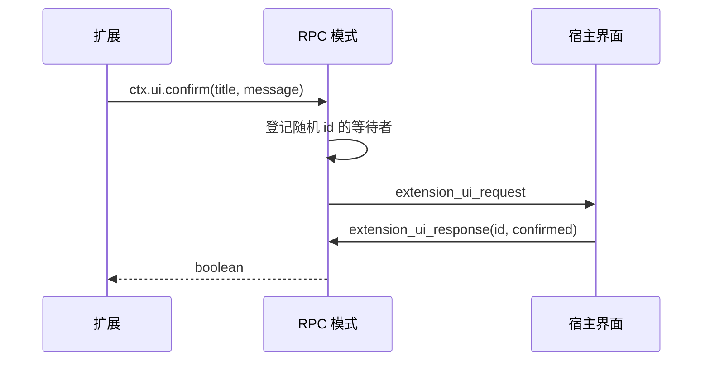

# 第二十一章 SDK、单次运行与 RPC 接入

## 21.1 问题：代理不只由终端用户驱动

同一套代理可能用于命令行回答一个问题，也可能被另一个 Node.js 程序嵌入，或作为子进程接到图形界面。三者共享 `AgentSession`，但输入、输出、用户确认和关闭方式不同。

SDK 是供程序调用的接口；RPC，即 Remote Procedure Call，是让另一端用消息请求操作的机制。本章的经典 RPC 是标准输入输出上的自定义 JSONL 协议，不是第二十二章的 MCP JSON-RPC，也不是后面新运行时的远程协议。

| 接入方式 | 输入 | 输出 | 生命周期 |
| --- | --- | --- | --- |
| 直接 SDK | 方法参数和宿主回调 | 对象、Promise、事件 | 宿主管理创建与释放 |
| print 文本 | 初始提示与后续提示列表 | 最后助手消息的文本 | 处理完后释放运行时 |
| JSON 单次模式 | 同样的提示列表 | 会话头与事件 JSONL | 单次运行后结束 |
| RPC 模式 | 持续接收命令 JSONL | 响应、事件和 UI 请求 JSONL | 标准输入结束或请求关闭时退出 |

## 21.2 代码地图

| 源码 | 主要入口 | 职责 |
| --- | --- | --- |
| [`core/sdk.ts`](https://github.com/earendil-works/pi/blob/11449730c8a733953ce1bcce70e066bccaa778a5/packages/coding-agent/src/core/sdk.ts) | `createAgentSession()` | 建立模型运行时、资源、代理和会话 |
| [`agent-session-runtime.ts`](https://github.com/earendil-works/pi/blob/11449730c8a733953ce1bcce70e066bccaa778a5/packages/coding-agent/src/core/agent-session-runtime.ts) | `AgentSessionRuntime` | 持有当前会话及随目录变化的服务，替换和释放 |
| [`agent-session-services.ts`](https://github.com/earendil-works/pi/blob/11449730c8a733953ce1bcce70e066bccaa778a5/packages/coding-agent/src/core/agent-session-services.ts) | 服务建立 | 围绕目录重建设置、资源和信任等服务 |
| [`modes/print-mode.ts`](https://github.com/earendil-works/pi/blob/11449730c8a733953ce1bcce70e066bccaa778a5/packages/coding-agent/src/modes/print-mode.ts) | `runPrintMode()` | 文本和 JSON 单次运行 |
| [`json-event.ts`](https://github.com/earendil-works/pi/blob/11449730c8a733953ce1bcce70e066bccaa778a5/packages/coding-agent/src/modes/json-event.ts) | `toJsonEvent()` | 去掉线协议中的累积助手快照 |
| [`rpc/jsonl.ts`](https://github.com/earendil-works/pi/blob/11449730c8a733953ce1bcce70e066bccaa778a5/packages/coding-agent/src/modes/rpc/jsonl.ts) | `attachJsonlLineReader()` | 逐行分帧、跨块 UTF-8 解码 |
| [`rpc-types.ts`](https://github.com/earendil-works/pi/blob/11449730c8a733953ce1bcce70e066bccaa778a5/packages/coding-agent/src/modes/rpc/rpc-types.ts) | `RpcCommand`、`RpcResponse` | 命令、状态、响应和 UI 消息 |
| [`rpc-mode.ts`](https://github.com/earendil-works/pi/blob/11449730c8a733953ce1bcce70e066bccaa778a5/packages/coding-agent/src/modes/rpc/rpc-mode.ts) | `runRpcMode()` | 命令派发与远端 UI 适配 |
| [`rpc-client.ts`](https://github.com/earendil-works/pi/blob/11449730c8a733953ce1bcce70e066bccaa778a5/packages/coding-agent/src/modes/rpc/rpc-client.ts) | `RpcClient` | 启动子进程、请求关联和事件辅助方法 |
| [`output-guard.ts`](https://github.com/earendil-works/pi/blob/11449730c8a733953ce1bcce70e066bccaa778a5/packages/coding-agent/src/core/output-guard.ts) | 原始输出队列 | 保持机器输出通道与处理背压 |

## 21.3 createAgentSession 的创建顺序

SDK 先确定工作目录：显式 cwd 优先，其次给定会话管理器的 cwd，再次进程当前目录。用户代理目录也可覆盖。

接着创建或复用 `ModelRuntime`、`SettingsManager`、`SessionManager`、`ResourceLoader`。未提供资源加载器时，构造默认加载器并等待 reload；提供自己的加载器时，SDK 不替调用者再 reload 一次。

从会话当前分支投影恢复消息，并确定初始模型。显式模型优先，否则尝试恢复保存的模型选择及其认证；失败后走默认模型解析，返回可用于界面的 fallback 说明。虚拟模型选择在模型变更条目中恢复，不能只拿最后一个助手消息中的物理模型当作原来的选择。

thinking level，即模型思考等级，按显式参数、已有会话、模型设置和全局默认逐步选择，再按模型能力限制；没有模型时设为 off。

初始工具选择结合显式 allowlist、`noTools`、默认工具设置和 exclude 列表。`noTools: "builtin"` 与 `"all"` 不同：前者禁用默认内置选择，后者用空允许集合。扩展工具和间接调用集合的细节仍须看第八、十六章，不能只检查 `Agent.state.tools` 的一个数组。

最后建立 `Agent`，装入消息转换、请求参数、上下文处理、队列模式和模型请求回调，再建立 `AgentSession` 并返回扩展结果。新会话写入初始模型与思考等级条目；已有会话可能补写缺失的元数据。因此“建立 SDK 对象”也可能涉及资源执行和会话保存，不一定是纯内存操作。

## 21.4 宿主需要明确资源信任与生命周期

SDK 的直接创建路径没有命令行那套完整项目询问流程。默认 `SettingsManager.create()` 把项目视为可信，默认资源加载器会采用这个状态。嵌入程序若接收外部提供的工作目录，应主动构建相应设置、信任和资源服务，不能假设调用 SDK 就自动出现可信确认对话框。

CLI 使用更高层的服务建立与信任解析，见第四、十七章。显式调用旧的扩展发现辅助函数，也不能直接继承默认资源加载器的信任引导。

以下只是说明调用关系的 SDK 示例，运行需要已配置模型与凭据；本次编写教材没有执行这个模型请求：

```ts
import {
  createAgentSession,
  SessionManager,
} from "@earendil-works/pi-coding-agent";

const cwd = process.cwd();
const { session } = await createAgentSession({
  cwd,
  tools: ["read"],
  sessionManager: SessionManager.inMemory(cwd),
});
const unsubscribe = session.subscribe((event) => {
  if (event.type === "message_end") console.log(event.message);
});
try {
  await session.bindExtensions({ mode: "print" });
  await session.prompt("解释当前目录中 package.json 的结构");
} finally {
  await session.abort();
  unsubscribe();
  session.dispose();
}
```

内存会话免去会话日志保存，不会自动禁用资源加载、模型联网或工具对磁盘的访问。调用者自己的权限方案仍需覆盖这些能力。

## 21.5 模型请求的回调如何穿过 SDK

SDK 把设置中的提供商重试、HTTP 空闲超时、WebSocket 连接超时等合并到请求选项。显式请求选项优先；配置的 HTTP 空闲超时为零时，会用接近 Node 定时器上限的值表达这一请求层行为，不能因此推导“所有等待都没有超时”。

请求头先加入提供商归属等信息，再让扩展原地调整。请求 payload、响应头和原始流事件也通过相应扩展事件；这些位置见第六、十六章。

消息转换动态读取 `blockImages`。启用时，用户与工具结果里的图像会被文本占位符替代，并合并相邻占位文字。这是发送前的防御路径，原始会话记录或工具已经产生的图像不因此被删除。

SDK 还连接缓存预热器。会话主请求可登记预热上下文，并检查当前模型选择及消息前缀是否仍匹配；压缩与总结有独立路由编号，不统一替换该主请求缓存。预热的实际调度和模型适配，不能仅根据 SDK 这几个回调推导全部保证。

## 21.6 单次运行：输入顺序、输出与退出码

`runPrintMode()` 绑定扩展与会话事件，先处理非空初始提示，再逐个等待后续提示。这里提示列表顺序明确，不是同时启动多个 `prompt()`。

文本模式最后检查会话最后一个消息。如果是助手正常完成消息，只输出其中 text 内容；思考和图像不是这条最终文本输出。如果助手结束原因为 error 或 aborted，向标准错误写说明并返回失败退出码。最后消息不是助手时，不会在这里自动搜索更早的助手消息补输出。

JSON 模式先输出会话 header，再输出发生的事件。它没有文本模式同一段最后助手 stopReason 的退出码判断；某些由错误事件表达的失败未抛出时，不能只依靠 JSON 模式退出码识别请求是否成功。

一般抛出的异常返回失败；finally 清理信号处理器、释放运行时并刷新原始输出队列。SIGTERM 和非 Windows 的 SIGHUP 还有关闭路径，处理跟踪的子进程与相应退出码。释放本身抛错时，也可能影响 finally 后面的刷新步骤，不能把异常清理视为绝不失败。

## 21.7 JSONL 分帧与增量事件

JSONL 表示每行一个 JSON 记录。本实现只以 LF，即 `\n`，分记录；行尾的 CR 被去掉，所以允许 CRLF。`StringDecoder` 保留不完整 UTF-8 字节，避免跨两次数据读取的中文字符变成损坏字符。流结束时，最后没有换行的非空片段也交给回调。

```text
data 块 1：半个中文字符 + 半个 JSON
data 块 2：剩余字符 + JSON 结尾 + \n + 下一条开头

解码器先保留字符边界，字符串缓冲再按 LF 取完整记录。
```

JSON 字符串里的字面 U+2028、U+2029 不应被接收方误当成换行分帧。这个 reader 没有设置未完成行的大小上限；MCP 标准输入输出传输的 16 MiB 限额不能套到这里。

流式输出还面临一个成本问题：若每个增量事件都带“目前全部助手文本”，总传输量可能随文本增长反复累加。`toJsonEvent()` 因此删除 message_update 中的累积消息与事件 partial，只保留增量、固定大小的 usage、索引和必要身份。

`toolcall_start` 从 partial 的对应内容位置取出工具编号和名字，放入线事件。普通 start 提供初始消息，增量逐步构造，`message_end` 的完整消息是最终权威结果。客户端应理解这三段关系，不能指望每条 delta 都是可独立显示的完整消息。

## 21.8 RPC 请求响应与 prompt 的真实含义

教学命令：

```json
{"id":"r1","type":"prompt","message":"解释 package.json"}
```

响应可能是：

```json
{"id":"r1","type":"response","command":"prompt","success":true,"data":{"disposition":"accepted"}}
```

这里 success 表示提示通过前置处理，不表示模型已经回答。`prompt` 分支启动异步会话请求，由 preflight 回调发权威响应。前置阶段失败会发失败响应；已接受后发生的运行错误通过后续事件表达，不为同一命令再补第二条失败响应。

disposition 要区分输入被处理、被排队或被接受运行。扩展完全处理输入时可能没有模型运行，调用者不能固定等待一个本次请求对应的 `agent_settled`。

其他命令覆盖模型选择、思考级别、队列、压缩、重试、bash、会话切换、分支、导出和状态查询。`get_entries` 返回追加顺序条目及 leaf；指定 since 时只取该条目之后，不等于当前分支上下文。`get_tree` 返回树，`get_messages` 返回当前消息视图；三者对应第十三章的不同状态。

RPC 命令类型在入口主要通过类型断言使用，没有一份统一运行时 schema 校验。正确 JSON 也可能不是正确命令对象，不能因为 TypeScript 联合类型存在就推导任何远端输入都被全面验证。

## 21.9 命令并发与会话替换

JSONL reader 对每行调用 `void handleInputLine(line)`，没有等待上一条命令结束再读下一条。这样长时间 bash 或 prompt 进行时，abort、UI 回答和状态查询可以进入。

```text
收到 bash → 等待进程输出
收到 get_state → 可先返回状态
收到 abort_bash → 通知终止
之后 bash 才返回结果
```

代价是不能假设会话变更、设置修改和多个控制命令天然串行。响应顺序也不能代替请求 id 的关联。这里没有给所有命令添加事务锁；各操作仍依赖会话与运行时自身的约束。

`AgentSessionRuntime` 替换会话时，先中止并保存旧运行，再发 shutdown、失效旧上下文，然后创建新运行时、应用并重新绑定。创建新运行时失败会向调用者传播，不自动回到原来的有效会话。

当前 RPC 成功替换会话还有一个具体执行顺序：runtime 的替换完成回调会 rebind，相关 RPC 命令分支又显式 rebind 一次。`bindExtensions()` 每次都会发 session_start 并发现扩展资源，因此根据实现可推导，某些成功替换路径会重复启动通知。事件订阅会先取消旧订阅，但这不等于启动处理器本身只执行一次。此结论来自执行路径分析，没有在本次编写中运行完整 RPC 替换集成实验。

## 21.10 扩展 UI 通过消息往返

RPC 给扩展提供可对话 UI：select、confirm、input 生成随机 id，登记等待者，发 `extension_ui_request`；宿主显示界面后发同 id 的 `extension_ui_response`，服务器完成对应 Promise。



select、confirm、input 支持取消信号与超时，结束时删除等待项，返回对应默认值。这个本地取消没有专门发送一个“取消已显示对话框”的线消息，宿主应管理自己的 UI 状态。editor 使用另一条等待路径，没有相同 options 超时接口。

notify、状态、文字 widget、标题和编辑器文字属于无需响应的通知。TUI 组件工厂、原始终端输入、页眉页脚、主题切换等在 RPC 中不支持或为空动作。同步 `getEditorText()` 不能等远端回答，返回空文本，宿主需要自己记录编辑状态。

待 UI 请求表没有在每次会话重绑时统一结算为取消。不能仅根据旧扩展 API 失效，就认为所有等待界面的 Promise 自动结束。

## 21.11 RpcClient 的方便方法与边界

`RpcClient.start()` 启动 PATH 中的 `node`，默认 CLI 相对路径是 `dist/cli.js`，可覆盖 cwd、环境、提供商、模型和参数。它等待约一百毫秒检查进程是否已退出，这不是与服务器握手的 ready 屏障。

请求分配 `req_N` id，先登记等待项和三十秒响应计时器，再把序列化命令写到 stdin。响应按 id 找等待者；进程错误、退出或输入管道错误拒绝当前待响应项。超时只删除本地请求并拒绝，不自动向代理发送取消命令，也不证明远端停止执行。

便利方法分为两类：需要数据的方法调用 `getData()`，检查 success 后返回字段；某些只等待 `send()` 的 void 方法没有进一步检查失败响应。`send()` 自己收到失败响应仍会 resolve，因此不能把所有便利方法都解释为“服务器 success=false 时必抛错”。

stdout 接收函数把匹配响应交给请求等待者，其他可解析行当作事件传给订阅者。迟到或未知响应没有统一的严格错误通道，也可能进入事件监听器。监听器按快照迭代，取消订阅不会跳过下一位；但监听器抛错被外围 catch 捕获，也会让同一行后面的监听器没有机会执行。

`waitForIdle()` 和 `collectEvents()` 是等下一次 `agent_settled` 的事件方法，不会先查询当前是否已经空闲。`promptAndWait()` 先订阅避免漏掉快速事件，但没有根据 handled disposition 提前结束；没有启动运行的提示仍可能等到超时。

停止客户端时，先脱离 stdout、发 SIGTERM，再以约一秒后的强制终止作为后备。进程退出与停止流程之间的时序仍影响待响应请求清理。客户端积累 stderr 没有固定容量限额，方法超时也没有与整个子进程生命周期组成统一事务。

这份便利客户端主要表达命令与代理事件；要完整实现扩展 UI 往返，宿主还需要处理对应消息类型和输入响应，不能只拿它的代理事件类型声明当成完整 UI 协议支持。

## 21.12 标准输出背压与关闭

背压是消费者读得较慢时，生产者需要暂缓继续输出。RPC 占用 stdout 为机器通道，普通日志转到其他路径，协议消息走 `writeRawStdout()`。命令响应后等待输出压力缓解，代理事件链也插入背压等待；第十二章解释这个队列与真实 stream.write() 的关系。

JSON CLI 在启动层也会保护机器输出。直接调用 `runPrintMode()` 的宿主则要考虑自己是否已建立同样输出环境，不能只根据 CLI 表现推导该函数自动完成所有全局保护。

标准输入结束触发关闭，释放运行时并暂停输入，然后退出。这条路径没有等待所有已经启动的 `handleInputLine()` 逐项完成的总队列；末尾无换行记录的读取与 end 关闭也会共享这一时序。SIGTERM 关闭路径有意不等待全部 stdout 刷新。客户端不能假设任何关闭方式都必然收到最后所有事件。

## 21.13 已验证的机制与练习

本章完整阅读 SDK、运行时及单次、JSON、经典 RPC 的源码。用实际 JSONL reader 和事件转换模块做了三组无依赖实验：跨块 UTF-8 与 Unicode 分隔符、工具开始身份与累积快照删除、完整消息保留及无效事件形状检查；均通过。没有启动真实模型请求或完整 RPC 子进程集成测试。

练习：

1. 为什么 prompt success 与 agent_settled 必须分别处理？给出扩展 handled 的反例。
2. 如果一条 bash 命令阻塞全部后续输入，用户取消和扩展确认会发生什么？
3. 按 id 关联响应，为什么比按到达顺序关联可靠？
4. JSONL 的中文跨块解码与记录分帧各由哪一层负责？
5. 为什么删除每个 delta 的累积快照能降低长回答的传输成本？
6. SDK 内存会话、只读工具选择和项目信任分别控制什么？
7. 设计宿主 UI 时，如何处理本地确认超时、进程退出和已经显示的对话框？

理解这些接入规则后，后面分析新运行时协议时，就能比较服务状态、消息可靠性和恢复语义，而不把所有名称含 RPC 的实现当成同一个系统。
