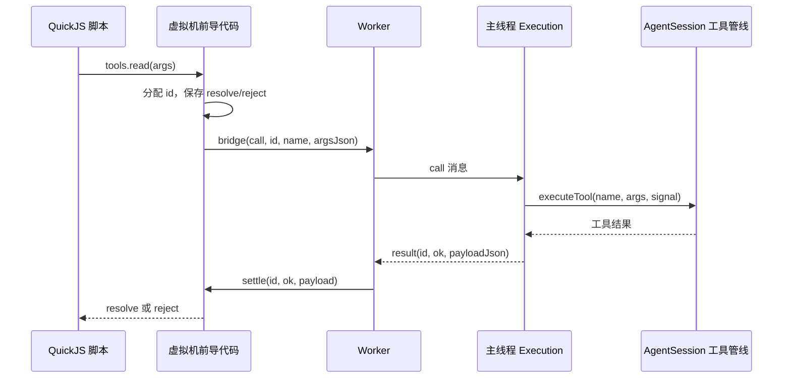

# 第二十三章 让模型用 JavaScript 组织工具调用

## 23.1 问题：一次模型往返只能组织很少的工作

假设模型需要读取三个互不依赖的文件，然后只留下包含某个函数名的段落。如果每次工具调用的完整结果都进入对话，模型需要处理大量原文；如果依次等三个结果，还会增加等待时间。Pi 的 `codemode` 允许模型提交一段 JavaScript，在其中调用工具、等待结果、过滤数据，并明确选择交给模型的输出。

以下是教学示例。它假定三个路径都存在，且 `read` 是当前会话允许脚本调用的工具：

```js
const paths = ["src/a.ts", "src/b.ts", "src/c.ts"];
const results = await Promise.allSettled(
  paths.map((path) => tools.read({ path })),
);
for (let i = 0; i < results.length; i++) {
  const result = results[i];
  if (result.status === "fulfilled") {
    text({ path: paths[i], lines: result.value.split("\n").filter((line) => line.includes("createSession")) });
  } else {
    text({ path: paths[i], error: String(result.reason) });
  }
}
```

这里的 `tools.read()` 是桥接后的异步函数。JavaScript 本身并没有获得 Node.js 文件系统 API。真正读取文件的仍然是第九章的宿主工具。脚本负责组织调用，工具负责实际能力；因此工具参数检查、扩展拦截和文件修改队列仍有位置可以执行。

两层实现要分开阅读：独立包 [`packages/codemode`](https://github.com/earendil-works/pi/blob/11449730c8a733953ce1bcce70e066bccaa778a5/packages/codemode/README.md) 提供沙箱和桥接协议；[`coding-agent/src/extensions/codemode`](https://github.com/earendil-works/pi/blob/11449730c8a733953ce1bcce70e066bccaa778a5/packages/coding-agent/src/extensions/codemode/index.ts) 把它接入 `AgentSession`、工具集合、会话分支和终端界面。

## 23.2 代码地图

| 文件 | 要追踪的入口 | 负责的行为 |
| --- | --- | --- |
| [`codemode/src/types.ts`](https://github.com/earendil-works/pi/blob/11449730c8a733953ce1bcce70e066bccaa778a5/packages/codemode/src/types.ts) | `CodemodeTool`、`CodemodeResult` | 宿主工具、运行选项、输出和错误类型 |
| [`source.ts`](https://github.com/earendil-works/pi/blob/11449730c8a733953ce1bcce70e066bccaa778a5/packages/codemode/src/source.ts) | `parseCodemodeSource` | 首行选项、输入检查和行号保留 |
| [`declarations.ts`](https://github.com/earendil-works/pi/blob/11449730c8a733953ce1bcce70e066bccaa778a5/packages/codemode/src/declarations.ts) | `renderToolSignature`、`schemaToType` | 把 JSON Schema 写成供模型阅读的 TypeScript 声明 |
| [`runtime/host.ts`](https://github.com/earendil-works/pi/blob/11449730c8a733953ce1bcce70e066bccaa778a5/packages/codemode/src/runtime/host.ts) | `CodemodeSandbox`、`Execution` | 创建 Worker、分派真实工具、截止时间和取消 |
| [`runtime/worker.ts`](https://github.com/earendil-works/pi/blob/11449730c8a733953ce1bcce70e066bccaa778a5/packages/codemode/src/runtime/worker.ts) | `main`、`drain` | 在 Worker 内启动 QuickJS，处理虚拟机任务 |
| [`runtime/prelude-source.ts`](https://github.com/earendil-works/pi/blob/11449730c8a733953ce1bcce70e066bccaa778a5/packages/codemode/src/runtime/prelude-source.ts) | `caller`、`settle`、`run`、`store` | 脚本可见的工具函数、输出函数和 Promise 桥接 |
| [`runtime/protocol.ts`](https://github.com/earendil-works/pi/blob/11449730c8a733953ce1bcce70e066bccaa778a5/packages/codemode/src/runtime/protocol.ts) | 两个消息联合类型 | Worker 与主线程之间的请求、结果、输出和结束消息 |
| [`wasm.ts`](https://github.com/earendil-works/pi/blob/11449730c8a733953ce1bcce70e066bccaa778a5/packages/codemode/src/wasm.ts) | `loadQuickJSWasm` | 缓存编译后的 WebAssembly 模块 |
| [`extensions/codemode/tool.ts`](https://github.com/earendil-works/pi/blob/11449730c8a733953ce1bcce70e066bccaa778a5/packages/coding-agent/src/extensions/codemode/tool.ts) | `createCodemodeToolDefinition`、`prepareCodemodeLoadout` | 模型看见什么工具、提示说明和语法约束 |
| [`extensions/codemode/execute.ts`](https://github.com/earendil-works/pi/blob/11449730c8a733953ce1bcce70e066bccaa778a5/packages/coding-agent/src/extensions/codemode/execute.ts) | `executeCodemode` | 调用会话工具、保存状态、整理最终输出 |
| [`extensions/codemode/renderer.ts`](https://github.com/earendil-works/pi/blob/11449730c8a733953ce1bcce70e066bccaa778a5/packages/coding-agent/src/extensions/codemode/renderer.ts) | `codemodeRenderers` | 显示脚本和嵌套调用状态 |

## 23.3 先解释两个运行环境

Node.js 的 Worker 是同一进程中的另一条执行线程。它有自己的 JavaScript 执行环境，可以接收主线程消息。Pi 用它承载沙箱：即使脚本进入同步死循环，主线程仍有机会处理超时。

QuickJS 是另一种 JavaScript 引擎；这里的实现通过 WebAssembly 模块运行它。WebAssembly 可以先编译成模块，再实例化执行。Pi 缓存的是编译后的模块，不是脚本的全局变量：每次 `execute()` 都新建 Worker、WebAssembly 实例和 QuickJS 虚拟机。两次脚本中的 `globalThis.x` 因此不共享。

宿主不是把 Node.js 的 `globalThis` 复制给脚本。Worker 建立虚拟机，注入有限的桥接函数，再执行脚本。脚本没有现成的 `process`、`require`、`fetch`、定时器或 Node.js 模块加载能力。`eval()` 和 `Function()` 生成的代码仍在同一个 QuickJS 虚拟机里运行，不能因此获得宿主的文件系统。

这并不消除已注入工具的权限。如果宿主注册了能写文件或联网的工具，脚本可以通过这些工具产生相应效果。权限边界由“宿主允许暴露哪些能力，以及真实工具怎样检查请求”共同决定。沙箱不是为所有被调用工具增加文件系统事务，也不是独立的操作系统进程隔离。

`loadQuickJSWasm()` 按传入的文件路径字符串缓存加载 Promise。成功后复用编译结果；加载失败会删除该缓存项，允许后来重试。路径没有在这里统一成 `realpath`，不同路径别名不一定命中同一个缓存键。

## 23.4 输入是一段函数体，选项只读第一行

Worker 把代码放入类似 `(async (tools, console) => { ... })` 的函数中。因此顶层 `await` 和 `return` 可用，但输入不是一份任意 ES Module，也不会先执行 TypeScript 编译。给模型看的 TypeScript 声明只是使用说明；脚本仍须提交 JavaScript。

代理扩展支持以下首行：

```js
// @options: {"max_output_tokens": 2000, "timeout_ms": 30000}
const content = await tools.read({ path: "package.json" });
text(content);
```

`parseCodemodeSource()` 的行为很具体：

1. 空白输入直接报错。
2. 只检查第一行，允许前导空格；第二行的同名注释不会变成配置。
3. 首行后的内容必须是非空代码；选项内容必须是 JSON 对象。
4. 只接受 `max_output_tokens` 和 `timeout_ms`。前者允许零，要求非负安全整数；后者要求正整数，最大为 `2_147_483_647`，对应 Node.js 定时器延迟上限。
5. 选项行被替换为空行，后续代码的行号保留。

独立 `CodemodeSandbox` 不自动识别这条注释。它接收已经准备好的代码和运行选项。解析注释是 `coding-agent` 扩展这一层的职责。

支持语法约束的模型可按 Lark 文法输出原始代码；普通 JSON 工具调用仍可通过 `{ code: "..." }` 参数进入执行。文法主要约束外形，不会证明代码语义正确，也不替代选项 JSON 的运行时检查。

## 23.5 一次工具调用怎样穿过两层 Promise

从 `await tools.read({ path: "a.ts" })` 开始，按以下轨迹读代码：



前导代码的 `caller()` 为每次调用建立 Promise，用递增的数字 `id` 将回调存入 `pending`。它把参数序列化成 JSON 文本，调用藏在闭包里的 `bridge`。Worker 只把消息发给主线程，不在此处执行真实工具。

主线程的 `handleCall()` 查找工具，解析参数，为该调用新建 `AbortController`，然后 `await tool.execute()`。工具返回值再次经过 JSON 序列化，发回 Worker。`settle()` 通过 `id` 找回原 Promise，解析成功值，或把失败文本包装成脚本环境中的 `Error`。

这解释了为何返回值通常是数据副本：函数、对象原型和共享对象身份不会按普通 JSON 往返保存；循环引用和 `BigInt` 等无法直接序列化的值可能导致失败。数组中的 `undefined` 经 JSON 会成为 `null`。工具作者不能把这些桥接函数当成同一 JavaScript 环境里的直接函数调用。

Worker 每次处理结果后调用 `drain()`，执行 QuickJS 等待中的 Promise 任务。若脚本还没结束，既没有可执行的任务，也没有等待宿主返回的调用，则 `stalled()` 判断它永远不会继续，例如 `await new Promise(() => {})`。由于虚拟机没有定时器或其他 I/O 来唤醒它，可以立即报告错误。若还有真实工具在等待，就不能据此判断停滞。

协议文件中的消息判别函数只检查对象的 `type` 是否属于已知值，并非完整的 JSON Schema 校验。这里的协议用于程序内部创建的 Worker，不应被当成可直接开放给任意网络输入的完整验证器。

## 23.6 并发由脚本和下层工具共同决定

`handleMessage()` 收到 `call` 后启动异步 `handleCall()`，没有先等待前一个调用。下面这段会发起两个宿主请求：

```js
const [a, b] = await Promise.all([
  tools.read({ path: "a.ts" }),
  tools.read({ path: "b.ts" }),
]);
text({ a, b });
```

`Promise.all()` 保留结果数组的输入顺序，不保证实际完成顺序；一个失败时会拒绝整个聚合 Promise，也不会自动撤销已完成的另一个调用。`Promise.allSettled()` 适合明确检查每个成功和失败。

是否能真正同时执行，还取决于 `ctx.executeTool()` 的调度和工具内部机制。第八章的嵌套工具管线负责会话层的顺序与拦截；第十一章的文件队列负责同一文件的修改顺序。脚本发出两个请求，不会绕过这些队列，也不能扩大它们已有的跨进程保证。

宿主在开始运行时复制 `toolsByName` 为一个 Map 快照。运行中向沙箱注册或注销工具，不会把新工具插进这个脚本已经获得的快照。独立沙箱支持多次 `execute()` 并行；它不会给这些脚本自动添加共享状态锁。

工具名称要转换成合法的 JavaScript 标识符。例如 `my-tool` 转成 `my_tool`。不同名称可能归一化为同一标识符，前导代码采用“第一个占据这个键”的规则，而不是报重复标识符错误。原始名称也尝试成为可用的方括号别名；但若原始名称本身已被先前的归一化键占据，也不会再覆盖。`my-tool` 先于 `my_tool` 注册时，`tools.my_tool()` 和 `tools["my_tool"]()` 都可能指向前者。宿主设计工具名时需要避免此类碰撞。

## 23.7 取消为什么不等于回滚

`Execution.finish()` 是幂等的：第一个结束原因胜出，后续 Worker 退出或工具返回不会再次结算结果。结束时它清除超时、移除外部取消监听、向所有待处理宿主调用发出取消信号并清空登记表。它还设置共享内存中的中断标记，然后终止 Worker。

共享内存只有一个 `Int32`。QuickJS 的中断回调读取这个值，辅助停止正在 WebAssembly 内部运行的代码；源码注释明确指出它用于处理 Bun 下单靠 `worker.terminate()` 无法终止 WebAssembly 忙循环的情况。结果 Promise 在 Worker 终止流程结束后交付，但它不等待所有宿主工具都实际退出。

由此可以推导以下轨迹：

```text
脚本调用 write → 宿主已写入文件 → 脚本进入下一项耗时操作
用户取消 → finish() 中止虚拟机并发出工具取消信号
最终结果为 aborted，但此前 write 的内容仍然存在
```

取消信号需要下层工具配合；已经提交的文件写入不能用取消信号倒转。忽略信号的宿主工具甚至可能在脚本结果返回后继续产生效果。`calls` 中的 `cancelled` 表示脚本结束时不再等待这项调用，不是操作系统已经证明该操作无效果。

同样，未 `await` 的工具也已经可能启动：

```js
tools.write({ path: "a.txt", content: "changed" });
return "done";
```

脚本返回后，待处理调用会收到取消信号，但不能依赖它阻止这次写入。正确的组织方式是等待所有需要完成的调用，并显式检查结果。

独立包默认总超时为五分钟；代理扩展显式把默认值改为 `Infinity`，除非首行指定 `timeout_ms`。这两个默认值不能混写。截止时间包括准备 WebAssembly、脚本计算和等待真实工具的时间。代理扩展同时为 QuickJS 配置 256 MiB 堆限额，独立包则由调用方决定；堆限额不等于整个 Node.js 进程的内存上限。

## 23.8 `store()` 保存的是成功脚本的分支状态

单次脚本初始化时取得 `store` 快照。`store(key, value)` 立即序列化值，`load(key)` 每次重新解析，因此读取到的是副本；修改读取结果不会自动写回。传 `undefined` 表示删除键。当前限制按 JSON 字符串长度计数：单值最多 256 Ki 字符，整个存储连同键名最多 1 Mi 字符，计量单位不是 UTF-8 字节。

前导代码另外记录这次运行的写集合。成功返回或 `exit()` 才把写集合放入成功结果；异常、超时和取消结果不带提交用的 `storeWrites`。`exit()` 先发送成功，然后用内部标记抛出控制流异常；即使脚本捕获该标记，已结算的运行也不会继续积累输出。

代理的 `readCodemodeStore()` 从当前会话分支根部向叶子扫描 `codemode-store` 自定义条目，先应用删除，再应用设置。脚本成功且写集合非空时，扩展追加一个自定义会话条目。它没有覆盖整份会话文件，因此分叉后每条路径读到的是自己祖先写过的值。

这只是状态提交，不是包含真实工具效果的事务：

```text
store("counter", 2) → write("a.txt") 成功 → throw Error
结果：counter 没有保存；a.txt 已经修改
```

而且 `store()` 没有比较版本或原子递增 API。根据实现可推导：若调用方并行运行两个脚本，二者都读取 `counter = 1` 并保存 `2`，之后按顺序应用两组写入仍得到 `2`。提交增量避免覆盖无关键，却不能解决同键的读改写冲突。独立沙箱也不会自行保存这些写集合；它把集合交给调用方。没有会话上下文时，代理脚本从空状态开始且不持久化写入。

## 23.9 声明、工具发现与实际可调用集合

`renderToolSignature()` 把 JSON Schema 转成模型可读的 TypeScript：必填属性没有 `?`，可选属性带 `?`，数组、联合类型、本地 `$ref` 都有相应转换。远程或重复递归引用降为 `unknown`；本地引用扩展次数上限为 32，默认输入声明超过 16,000 字符也降为 `unknown`，避免提示无限增长。这些转换不是运行时参数验证。

工具上下文的真实来源是 `AgentSession` 提供的 callable 集合。`codemode` 自身设为 `model-only`，脚本也过滤同名工具，避免脚本递归启动另一个 `codemode`。经典会话通过 `ctx.executeTool()` 执行嵌套调用，因此仍经过参数验证、`tool_call`、`tool_result` 和相应的拦截机制。具体能否被阻止，取决于已安装扩展和工具自己的检查。

默认 `on` 模式保留直接工具的模型声明，并在其说明中标注脚本调用方式；`only` 模式把可调用的直接工具声明隐藏，让模型主要通过脚本组织工作。隐藏声明改变模型看见什么，不会自动取消脚本对该工具的调用资格。

内联说明默认预算约为 3,000 token，按四字符一个 token 估算。工具按命名空间分组，每轮各组选剩余说明中最便宜的一项；某组下一项放不下时，该组退出，其他组继续。这不是保证每个命名空间一定能列出的公平调度：预算不足时，后面的组仍可能没有名额。说明前言、共享类型和命名空间标题也没有一起纳入这个工具段落预算。

`deferred` 工具的声明不列进 `codemode` 说明，减少 MCP 连接变化导致提示变化；它们仍可通过 `ALL_TOOLS`、`searchTools()` 和 `describeTool()` 查到。脚本里的 `searchTools()` 只查询当前脚本快照，不改变模型的活跃工具集。独立的 `tool_search` 工具则会激活搜索结果，使下一次模型请求增加声明，两者的效果不同。

共享的 [`tool-search/tool.ts`](https://github.com/earendil-works/pi/blob/11449730c8a733953ce1bcce70e066bccaa778a5/packages/coding-agent/src/extensions/tool-search/tool.ts) 使用 BM25 文本排序：先切分驼峰、转小写、去英语停用词、做简单单复数归一化，再结合词频、文档频率和长度计分。当前分词字符集只保留 `a-z0-9`；纯中文查询可能没有有效词元。这不是向量检索，也没有调用模型进行语义重排。

## 23.10 哪些结果会进入模型

独立包把 `text()`、`console.*` 和 `image()` 收集为输出数组，同时单独返回脚本 `return` 的值。代理扩展会把非 `undefined` 的返回值也追加成文字。因此单独使用独立沙箱时，不能假定 `return` 自动出现在 `output` 中。

经典工具没有 `outputSchema` 时，脚本收到各文字块拼接后的字符串。有 `outputSchema` 且结果携带 `structuredContent` 时，脚本收到该结构化值，甚至可以收到含错误标记的结构化结果；其余失败会转成可捕获的异常。需要检查所用工具的具体声明，不能假定任何错误结果都会直接 reject。

嵌套结果供脚本处理，最终模型主要看脚本选择的输出；每次嵌套调用的原始结果不会因此自动展开为模型对话中的独立工具结果。终端则可显示调用名、最多 200 字符的参数预览、状态和耗时，展开后显示最多 500 字符的错误预览。折叠状态只保留最近八次调用和有限的代码、输出行数，减少界面滚动。

前导输出辅助函数限制合计 16 Mi 字符和 100,000 条输出，空字符串同样计入条数。超过时先结算失败再抛异常，因此用 `try/catch` 吞掉异常也不能继续打印。图片必须是内联 base64 数据；格式通过 PNG、JPEG、GIF、WebP 的文件头特征识别，并覆盖声明的 MIME 类型。这种检查不是完整图片解码，不能据此保证所有被接受图片都完整有效。

代理扩展另有默认 10,000 token 的文字输出预算，仍按四字符估算。超过后拼接所有文字，保留前后两段，把完整文字写到随机临时文件，并在结果中给出路径；图片移到文字之后。提示、文件路径和图片本身不受这段文字预算精确计量，所以 `max_output_tokens: 0` 也不表示工具结果完全没有文字。临时文件写失败会返回说明；这里没有统一的自动清理生命周期。

## 23.11 脚本调用模型还有一层限额和认证边界

扩展可注入 `models` 命名空间，提供目录查询、分类器和图片生成接口。脚本拿到的模型信息去掉 `headers`，避免把可能携带凭据的请求头直接传进虚拟机。真正执行分类或图片生成时，只采用脚本提供的 `provider` 与 `id`，重新从宿主目录解析模型；脚本自行伪造的 `baseUrl` 或 `headers` 不会直接获得宿主凭据。

分类上下文和图片输入在宿主先做结构检查，再交给模型运行时。`models.classify()` 与 `models.generateImages()` 共享一个脚本内的四项并发限额：维护活跃数和等待队列，完成时在 `finally` 中释放并唤醒下一项。这个限额不适用于普通工具，也不是整个进程所有脚本合计只能发四个模型请求。

每项模型调用记录状态、耗时和用量，合并到这次 `codemode` 工具结果。下层返回 `stopReason: "error"` 时，记录会标为失败，但结果仍可交给脚本检查，不能把它等同于桥接函数必然抛异常。图片生成只产生数据；脚本必须对需要显示的图片调用 `image()`。若生成了图片而最终输出没有任何图片，扩展会添加提醒。

## 23.12 验证与练习

本章通读了 `pi-codemode` 的全部实现和三个测试文件，以及经典代理的 `codemode`、`tool-search` 集成。测试源码包含无限循环、微任务循环、取消、别名碰撞、状态副本、输出限额和宿主全局隔离等案例；本次没有运行这些完整沙箱测试，不能把安装依赖视为已通过验证。

另外，初版曾使用 Node.js 24 直接导入项目的纯函数，记录了八项检查（临时脚本未保留，见附录 B.2）：选项行保留行号、只识别首行、零输出预算、定时器上限、未知选项拒绝、名称归一化碰撞、递归类型终止和声明长度降级，均通过。递归 `$ref: "#"` 的具体输出会先展开一层，再把重复引用降为 `unknown`；这也是只看注释容易忽略的细节。这些检查不证明 Worker 或真实工具取消行为已经测试通过。

1. 把本章第一个示例的 `Promise.allSettled()` 改成 `Promise.all()`。某个读取失败时，最终输出有什么不同？此前成功读取是否被撤销？
2. 追踪 `tools.write()` 从脚本到第十一章文件队列的路径。分别写出“脚本开始执行”“工具取得文件队列位置”“文件写入完成”“脚本提交 store”四个时刻。
3. 两个脚本同时对相同 `store` 键进行加一，为什么保存增量仍不足以保证最终加二？设计一个比较版本接口，并说明应当在哪一层执行比较和写入。
4. 修改脚本，让图片生成后只打印 `result` 的 JSON。为什么这不等于给模型显示图片？
5. 分别查看 `searchTools()` 和 `tool_search`。哪一个会改变下一次模型请求的工具声明，哪一个只查脚本已有目录？

这些问题共同要求读者区分计算隔离、能力暴露、调用调度、状态提交和外部效果。它们在这套代码中分别由不同模块承担。

## 23.13 BM25 的分数怎样算出来

问题是“搜索 issue 工具”为什么某项排前面。当前 Bm25Ranker 默认 k1=1.2、b=0.75；查询先去重，所以 `issue issue` 不会把分数算两遍。对一个词，分数为 `idf × tf × (k1+1)/(tf+norm)`，idf=`ln(1+(N−df+0.5)/(df+0.5))`，norm=`k1×(1−b+b×文档长度/平均长度)`。tf 是该文档词频，df 是含该词的候选文档数，N 是本次候选总数。

下面是 rank 方法实际累积分数与排序的部分；前面已经建立 termCounts、lengths、averageLength 和 idf：

源码定位：[packages/coding-agent/src/extensions/tool-search/tool.ts](https://github.com/earendil-works/pi/blob/11449730c8a733953ce1bcce70e066bccaa778a5/packages/coding-agent/src/extensions/tool-search/tool.ts#L144)，第 144—155 行。

<!-- source-lines: packages/coding-agent/src/extensions/tool-search/tool.ts:144-155 -->
```ts
		const matches: ToolSearchMatch[] = [];
		documents.forEach((document, index) => {
			let score = 0;
			for (const term of queryTerms) {
				const count = termCounts[index].get(term);
				if (!count) continue;
				const norm = this.k1 * (1 - this.b + (this.b * lengths[index]) / averageLength);
				score += (idf.get(term) ?? 0) * ((count * (this.k1 + 1)) / (count + norm));
			}
			if (score > 0) matches.push({ name: document.name, score });
		});
		return matches.sort((a, b) => b.score - a.score).slice(0, limit);
```

为了能够手算，先直接传入三个 ToolSearchDocument，不使用实际元数据拼接：

| 名称 | 文档 text | 长度 | issue 词频 |
| --- | --- | ---: | ---: |
| read_issue | issue issue read | 3 | 2 |
| create_issue | issue create | 2 | 1 |
| weather | weather forecast | 2 | 0 |

查询 `issues` 被简单词干化为 issue。N=3、df=2、平均长度=7/3，idf=ln(1.6)=0.4700036292。read_issue 的 norm=1.4571428571、分数=0.5981864372；create_issue 的 norm=1.0714285714、分数=0.4991762683；weather 分数为零，不进入返回数组。最后按降序 slice(limit)，相同分数保留输入顺序。

实际文档由 createToolSearchDocument 拼接工具原名、下划线转空格的名称、description、schema 属性名/description、items/联合分支和 namespace 说明。这会改变长度和词频；工具名因此可能贡献不止一次词频。上表是 ranker 的固定输入数值，不能冒充真实 MCP 元数据的分数。

当前分词只保留 ASCII 字母与数字，纯中文 `查询问题` 得到空词元并返回空匹配。复数归一化只是少数后缀规则，不是完整语言分析；namespace instructions 也只是搜索文本，不会因匹配就获得更高执行权限。要增加中文或语义检索，应替换分词/ToolRanker 并验证排序与激活行为，当前实现没有 embedding 模型或向量库。

## 23.14 排名以后怎样影响下一次模型调用

以下是 searchAndLoad 完整生产函数：

源码定位：[packages/coding-agent/src/extensions/tool-search/tool.ts](https://github.com/earendil-works/pi/blob/11449730c8a733953ce1bcce70e066bccaa778a5/packages/coding-agent/src/extensions/tool-search/tool.ts#L200)，第 200—214 行。

<!-- source-lines: packages/coding-agent/src/extensions/tool-search/tool.ts:200-214 -->
```ts
function searchAndLoad(
	tools: NonNullable<ToolSearchToolOptions["tools"]>,
	query: string,
	limit: number,
): ToolSearchResultTool[] {
	const active = tools.getActiveTools();
	const candidates = tools.getAllTools().filter((tool) => isSearchable(tool.exposure) && !active.includes(tool.name));
	const documents = candidates.map((tool) => createToolSearchDocument(tool, tool.namespace));
	const matches = new Bm25Ranker().rank(query, documents, limit);
	if (matches.length > 0) tools.setActiveTools([...active, ...matches.map((match) => match.name)]);
	return matches.map((match) => ({
		name: match.name,
		description: candidates.find((tool) => tool.name === match.name)?.description ?? "",
	}));
}
```

先取 active 快照，再筛出 exposure 为 codemode/deferred 且尚未 active 的工具；BM25 的 N 与 df 都针对这个候选集计算，而不是全注册表。若匹配非空，setActiveTools 在旧列表后追加工具名；返回结果文字只列名称与说明，不直接执行它们。

例如 active=`[read, already]`，注册表还包含 deferred issue_read、codemode issue_create、hidden hidden_issue。查询 issue、limit=2，后两种可搜索工具中的前两项被追加，active 变为 `[read, already, issue_read, issue_create]`（这里两项同分，依注册顺序）；hidden 不加入，already 被排除，不重复激活。下一轮通过第七章的工具差异声明与第八章请求投影增加实际定义；若某提供商只能使用顶层工具列表，则按其能力收敛，而不是强行发送它不支持的中途 additions。

脚本的 searchTools() 则只查脚本开始时的工具快照，不调用这条 setActiveTools。两种搜索复用排序思想，却有不同的状态写入路径。tool_search 默认 limit=8，在 execute 中拒绝空查询和非正整数 limit。

`node labs/run-offline.mjs search` 验证数值、重复查询词、中文空词元、平分稳定顺序、schema/namespace 搜索字段，以及 active 前后变化。工具注册与激活 API 使用内存模拟，故不能据此声称真实 MCP 连接、权限策略或分支恢复已通过集成测试。
