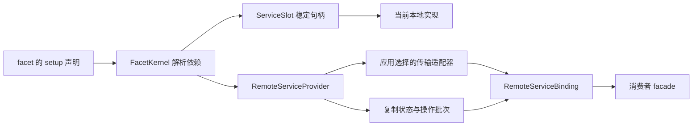
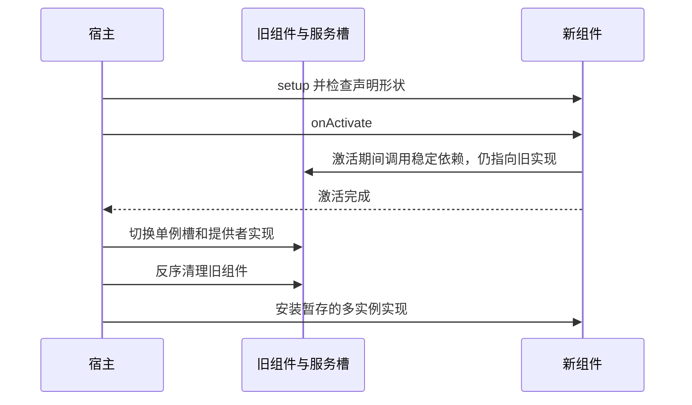

# 第二十四章 Chord：服务组合、热重载与不可变状态

本章解决两个问题。第一，应用由多个模块组成时，模块怎样声明依赖、交换服务，并在替换模块后继续使用原有引用？第二，生产者不停更新状态时，消费者怎样拿到一致的初始快照，再按顺序接收变化？

先看一个具体场景：界面保存了 `const read = service.read`；后台模块被替换后，界面仍调用 `read()`。如果它保存的是旧实现的方法，重载就没有效果。另一个场景是：消费者读取了计数器 10，还没安装监听器，生产者已经更新到 11；随后只收到 12 的增量，就会永远漏掉一次变化。Chord 分别用稳定服务句柄和“快照加暂存更新”的订阅协议处理这两个问题。

Chord 位于 [packages/chord/src](https://github.com/earendil-works/pi/blob/11449730c8a733953ce1bcce70e066bccaa778a5/packages/chord/src)，是可独立使用的应用组合运行时。本章讲它自身的保证；Durable 如何把状态变化写入存储、远程应用如何选择传输协议，分别在第二十五章和第二十八章展开。不能把 Chord 的内存状态提交等同于磁盘事务。

## 24.1 代码地图与运行时角色

| 代码 | 职责 | 读代码时应追踪的问题 |
| --- | --- | --- |
| [api.ts](https://github.com/earendil-works/pi/blob/11449730c8a733953ce1bcce70e066bccaa778a5/packages/chord/src/api.ts)、[types.ts](https://github.com/earendil-works/pi/blob/11449730c8a733953ce1bcce70e066bccaa778a5/packages/chord/src/types.ts) | 创建宿主、定义服务、创建复制状态与远程绑定 | 哪些是类型约束，哪些实际执行检查？ |
| [facets/host.ts](https://github.com/earendil-works/pi/blob/11449730c8a733953ce1bcce70e066bccaa778a5/packages/chord/src/facets/host.ts) | 依赖解析、生命周期、激活、替换、清理 | 什么时候允许调用服务？切换失败能否保留旧模块？ |
| [services/handle.ts](https://github.com/earendil-works/pi/blob/11449730c8a733953ce1bcce70e066bccaa778a5/packages/chord/src/services/handle.ts) | 保留稳定引用，动态寻找当前服务实现 | 保存下来的方法为什么能够切换目标？ |
| [services/provider.ts](https://github.com/earendil-works/pi/blob/11449730c8a733953ce1bcce70e066bccaa778a5/packages/chord/src/services/provider.ts) | 服务目录、实例、方法调用、快照与更新 | 快照和后续更新之间怎样避免空隙？ |
| [services/consumer.ts](https://github.com/earendil-works/pi/blob/11449730c8a733953ce1bcce70e066bccaa778a5/packages/chord/src/services/consumer.ts)、[instances.ts](https://github.com/earendil-works/pi/blob/11449730c8a733953ce1bcce70e066bccaa778a5/packages/chord/src/services/instances.ts) | 消费者代理、实例观察、重连、状态副本 | 迟到消息怎样与新连接、同名新实例区分？ |
| [services/state.ts](https://github.com/earendil-works/pi/blob/11449730c8a733953ce1bcce70e066bccaa778a5/packages/chord/src/services/state.ts) | 本地状态发布、源适配、只读副本与监听队列 | 提交、通知、监听器完成是同一时刻吗？ |
| [delta/tracker.ts](https://github.com/earendil-works/pi/blob/11449730c8a733953ce1bcce70e066bccaa778a5/packages/chord/src/delta/tracker.ts)、[delta/index.ts](https://github.com/earendil-works/pi/blob/11449730c8a733953ce1bcce70e066bccaa778a5/packages/chord/src/delta/index.ts) | 可修改草稿、不可变候选、变化操作与重放 | 并发草稿怎样发现过期？旧版本为什么不变？ |
| [delta/diff.ts](https://github.com/earendil-works/pi/blob/11449730c8a733953ce1bcce70e066bccaa778a5/packages/chord/src/delta/diff.ts) | 比较两个既有版本，生成变化操作 | 如何限制昂贵比较的成本？ |
| [services/wire.ts](https://github.com/earendil-works/pi/blob/11449730c8a733953ce1bcce70e066bccaa778a5/packages/chord/src/services/wire.ts)、[state-codec.ts](https://github.com/earendil-works/pi/blob/11449730c8a733953ce1bcce70e066bccaa778a5/packages/chord/src/services/state-codec.ts) | 消息形状检查与增量路径字典 | JSON 类型声明是否自动验证业务数据？ |
| [node/bundle.ts](https://github.com/earendil-works/pi/blob/11449730c8a733953ce1bcce70e066bccaa778a5/packages/chord/src/node/bundle.ts)、[node/bundle-loader.ts](https://github.com/earendil-works/pi/blob/11449730c8a733953ce1bcce70e066bccaa778a5/packages/chord/src/node/bundle-loader.ts) | 打包、清单、完整性校验、模块代次加载 | 新模块如何避免复用旧模块的顶层状态？ |

这里的 **facet** 是具有 `id` 和同步 `setup(env)` 的组件。**service** 是模块交换能力时使用的稳定身份，例如 `defineService<Counter>("counter")`。身份本身不包含服务实现；提供者安装对象，消费者按身份声明依赖。



“远程”描述可通过 JSON 边界表达的服务形式，并不强制使用网络。同进程中也能用 `createLoopbackServiceTransport()` 连接提供者与消费者；它直接转交对象引用，没有序列化带来的隔离复制。

## 24.2 服务契约：TypeScript 检查与运行时检查的分工

教学简化代码：

```ts
interface Counter {
  state: ReplicatedState<{ count: number }>;
  increment(amount: number, context: Context): Promise<number>;
}

const CounterService = defineService<Counter>("counter");
```

可远程服务的成员应是复制状态，或末尾参数为 `Context`、返回 `Promise` 的方法。业务参数和结果应能表示为 JSON，结果也可以是 `void`。[types.ts](https://github.com/earendil-works/pi/blob/11449730c8a733953ce1bcce70e066bccaa778a5/packages/chord/src/types.ts) 的 `RemoteServiceContract` 用条件类型检查这些要求；`defineService()` 的重载把不合格类型变成无法满足的参数。

这属于第二章讲过的静态检查。运行时 `defineService()` 主要检查服务 ID 非空、不能占用 `$chord.` 前缀，然后冻结身份对象。它没有由接口自动生成参数验证器。

提供者安装实现时会检查实际成员：枚举并排序对象自身的可枚举字符串属性，要求它们是数据属性，成员值只能是函数或已登记的复制状态，且至少存在一个成员。访问器不接受，类原型上的方法不会被这种枚举自动收集。因此远程实现通常是包含方法的数据对象。

**当前实现的关键边界：** `RemoteServiceProvider.invoke()` 取出方法，把 `call.args` 与 `context` 拼成参数列表，调用后等待结果；它没有逐个验证或复制业务参数与结果。消费者也不会把 TypeScript 接口变成运行时 JSON 校验。在回环路径上，错误地传入非 JSON 值仍可能抵达实现。`ServiceCall.args` 的注释描述借用不可变数据的契约，不能代替这里的执行检查。

`local: true` 的服务允许更自由的对象契约，只在进程内绑定，不会发布进远程目录。它适合无法表示为 JSON 的本地资源；这不自动赋予它锁、访问权限或资源隔离。

## 24.3 显式 Context：传值、取消与清理

[context/index.ts](https://github.com/earendil-works/pi/blob/11449730c8a733953ce1bcce70e066bccaa778a5/packages/chord/src/context/index.ts) 没有使用全局可变的“当前请求”。`Context` 是显式传给操作的参数，包含按类型身份查找的值以及可选 `AbortSignal`。

`createContextKey()` 用独立 `Symbol` 创建身份；两个描述文字相同的键仍不同。`withContextValue(key, value, parent)` 返回包含新值的子上下文，查找其他键时交给父上下文。父上下文不被改写，但存进去的业务对象不会被深度冻结或复制。

取消也是一个上下文值。`withAbortSignal()` 通过 `AbortSignal.any()` 合并已有信号与新信号；`withCancel()` 创建可独立取消的子上下文。`withoutAbortSignal()` 只遮蔽取消值，保留其他上下文信息，供必须完成的清理使用。

具体轨迹：

```text
底层 Promise 正在写文件
  → 调用者等待 awaitWithContext(promise, context)
  → 调用者信号取消，等待者拒绝
  → 底层 Promise 仍可能继续写完
```

`awaitWithContext()` 取消的是这一等待者，不能中止任意底层 Promise。它会移除已不需要的事件监听器，但“拒绝等待”不代表外部操作被撤销。需要中止实际工作时，实现必须主动观察信号，或将信号交给支持取消的底层 API。

## 24.4 setup 阶段怎样声明依赖和资源

教学简化代码：

```ts
const counterFacet = defineFacet({
  id: "counter-provider",
  setup(env) {
    const state = env.replicatedState({ count: 0 });
    env.provide(CounterService, {
      state,
      async increment(amount, context) {
        state.change(context, draft => { draft.count += amount; });
        return state.value.count;
      },
    });
    env.onActivate(() => { /* 依赖绑定后初始化 */ });
    env.onDeactivate(() => { /* 清理该组件持有的资源 */ });
  },
});
```

`setup()` 声明自己提供什么、依赖什么、观察哪些多实例服务。此时返回的服务句柄还不允许实际访问实现。异步初始化放在 `onActivate()`：如果 `setup()` 返回可等待对象，宿主会拒绝，而不是等待它再继续组装。

组件的记录在运行 `setup()` 前加入宿主，因此即使 `setup()` 中途失败，已经登记的清理函数仍能被找到。`env.own(disposal)` 给生命周期登记资源清理；`onDeactivate()` 也通过这种机制登记。清理按登记的反序逐个等待，所以它与其他 `own()` 的相对顺序取决于登记位置，并非额外固定的最后一步。

正常退役时，生命周期进入清理阶段，服务访问在清理函数运行期间仍可用，全部清理后才撤销访问。宿主发生致命错误并中止时则先撤销访问，再做清理；此时清理函数不能依赖还能调用正常业务服务。

`own()` 是资源所有权约定：Chord 会调用登记的函数。模块自己启动的定时器、请求或文件句柄如果没有登记，也没有其他明确生命周期管理，就不会因为存在 facet 自动得到清理。

## 24.5 完整激活：依赖图与顺序

`FacetKernel.activate()` 的主要顺序是：

1. 同步运行所有 `setup()`，收集提供与依赖声明。
2. 并发取得外部服务来源的目录。
3. 检查重复提供者、服务模式不一致、缺失依赖与依赖环。
4. 构造提供者、远程绑定、本地多实例目录和服务槽。
5. 等待各绑定安装所需初始快照。
6. 按依赖图的拓扑顺序逐个激活组件。
7. 所有激活完成后，宿主进入可重载的 `active` 阶段。

**拓扑顺序**指依赖关系决定的先后：A 依赖 B 时，先激活 B，再激活 A。实现使用入度和就绪队列处理依赖；无法消费完整个图时，说明存在环。自己使用自己提供的服务不会构成需要排序的跨组件边。

本地提供的服务优先被解析。外部目录出现同 ID 的多个来源会报错。缺失服务在恰有一个允许“暂时不可用服务”的来源时，可先归属该来源；多个候选则无法确定归属。

外部绑定拿到的是本次需要的服务列表与宿主访问检查函数。这是能力范围与生命周期约束，不能直接解释成对联网客户端的身份认证。认证、消息传输、连接路由属于具体来源和应用适配器。

## 24.6 稳定句柄为什么能跨重载

[services/handle.ts](https://github.com/earendil-works/pi/blob/11449730c8a733953ce1bcce70e066bccaa778a5/packages/chord/src/services/handle.ts) 把“引用身份”和“当前目标”分开。`ServiceSlot` 保留当前实现；消费者拿到一个代理对象，而非直接得到该实现。

当消费者读取方法，包装函数会被缓存。但包装函数每次执行时重新读取槽中的当前实现及当前成员，再用正确的接收者调用。这处理了下面的情况：

```text
界面保存 read = handle.read
read() → 槽当前指向旧实现，返回 old
宿主替换槽目标
read() → 同一个包装函数重新查槽，返回 new
```

非本地服务的对象成员也有访问保护与稳定包装，例如复制状态；本地服务的非函数对象成员可直接返回，不能由此推导深层对象都受到同样代理保护。代理也不是实现对象的完整反射副本：它主要实现属性读取，不能假设 `Object.keys(handle)` 会列出真实服务的所有成员。

已开始的调用则不同：包装函数已经解析出旧方法后，旧方法正在等待 I/O。替换服务槽只影响下一次解析，不会自动等待或取消这个在途调用。如果它稍后写文件，仍是旧调用产生的副作用。模块需要自己的并发策略和清理协议来控制这种工作。

## 24.7 热重载：准备、激活、切换、退役

问题：只要新组件加载成功就立即替换旧组件，可能出现新组件初始化失败、旧组件却已经被清理的局面。Chord 先把候选组件准备好，再切换服务目标。

宿主用阶段状态限制重叠操作。`reload()` 在第一次异步等待前就设置 `reloading`；这期间再次 `reload()` 或 `dispose()` 会被拒绝。这里是拒绝并发操作的状态检查，没有等待队列或文件锁。

重载要求组件 ID 已存在，替换集合内不能重复；声明的服务提供、依赖及单例/多实例模式要与旧组件匹配。远程单例还检查成员名称和方法/状态种类的形状。这个检查不比较函数代码，也不构造方法业务参数的运行时 schema。



候选组件按原依赖顺序激活。在所有候选激活完成前，已有服务句柄仍解析旧目标；候选激活函数调用依赖时也如此。因此“候选已激活”不等于“新提供者已经对其他候选可见”。

激活期间产生的多实例实现先暂存，旧实例退役后再安装，避免同名实例同时占有目录。单例切换是依次更新各个槽或提供者的同步过程；它不是数据库式覆盖所有对象和外部世界的一次事务。

| 出错位置 | 当前处理 | 必须理解的边界 |
| --- | --- | --- |
| 候选 setup、形状检查或激活失败，尚未切换 | 清理候选；清理成功时恢复旧宿主的可用阶段 | 候选此前已做的外部 I/O 或对旧服务的调用不回滚 |
| 上述阶段失败，候选清理也失败 | 中止整个宿主并汇总错误 | 不能假设旧组件继续正常服务 |
| 切换或旧组件退役后发生错误 | 撤销访问并终止宿主 | 不尝试把所有新旧组件自动回滚为原状 |

这里保留的是宿主能够控制的引用和生命周期，不是任意 Node.js 操作的原子回滚。它是必要的故障边界；把重新加载模块当成安全执行不可信代码，会超出实现能力。

## 24.8 单例与多实例：key 为什么还需要 generation

单例服务有一个实现，消费者用 `use(service)` 获取稳定外观。多实例服务由 `provideMany(service)` 的生成能力创建，通过 `observe(service, handler)` 逐个观察。

具体例子：任务 `job-1` 关闭后，又创建了一个 `job-1`。如果消息只携带 key，旧任务的迟到关闭通知可能把新任务删掉。Chord 地址还携带 `generation`：

```text
旧实例：{ key: "job-1", generation: 1 }
关闭旧实例
新实例：{ key: "job-1", generation: 2 }
迟到的 generation 1 更新或关闭 → 不作用于 generation 2
```

远程提供者为同一 key 的创建递增代次，已经活着的 key 不能再创建。关闭函数既有幂等标记，也核对目录里的对象身份，防止旧关闭函数误删新对象。校验失败的创建可能消耗代次，因此不应要求代次没有间隙。

`InstanceDirectory` 对每个实例、每个观察者创建取消上下文。多个实例的观察处理可以重叠，不会等待一个实例的处理结束才观察下一个。实例关闭、替换或取消观察时会使该上下文取消，但没有强制停止或等待处理函数；代码必须主动处理取消。

同代次全量恢复时，消费者可以保留原有外观并重新安装快照；代次变化时关闭旧观察、创建新实例外观。它防的是身份混淆，不是对业务任务的自动事务重试。

## 24.9 快照和更新：订阅的原子边界

`RemoteServiceProvider.subscribe()` 在同一个同步过程内先登记订阅者，再取得实例与状态快照。订阅者起初未激活；随后发生的更新进入它的缓冲区。返回值包含固定 `snapshot` 和 `activate()`。

正确顺序是：

```text
提供者登记订阅并取得序号 10 的快照
  → 生产者提交 11，进入未激活订阅的缓冲
  → 消费者安装快照 10
  → 消费者 activate()
  → 缓冲中的 11 按顺序交付
```

每个复制状态快照同时携带不可变值和匹配的发布序号。提供者还记录快照已覆盖的序号，避免重入发布产生的、已包含在快照中的旧更新再次交付。更新先入所有目标订阅的队列，再运行回调，减少一个回调重入时打乱其他订阅顺序的风险。

未处理更新不能无限积累：当暂存的 100 帧再增加一帧时，提供者清空旧积压，取新的完整快照，用 `reset` 重新建立基线。消费者据新基线继续，不必逐帧重放丢弃的历史。

提供者的监听回调同步排空队列，重入时用 `draining` 防止递归排空。多个监听失败被汇总报告，但此时状态变化或实现替换可能已经完成；报告错误不撤销已提交结果。

远程端点 `createRemoteServiceEndpoint()` 管理每个消费者的订阅 ID。订阅控制调用会安装订阅、激活，然后返回初始快照；应用适配器可能先收到更新，再收到调用响应，因此必须安排相应暂存。端点不会等待异步 `publish()` 的完成，也没有通用的网络发送背压。生产速度与网络速度之间的队列限制要在传输层继续实现。

## 24.10 消费者外观、ready 与重连

[services/consumer.ts](https://github.com/earendil-works/pi/blob/11449730c8a733953ce1bcce70e066bccaa778a5/packages/chord/src/services/consumer.ts) 为成员创建槽。未取得描述前，成员可以是延迟判断的代理；一旦调用方法或读取状态，槽会记住预期种类，安装快照时发现方法/状态不一致就报错。

方法调用要求最后一个参数具有上下文的基本形状，将其从业务参数中取出后交给传输。这个形状检查不验证调用者身份，也不深度检查业务数据。

`ready(context)` 等待当前已获取服务的启动订阅与重绑定过渡。如果等待期间又获取了其他服务，修订标记变化后会重新检查。它帮助初始化阶段确保所需快照齐备；未 hydrated 的状态值仍可能是 `undefined`。不能把调用 `use()` 当成已经完成异步初始化。

每轮绑定有修订标记。重连会清空状态基线、关闭旧订阅并启动新订阅；旧异步启动结果和旧更新通过修订检查丢弃或关闭。keyed 实例还核对地址代次。两者分别解决“旧连接结果迟到”和“同名旧实例迟到”。

这些标记不构成全局串行锁。重叠重绑定期间，旧过渡仍可能在底层打开订阅，随后检测过期并关闭；没有保证从未创建过额外资源。首次启动失败的 Promise 也不会自行消失并自动重试，通常需要新的重绑定路径。

消费者处置会等待相关订阅启动、关闭等工作，但不统一等待服务方法的在途业务调用。如果底层订阅 Promise 永不完成，处置也可能一直等待；取消等待不会替传输实现补上超时。

## 24.11 本地状态修改：先准备，再采用，再发布

`replicatedState({ count: 0 })` 创建权威状态，内部使用 Delta tracker。`state.change(context, callback)` 的顺序是：

```text
beginChange 建立覆盖草稿
  → 同步 callback 修改草稿
  → prepare 生成不可变候选与精确操作
  → adopt 校验并切换当前根引用
  → 若存在操作，发布新的状态序号
  → 通知源监听器与公众订阅者
```

修改回调必须同步完成。返回 Promise 会被拒绝并中止草稿；不能在 `state.change()` 里 `await` 网络请求，再继续修改草稿。正确做法通常是先完成外部读取，再在同步回调里把结果放入状态，同时重新检查结果是否还适用。

`#changing` 禁止修改回调内再次 `change()` 或 `replace()`，防止草稿正在准备时出现嵌套提交；提交之后运行的监听器可以再修改状态。发布器用内部队列处理这种重入：每个发布帧保留当时的值，即使当前 getter 已经看到更晚版本。

无变化的候选仍会被 tracker 采用并推进修订号，但不增加状态的发布序号、不发送更新。要区分 **草稿修订号**与 **复制状态发布序号**。

源监听器用于把操作发给服务协议等内部消费者，同步失败被汇总后抛给调用者。由于 `adopt()` 已先完成，失败后权威状态仍是新值。公众订阅回调失败通过错误处理路径报告，并继续后续交付；默认异步错误报告会在微任务中抛出，不能把这种隔离理解成进程必然不会退出。

## 24.12 每个公众订阅有自己的慢消费者队列

公众 `state.subscribe()` 首先交付 `hydrate`，后续交付 `update`。同一订阅返回的 Promise 会被等待，所以不会在它处理初始值期间并发调用它的下一帧回调。其他订阅和生产者不等待这个 Promise。

例如 A 的初始化回调等待 5 秒，B 同步处理：B 仍能继续看到新值，生产者也能继续提交；A 的待处理队列积累到上限时，丢弃积压并保留最近帧。冷副本第一次 hydration 尚未开始时还有特殊处理：溢出仍保留初始 hydration，再跟随最近帧。

溢出之后的新帧又能继续积累，因此这不是永久“只存一帧”的槽。公众监听器可能跳过中间发布序号，适合消费最新值；内部精确增量副本则不能跳过操作而继续假装连续。

取消订阅会删除待处理帧，不会中止或等待已经运行的回调。清空副本时也不强制中止公众回调。持有某一帧的回调读到的是当时不可变版本，不应自行修改它。

## 24.13 复制副本怎样检测丢失或非法变化

`ReplicatedStateReplica` 在初始快照前没有值。`hydrate(sequence, ops)` 要求操作批次能够从根替换建立基线，再应用并验证整个结果。`update()` 必须满足：

```text
已有序号 10 → 收到 11：应用并验证，发布新值
已有序号 10 → 收到 12：发现缺口，清空副本并报错
已有序号 10 → 收到非法操作或非法结果：清空副本并报错
```

它没有自行猜测丢失的内容，也不会自动发起重订阅。恢复需要周围协议提供完整快照或新的订阅。

[revision-validator.ts](https://github.com/earendil-works/pi/blob/11449730c8a733953ce1bcce70e066bccaa778a5/packages/chord/src/delta/revision-validator.ts) 检查结果中的有限数字、JSON 原始值、稠密数组、普通或空原型对象、自身可枚举数据属性以及无环要求，拒绝符号、访问器等非法内容。它用 `WeakSet` 记住此前已经验证过的不可变容器，后续共享旧容器时跳过重复遍历。这项优化依赖值不被外部偷偷修改。

Chord 不冻结所有状态。在回环连接中，消费者甚至可能共享提供者的容器；修改副本值可能直接破坏权威状态，且无法被“上一轮验证过”发现。不可变是必须遵守的所有权契约，不是 JavaScript 自动执行的写保护。

## 24.14 对接其他权威状态源

`replicatedState(source)` 也能只发布一个外部源的版本，不自行修改它。源的 `attach()` 必须同步建立以下边界：快照包含边界前的全部提交，附件暂存边界后的全部帧，没有重复或缺口；`activate(listener)` 安装唯一监听器并同步排空暂存。

附件帧包含 `cursor`、完整不可变值、从上一版产生这一版的精确操作和上下文。Chord 核对游标是安全整数且每帧加一，然后发布这些引用；它不重新应用操作来验证“这个值确实由这些操作生成”。正确性由权威源负责。

源游标与 Chord 发布序号是独立计数。源游标跳跃时，附加状态标记为已处置、释放附件、报告错误，保留最后成功发布的值；不会把遗漏帧当作正常新版本继续发布。Durable 的提交源如何履行这一契约，是下一章的核心连接点。

## 24.15 Delta 的操作语言

[delta/index.ts](https://github.com/earendil-works/pi/blob/11449730c8a733953ce1bcce70e066bccaa778a5/packages/chord/src/delta/index.ts) 使用七种元组。元组是按位置解释的数组，减少字段重复，但阅读时必须先掌握各位置的含义。

| 操作 | 含义 | 小例子 |
| --- | --- | --- |
| `["r", value]` | 替换整个根 | 从无基线恢复一个快照 |
| `["s", path, value]` | 设置属性或数组元素 | `['s', ['count'], 1]` |
| `["d", path]` | 删除对象属性；删除数组元素时收缩数组 | `['d', ['obsolete']]` |
| `["a", path, text]` | 在字符串末尾追加 | `abc` 追加 `d` 得到 `abcd` |
| `["t", path, count]` | 删除字符串开头的 UTF-16 单元 | `abcd` 删除前 2 单元得到 `cd` |
| `["p", path, index, remove, items]` | 数组剪接 | 从下标 1 删除 2 项，再插入新项 |
| `["m", path, permutation]` | 重排数组 | `new[i] = old[permutation[i]]` |

只有 `r` 整体替换根；`p`、`m` 可以操作根数组；`s/d/a/t` 需要非空路径。字符串的计数单位是 UTF-16，不能把它理解成完整 Unicode 字符数或终端列宽。

路径拒绝 `__proto__`、`constructor`、`prototype` 等保留段，读取只沿对象自身属性，写入使用数据属性定义来避开原型 setter。数组写入不允许跨过末尾制造稀疏大数组，重排要求有效排列。

操作形状与路径检查不等于载荷 JSON 检查：根替换值、设置值、插入项需要由相应入口保证严格 JSON，复制状态副本还会校验最终结果。

## 24.16 可修改草稿怎样保护原版本

`track(initial)` 接管一个没有容器别名的严格 JSON 根，初始阶段不遍历、不复制、不冻结。调用者从此不能再修改这个根。“没有容器别名”例如 `{ a: object, b: object }` 不可让两个位置共用同一个可变容器；复用数字或字符串没有这个问题。

`beginChange()` 在当前根上创建覆盖层。读一个嵌套对象时，才为它建立 `Proxy` 节点；对象写入和删除记在覆盖层，不直接写原对象。常见的单属性修改先用单槽记录，出现更多修改再使用 `Map` 或 `Set`。

外部放入草稿的值与初始根不同：赋值、插入会通过 `copyJson()` 验证并复制，防止调用者之后改动自己的对象影响候选，也让同一对象放入两个位置时得到独立容器。批量插入先准备全部合法项；发现非法项时不执行该次插入。

```text
external = { id: 1 }
draft.entries.push(external)
external.id = 9
prepare().value.entries 最后插入的 id 仍是 1
```

对象属性设为 `undefined` 表示删除；数组中的 `undefined`、稀疏项、符号写入、访问器和非 JSON 对象被拒绝。扩大草稿数组的 `length` 用 `null` 填充，缩小则删除尾部。`defineProperty`、改变原型和把覆盖层设为不可扩展也不支持。

`prepare()` 生成候选与操作后，释放草稿的覆盖数据；保存下来的草稿及嵌套句柄从此不可使用。候选、操作载荷与部分结果容器可能共享引用，同样必须按不可变值对待。深度相等的赋值常被归一为空操作，保留旧版本；这里的相等比较不关心对象键顺序和原型，因此不能把这类差别当作必然发布的变化。

## 24.17 并发草稿的过期检测

一个 tracker 可同时有多份草稿，也可把草稿保留跨越 `await`。冲突策略是乐观校验：先允许准备，采用时检查基线仍是当前版本。

```text
当前根 R0，revision=0
  ├─ 草稿 A：count=1 → 准备 PA，baseRevision=0
  └─ 草稿 B：count=2 → 准备 PB，baseRevision=0
adopt(PA) → 当前根 R1，revision=1
adopt(PB) → 拒绝 stale，不能覆盖 R1
```

`adopt()` 检查候选属于本 tracker、没有使用或中止、状态为 prepared、基线修订号匹配，且根身份仍与 `prepared.base` 相同。准备好的值已经物化，校验通过后采用只切换根引用并增加修订号。

尚未准备的竞争草稿会被标成过期并释放覆盖层强引用，后续访问或准备失败。已经准备好的竞争候选采用时通过基线检查失败。宿主没有自动合并它们，即使 A、B 修改不同字段也如此；调用者应从新根重新开始并确认业务操作仍合适。

无操作候选被采用也推进修订号，依然使竞争草稿过期。这使“我确认了这一版本并提交”与“这一版有没有需要发布的值变化”分开。

tracker 用 `WeakRef` 登记未完成覆盖上下文，避免单凭登记表永久保留已被调用者丢弃的草稿；大型覆盖层清理尽量释放整体引用，而非在采用阶段逐个遍历所有竞争节点。它降低内存留存和清理成本，不替代调用者明确 `prepare()` 或 `abort()` 的生命周期约定。

## 24.18 数组覆盖层：元素移动后句柄怎样跟随

问题：保存 `const first = draft.items[0]` 后执行 `reverse()`，再写 `first.name`。如果节点只记录旧下标 0，写入会落在错误的元素。

tracker 的数组覆盖层把数组表示为片段，每个片段说明来自原数组还是新插入源、开始位置、长度与方向。片段树保存子树元素总数，通过分割、合并实现结构操作；随机优先级树用于维持通常情况下的搜索成本，没有为每次头部插入复制整张数组。

节点记住的是源位置和插入源身份。生成操作时，通过片段位置索引找它现在的逻辑下标。被移除且不再可达的节点修改不进入最终操作；被重排的节点仍能定位到移动后的位置。

`reverse()` 翻转片段顺序和方向。`sort()` 先建立源位置顺序再重排；比较函数修改、准备、中止或采用草稿属于源码文档明确排除的用法，不应依赖内部处理得到稳定结果。`fill()` 和 `copyWithin()` 的容器放置会复制，避免人为制造位置别名。

生成数组操作通常先从后往前删除不保留的原位置，再发排列，再插入新片段，最后更新原位置上的值。小范围对象变化保留细粒度路径；密集数组区域达到启发式条件时可折叠成区域剪接；总操作量过大时可退化为根快照。操作批次要求结果精确，不要求对同一种变化永远生成唯一形式。

## 24.19 重放、结构共享与普通 diff

`apply()` 在独占的可变副本上原地应用操作，且会接管载荷容器。如果第一个操作成功、第二个失败，不会自动回滚第一步。不能把同一批共享载荷同时给两个可变副本使用，再允许它们分别修改。

`applyImmutable()` 只复制变化路径上的容器，未变化部分与旧版本共享。旧版本不被重写；新版本与载荷也可能共享，因此全部应按不可变约定使用。`applyImmutableBatches()` 对一组有序批次共用一个复制范围，适合只要最终结果的积压重放；不能在这个过程中发布或保留可被后续批次修改的中间结果。

`diffRevisions(before, after)` 则用于手里已经有两个完整版本时。它优先利用相同引用、相同值、前后相同区域、身份锚点与子序列；必要时使用有单元数量上限的最长公共子序列比较。重复值造成身份候选过多时切换贪心策略，避免候选数量无界增长。

字符串追加生成 `a`；滚动文本发现旧后缀等于新前缀时可生成 `t` 再 `a`。重排相同元素可生成 `m`。操作数上限与大批次的体积估算允许退化为 `r`。体积估算是成本选择的启发式，不是完整 JSON 序列化的精确字节统计；它改变紧凑程度，不应改变最终值。

## 24.20 路径压缩与消息校验

Delta encoder 把重复路径登记为数字 ID，并能省略紧邻上一条操作的同一路径。字典跨批次保留，批次内“上一条路径”重新开始，根替换 `r` 清空字典。decoder 检查元组形状、路径安全和已登记引用。

每个状态流需要自己的 encoder/decoder 配对；[state-codec.ts](https://github.com/earendil-works/pi/blob/11449730c8a733953ce1bcce70e066bccaa778a5/packages/chord/src/services/state-codec.ts) 按实例 key、generation 与成员分开维护。完整 reset、替换或不可用会清理相应字典，防止把旧流的路径 ID 用在新流上。

decoder 处理前几条消息时可能已经修改字典，后面的非法操作才让整批解码失败。这不是字典事务。失败后丢弃解码器和副本，从后续完整根快照恢复，比继续使用半更新字典可靠。

[wire.ts](https://github.com/earendil-works/pi/blob/11449730c8a733953ce1bcce70e066bccaa778a5/packages/chord/src/services/wire.ts) 检查服务消息字段、模式、实例地址、操作形状和序号等。全量 reset 还要求状态成员带根替换基线；消费者进一步检查重复成员、实例与具体形状。业务 `args` 的内容不在这些形状解析器中自动变成严格 JSON。

Chord 只定义服务语义和可插入传输接口，没有强制某种帧格式、网络协议、认证、持久化或“恰好执行一次”。这些要求必须沿具体应用的传输与任务代码继续追踪。

## 24.21 打包与加载：完整性、模块代次和目录替换

[node/package.ts](https://github.com/earendil-works/pi/blob/11449730c8a733953ce1bcce70e066bccaa778a5/packages/chord/src/node/package.ts) 从包元数据读取入口、外部依赖与 source map 选项；应用可给默认入口，包配置可覆盖或禁用。路径先检查不能越出包目录，再用 `realpath()` 检查符号链接解析后的路径仍在目录内。

[node/bundle.ts](https://github.com/earendil-works/pi/blob/11449730c8a733953ce1bcce70e066bccaa778a5/packages/chord/src/node/bundle.ts) 为各入口生成独立 CommonJS 文件，默认把 Chord 及指定外部导入留给宿主解析，生成版本化清单与 JavaScript 的 SHA-256。默认 Node 目标是源码配置中的 `node22.19`；这里描述配置，不代表本教材运行了构建。

输出先写入随机临时目录，完整后把旧目录重命名为备份，再把新目录移动到目标；新目录移动失败会尝试恢复备份。两次重命名之间存在目标路径暂时缺失的窗口，没有跨进程构建锁，也没有 fsync 的掉电耐久保证，不能宣称整个目录替换对所有读者永远无缝。

[node/bundle-loader.ts](https://github.com/earendil-works/pi/blob/11449730c8a733953ce1bcce70e066bccaa778a5/packages/chord/src/node/bundle-loader.ts) 读取清单并默认校验 JavaScript 完整性，检查入口文件名不能含目录逃逸。通过 `compileFunction()` 每次重新执行 CommonJS 模块，生成独立模块代次，避免 ESM 缓存让同一路径一直复用旧顶层变量。

包只能通过提供的 `require` 导入清单声明的外部模块。传送的 artifact 先验证源文本散列，再物化到独立临时目录；处置时清空对外的 facet 列表并删除目录，汇总清理错误。

SHA-256 检查的是代码与清单给出的散列一致，不是发布者签名或代码安全审计。VM 编译没有建立操作系统沙箱，代码仍在 Node.js 宿主执行；清理列表和临时目录也不能撤销模块顶层已经做出的任意全局或外部副作用。source map 未作为代码散列校验的一部分。

## 24.22 已运行的源码实验与练习

本章使用 Node.js 直接导入本地 Chord 源码运行了 9 组实验，没有安装依赖、调用模型、运行构建或连接远程服务器。实际通过的覆盖点是：

- 同一基线的竞争草稿过期、已采用候选不能重用、无操作采用仍推进修订号。
- 外部放置值被复制，非法批量插入不产生部分插入，数组重排后保存的元素句柄跟随原元素，旧版本保留。
- 路径 codec 跨批次及根重置、滚动文本前缀删除、精确重放、状态副本遇序号缺口后清空。
- 异步状态修改回调被拒绝；源监听器失败时已提交值和发布序号仍存在。
- 初始化回调未完成时同一订阅不交付更新；取消订阅删除排队帧。
- 未激活订阅第 101 帧触发完整 reset，初始快照仍是原序号。
- 同名多实例新代次不受旧关闭函数影响，旧地址调用被拒绝。
- 保留的方法跨重载切换，候选激活仍看到旧服务，重叠重载被拒绝，切换前 setup 失败保留旧宿主。
- 实际 bundle artifact loader 创建独立模块代次、独立处置并拒绝不匹配散列。

这些小实验不覆盖真实网络断连、操作系统崩溃、完整打包流程或所有组合生命周期错误；相应结论仍应按源码分析的保证边界理解。

练习：

1. 一个 `increment()` 已经读取旧值并等待数据库，新模块切换完成后它继续写入。稳定句柄能否阻止这次写入？需要在哪一层安排取消、等待或版本检查？
2. A、B 草稿分别修改两个不同字段；为什么采用 A 后 B 仍失败？重新执行 B 时需要重新确认哪些业务条件？
3. 公众订阅可以跳帧，增量副本却遇跳号清空。两者分别接收完整值还是精确操作，为什么策略不同？
4. 为什么 `awaitWithContext()` 拒绝不能证明底层写文件已经结束？把这一结论与第十一章文件修改队列的取消边界对照。
5. 给出“函数返回错误但状态已经改变”的三条路径：状态源监听器、重载切换后清理、可变批次重放。各自应该怎样读取真实结果和恢复？
