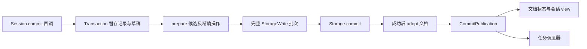

# 第二十五章 Durable：条目、文档与提交事务

本章先解决“什么时候可以告诉界面一件事已经发生”。如果模型输出先显示、随后保存失败，界面和重启后的程序会看到不同历史。如果工具意图没有保存就开始执行，崩溃后甚至不知道自己曾做过这件事。

Durable 的办法是把条目、文档变化和任务检查点放在同一条提交序列上：先准备完整候选批次，存储成功后才更新内存权威状态并发布。任务如何依据检查点恢复在下一章说明；本章从数据和事务讲清这条基础约束。

[packages/durable/README.md](https://github.com/earendil-works/pi/blob/11449730c8a733953ce1bcce70e066bccaa778a5/packages/durable/README.md) 将这个包标为实验性实现。它与第十三章经典 coding-agent 的会话 JSONL 是两个不同系统：经典会话主要保存条目树；Durable 额外提供文档、原子批次、任务记录和后端接口。不能把本章保证套到经典会话文件上。

## 25.1 代码地图与数据流

| 代码 | 职责 |
| --- | --- |
| [types.ts](https://github.com/earendil-works/pi/blob/11449730c8a733953ce1bcce70e066bccaa778a5/packages/durable/src/types.ts) | 记录、事务、存储和观察协议 |
| [documents.ts](https://github.com/earendil-works/pi/blob/11449730c8a733953ce1bcce70e066bccaa778a5/packages/durable/src/documents.ts) | 文档定义、地址、版本和迁移 |
| [entries.ts](https://github.com/earendil-works/pi/blob/11449730c8a733953ce1bcce70e066bccaa778a5/packages/durable/src/entries.ts) | 条目类型身份及内置条目 |
| [session/session.ts](https://github.com/earendil-works/pi/blob/11449730c8a733953ce1bcce70e066bccaa778a5/packages/durable/src/session/session.ts) | 单条修改序列、文档缓存、持久化后采用和发布 |
| [session/transaction.ts](https://github.com/earendil-works/pi/blob/11449730c8a733953ce1bcce70e066bccaa778a5/packages/durable/src/session/transaction.ts) | 回调事务、草稿、校验、批次组装 |
| [session/forks.ts](https://github.com/earendil-works/pi/blob/11449730c8a733953ce1bcce70e066bccaa778a5/packages/durable/src/session/forks.ts) | 分支时选择文档的历史或当前来源 |
| [session/observation.ts](https://github.com/earendil-works/pi/blob/11449730c8a733953ce1bcce70e066bccaa778a5/packages/durable/src/session/observation.ts) | 提交到 Chord 的桥接、精确观察与慢消费者处理 |
| [harness/context.ts](https://github.com/earendil-works/pi/blob/11449730c8a733953ce1bcce70e066bccaa778a5/packages/durable/src/harness/context.ts) | 从不可变条目推导模型上下文 |
| [harness/view.ts](https://github.com/earendil-works/pi/blob/11449730c8a733953ce1bcce70e066bccaa778a5/packages/durable/src/harness/view.ts) | 从提交推导界面结构状态 |
| [storage/memory.ts](https://github.com/earendil-works/pi/blob/11449730c8a733953ce1bcce70e066bccaa778a5/packages/durable/src/storage/memory.ts) | 内存参考后端与批次预检 |
| [storage/jsonl/storage.ts](https://github.com/earendil-works/pi/blob/11449730c8a733953ce1bcce70e066bccaa778a5/packages/durable/src/storage/jsonl/storage.ts) | 多文件日志、提交标记和恢复 |
| [storage/sqlite/storage.ts](https://github.com/earendil-works/pi/blob/11449730c8a733953ce1bcce70e066bccaa778a5/packages/durable/src/storage/sqlite/storage.ts) | 数据库批次与文档版本物化 |



每条箭头都体现一个可检查的顺序。尤其是 `Storage.commit` 到 `adopt`：磁盘未成功前，草稿可以修改，但已提交的文档 getter 与观察者仍保持旧值。

## 25.2 五种记录：身份不同，作用不同

Durable 统一使用数字 ID 空间；TypeScript 的品牌类型区分 `ConversationId`、`EntryId`、`TaskId`、`SubmissionId` 与 `DocumentId`。品牌在运行时被擦除，分配和解码边界需要可信地提供数字，存储还检查一个 ID 不能属于两种记录。

| 记录 | 具体作用 | 是否以追加历史为主要形式 |
| --- | --- | --- |
| conversation | 对话身份、分支父节点、任务所有权 | 身份记录创建后不可变 |
| entry | 一条不可变历史，包括展示数据与模型消息贡献 | 追加，原条目不改写 |
| task | 输入、阶段检查点、取消标记与最终结果 | 当前记录整体替换 |
| submission | 用户输入或被动写入的接纳、排队、放置和结算 | 当前记录整体替换 |
| document | 某个作用域内的 JSON 状态与版本 | 根基线加变化操作，按定义保留历史 |

`Seq` 是成功存储批次的提交序号，严格增加但允许缺号。它与条目 ID、任务 ID、Chord 状态发布序号都不同。一个批次可以包含多条 entry、多份 document 与 task，它们具有同一个提交序号。

根对话保留 ID 1，普通分配从其他数字开始。分配候选 ID 不等于创建记录：事务失败后不会出现相应记录，也不要求 ID 连续。

## 25.3 Entry 把模型内容与应用内容分开

条目可以有 `model`，表示贡献给模型的消息；也可以有 `data`，用于应用展示、诊断或记账；还可以只有类型与身份。不能把所有 JSON 条目不加选择地发送给模型。

内置类型包括 `pi.user`、`pi.assistant`、`pi.tool-result`、`pi.system`、`pi.reset` 和 `pi.compaction`。`defineEntry(kind)` 提供按 kind 缩窄的类型身份，不验证该 kind 下的业务数据 schema。

`head` 改变活跃上下文的下界。`head: "self"` 在追加时转换成新条目自己的 ID，常用于 reset。原有历史仍在存储中，模型只使用新的活跃范围。

`edits` 可以省略或替换之前可见条目对模型的贡献。它们作为新的不可变条目保存，不改写目标原记录；同一目标在当前范围内以最新修改为准。这让“显示完整原历史”和“给模型一个修正后的上下文”能够分别推导。

任务运行时追加条目还可带 `byTaskId`，用于追踪来源。这个字段由事务作用域附加，不是调用者任意在草稿里指定后就被信任的工作身份。

## 25.4 Document：逻辑地址与一次生命期的 ID

教学简化代码：

```ts
const Todos = defineDoc({
  kind: "app.todos",
  version: 1,
  scope: "conversation",
  history: "rewindable",
  fork: "asOf",
  initial: () => ({ items: [] as string[] }),
});

await session.commit(async tx => {
  const draft = await tx.doc(Todos, conversationId);
  draft.items.push("阅读事务实现");
}, context);
```

文档逻辑地址由 kind、作用域、所有者以及可选 family key 组成。例如会话 10 的 `app.todos` 与会话 11 的同类文档是不同地址。session 文档没有对话所有者，task 文档归属于一个任务。

**incarnation** 指一次从创建到退役的生命期。某地址上的文档退役后重建，逻辑地址相同，但获得新的 DocumentId：

```text
地址 app.todos / conversation 10
  → 文档 ID 30 在 Seq 2 创建
  → ID 30 在 Seq 8 退役
  → 同地址 ID 45 在 Seq 8 创建
```

观察 ID 30 的订阅收到退役 `null`，不会悄悄改为观察 ID 45。历史查询也按 `[createdAt, retiredAt)` 确定该生命期在某提交点是否存在；创建和退役发生在同一批次时，不形成一个对外活着的中间版本。

family 文档为每个 key 保存独立成员，第一次不存在时才使用 `initial(seed)`。同一事务重复获取一个尚未退役的地址会复用它的草稿获取 Promise，避免创建两份竞争草稿。family seed 在进入初始化前复制成 JSON；它是初始化参数，不是此后每次读取都覆盖当前文档的值。

`defineDoc()` 的运行时检查主要是版本必须为正安全整数；定义的类型约束不等于自动生成每个字段的业务验证器。需要业务 schema 时，要在自己的初始化、迁移或输入入口实施。

## 25.5 历史与分支策略

对话文档定义声明两个独立维度：是否保存历史，以及分支从哪里开始。

| 策略 | 行为 |
| --- | --- |
| `history: "latest"` | 只要求读取当前状态；不能用它读取任意旧提交的内容 |
| `history: "rewindable"` | 保留按历史提交点物化状态所需的数据 |
| `fork: "initial"` | 子分支使用定义的初始值 |
| `fork: "current"` | 子分支复制分支创建时父对话的当前文档 |
| `fork: "asOf"` | 子分支复制截断条目所在提交点的文档，只用于可回溯文档 |

conversation 文档按定义选策略；session 和 task 文档没有相同的分支历史组合。某些 backend 会清理 latest 文档旧基线前的修订，不能把它理解成碰巧保留了文件行就支持历史读取。

内置 `pi.agent` 是 rewindable/asOf，确保从旧条目分支时恢复当时选择的模型、工具和扩展名称；`pi.live`、`pi.inbox`、`pi.usage` 采用 latest/initial，子分支不继承父对话当时正在运行的输出、排队输入或已累计花费。

## 25.6 Session 的一条提交序列怎样解决并发

问题：A、B 同时读取 count=0，各自提交 count=1，就会丢失一次增加。Session 把整个回调到提交发布的过程排在同一条 Promise 链上：

```text
提交 A 进入序列：读取 0，等待外部工作，准备并提交 1
提交 B 在 A 后等待：随后读取 1，准备并提交 2
```

`#enqueue()` 把工作接到 `#tail`，成功和失败都更新为已消化拒绝的尾 Promise，避免一个普通失败让整个队列永久断裂。这是进程内串行化，不是文件系统锁。

回调可以异步等待，但等待期间占有整条修改序列；长网络请求会阻塞其他对话的提交、某些冷读取和观察获取。因此通常应先在事务外完成慢 I/O，再用短提交重新读取必要状态、验证条件并写入。是否还适用需要业务检查，不能直接使用事务外读到的旧状态覆盖新值。

内部 `readOnLine()` 把多次读取放在序列上，建立一个一致的读取边界。已缓存的普通 `snapshot()` 可以直接返回当前已采用值，不等待前面正在修改的草稿；它不会返回尚未提交的候选。

在提交回调里等待另一个排在同一序列后的 Session API，可能形成自己等自己的死锁。事务内读写应使用传入的 `tx`；在数据库事务中同样应使用传入的 transaction handle。

## 25.7 Transaction 暂存什么，什么时候失效

事务暂存条目、对话、任务、submission 变化和文档草稿。表记录会在进入暂存时复制成 JSON，对象字段为 `undefined` 时按配置省略；数组和非 JSON 内容仍有严格要求。返回给回调的记录属于 Session 管理的不可变值，不允许在拿到后自行改写。

文档加载得到缓存的 tracker，再 `beginChange()` 建立覆盖层；新文档用复制并验证过的初始值建立 tracker。它们都是第二十四章的草稿：修改期间旧根不变，准备之后所有草稿句柄失效。

事务回调结束后立即 sealed，后续使用 `tx` 被拒绝。已经准备好的候选和计划只允许在存储成功后采用一次。保存 `tx` 或 `draft` 到定时器里，不会得到一个能长期修改 Session 的能力。

事务内部没有为外部世界提供回滚。回调里发送请求、写文件或输出日志，即使后来 callback 抛错，这些行为也不会由 `discard()` 撤销。原子性覆盖的是本次 StorageWrite 批次与尚未采用的文档候选。

## 25.8 为什么必须等待每个 Tx 异步操作

具体错误例子：

```ts
// 错误：没有等待获取文档完成。
await session.commit(tx => {
  tx.doc(Todos, conversationId);
}, context);
```

`Transaction` 用 `#pendingOperations` 跟踪其异步操作。回调成功结束时若仍有操作未完成，就封住事务、中止草稿、等待未完成操作结算，然后报错，不进入持久化。

这样做是必要的：否则一个迟到的文档获取可能在批次已经提交后才把新写入加入事务。异步操作每次等待后也检查 `#assertOpen()`，过期结果不能继续暂存。

回调本身失败时，事务同样中止变化并 `Promise.allSettled()` 观察未结束操作，使它们不会在下一份事务开始后继续改变这份暂存状态。这是排空管理范围内的操作，不能强制完成一个永不结算的底层 Promise。

正确写法使用 `await` 或确实等待所有操作的 `Promise.all()`。同一个文档的草稿如果被多个并发分支共同修改，修改逻辑仍需业务上定义先后；复用草稿 Promise 不等于每个任意异步业务分支都自动串行。

## 25.9 先读表，再写表的规则

`Tx` 的公开表读取在第一次表写入之后被 `ReadAfterWrite` 拒绝。例如先 `appendEntry()`，再 `tx.conversation()` 不允许。应先取得所有需要的表状态，再开始写入。

这不是 SQL 无法做到，而是 Session 事务接口明确约束读取语义：公开表读取面向已提交数据，不伪装成能自动合并所有暂存写入的通用数据库视图。否则调用者可能误以为扫描包含了刚创建但尚未存储的记录。

文档获取、submission 结算和内部所有者校验有自己的暂存解析路径，可以处理已创建的对话、候选任务或 submission；不能把它们与公开表读取混为一谈。创建结果可以直接保存，后续代码用该结果的 ID，不需要再做被禁止的查询。

## 25.10 准备、组装与原子批次

回调成功后，`settleSuccess()` 同步准备每一份文档草稿，再组装全部存储操作。组装阶段会：

- 检查任务替换不能改变对话或替换终态记录。
- 检查新拥有的任务或对话，其最终所有者仍活着、未 completing、未取消标记。
- 为终态任务退役它持有的全部 task 文档，包括同批次创建的文档。
- 解析 submission 的放置与结算，已结算记录保持终态。
- 检查分支复制来源不能在同批次被修改。
- 预先解析文档发布所属对话，避免存储成功后再做异步查询。
- 最后运行文档 checkpoint 谓词，选择本次保存完整基线还是增量。

例如“写一条工具结果、增加工具使用量、把工具任务设为终态、更新 live 槽”可以在一个批次内完成；观察者不应看到只完成其中一半的已提交状态。

checkpoint 谓词抛错仍在存储接纳前，因此候选全部被弃用；它不是在保存一半后才决定是否要基线。谓词应只做同步判断，不应夹带需要回滚的外部副作用。

## 25.11 先存储，后采用，最后发布

正常顺序：

```text
回调返回结果
  → prepare 与组装完整 writes
  → Storage.commit(writes) 返回 Seq
  → tracker.adopt(prepared) 切换根引用
  → 更新缓存版本、基线计数与生命期
  → subscribeCommits 发布已提交记录
  → 回调结果返回调用者
```

没有 writes 时事务丢弃准备结果，返回 callback 的结果，不调用存储。已有文档无变化时也不会只为采用空候选推进 tracker；这与直接使用 Chord tracker 的无操作采用行为有区别。

存储接纳后不再让调用者取消中断结算：Session 给 `Storage.commit()` 使用遮蔽取消的上下文，避免“调用者放弃等待”与“底层还在写”导致下一次提交抢先开始。进入序列时仍会检查取消，之前的读取和回调可使用其上下文；这不是承诺任意时刻取消都能保证没有写入。

`subscribeCommits()` 是内部同步的后采用通知，监听器必须不抛错、不阻塞、不调用 Session API。公众文档和 view 的监听由观察桥接排到后续微任务。直接注册的提交监听器如果违反约定并抛错，调用者可能收到拒绝，而存储和内存已经完成本次提交；不能据拒绝推断批次未写入。

## 25.12 可确认拒绝与不确定失败

Durable 把两类错误分开：

| 失败 | 内存与存储的判断 | 后续行为 |
| --- | --- | --- |
| callback 或准备失败 | 本次未交给存储 | 丢弃草稿，Session 可继续 |
| `StorageRejected` | 后端明确保证批次没有任何持久化效果 | 丢弃候选，Session 可继续 |
| 其他存储错误 | 可能没写，也可能已经写但回复丢失 | Session 标为 poisoned，后续正常使用拒绝，要求重新打开 |
| 存储已成功，但 adopt 失败 | 存储已前进、内存未能可靠跟随 | 同样 poisoned，需要从存储重开 |

**poisoned** 表示当前 Session 已不能可靠判断自己的内存缓存与存储是否一致，不表示数据库所有内容被删除。重新打开后按存储实际成功的批次恢复。

这解决一个具体歧义：数据库已经提交，随后连接报错。若马上用旧内存继续操作，可能重复生成结果或覆盖已成功状态。宁可停止使用这一缓存，也不能凭错误消息猜测存储一定回滚。

后端普通校验错误不自动拥有 `StorageRejected` 的含义；只有明确抛出这个类别且履行其契约，Session 才把它视为无效果拒绝。SQLite rollback 自己失败时也必须用不同错误报告，不能仍把原 callback 错误当作可靠回滚证据。

## 25.13 文档版本：读取迁移与保存迁移

`materializeDocument()` 检查定义的作用域、历史及分支语义与存储记录相符。存储版本比定义新时拒绝；存储版本旧却没有迁移函数时也拒绝。

```text
存储 version 1：{ oldCount: 3 }
以 version 2 的 token 读取
  → migrate 生成 { count: 3 }
  → snapshot 返回新形状，存储仍是 version 1
以 version 2 的 token 在 commit 中获取
  → 即使不再改字段，也保存 version 2 的完整 base
```

Session 区分 `storedVersion` 与 `valueVersion`。缓存中已经迁移的新形状不代表它已经写回；真正提交时才更新持久化版本。迁移后的值被复制并验证为 JSON。

版本变化必须以完整基线保存，不能把新形状的增量接到旧形状上。观察者若持有不同版本的值，会收到根替换；已按新版本读取的观察者对仅保存迁移基线的空变化可以不收到重复帧。

缓存只供对应物化版本使用；以其他版本的 token 访问会重新从存储加载。业务迁移不是数据库表结构迁移，SQLite schema 还有独立的迁移版本。

## 25.14 基线和增量怎样控制重放成本

创建文档保存 `base`，普通变化默认保存 Delta 的 `ops`。重新打开时找到读取点之前最新基线，再依次重放后面的相同版本增量。

`checkpointWhen(value, ops, { deltasSinceBase })` 可把普通变化改为新完整基线。输入计数表示此前已经存了多少增量，不包括正在评估的这次变化。选择新基线后计数归零。

内置策略与状态性质有关：`pi.agent` 和 `pi.usage` 的变化保存基线；空 inbox 保存基线；`pi.live` 在没有 generation 且没有 running 工具槽时保存基线，避免把所有历史流式输出连接成永远增长的增量链。

[harness/json.ts](https://github.com/earendil-works/pi/blob/11449730c8a733953ce1bcce70e066bccaa778a5/packages/durable/src/harness/json.ts) 的 `assignJson()` 逐层更新流式消息，字符串叶子增长时便于生成 `a`。如果每次把整个消息对象替换，Delta 会频繁保存完整容器。这是数据表示和草稿写法共同影响存储体积的例子。

可回溯文档仍保留读旧时间点需要的旧基线；latest 文档在新基线后可清理先前内容。是否 checkpoint 决定成本和恢复读取长度，不改变本次对外采用的精确值。

## 25.15 分支历史与文档复制

对话 fork 记录父对话和包含的截止条目 `at`，并不复制全部历史 entry。后端扫描先看子对话自身条目，再沿父关系扫描，逐层收紧最大条目 ID。因此父分支后来追加的内容不会泄漏进已经创建的子分支。

文档复制分别选择：截断条目实际所属对话、该条目提交序号处的 asOf 文档；以及直接父对话当前的 current 文档。复制没有要求先注册这些文档的业务定义，后端可以按记录语义复制到新 DocumentId。

若子分支初始化回调获取了一个已暂存的复制文档，则先物化来源、按 token 迁移，再改为本次直接创建的候选；初始化变化和对话创建仍在同一批次。

事务禁止同时修改被复制的来源，也禁止分支父对话同时修改 current 策略文档。这避免“复制到底取修改前还是修改后”的歧义，让来源是本次开始时可确定的已提交版本。

`snapshotAsOf(token, conversationId, entryId)` 先验证条目在该对话祖先历史中可见，再使用条目实际所属对话与提交序号查文档。同批次含多个条目时，它们看到这一批次最终文档状态，不存在公开可读的半事务时刻。

## 25.16 从日志推导模型上下文

[harness/context.ts](https://github.com/earendil-works/pi/blob/11449730c8a733953ce1bcce70e066bccaa778a5/packages/durable/src/harness/context.ts) 在提交序列上固定尾条目和最新 head marker；条目不可变，固定边界后可离开序列按页扫描，减少长历史读取占用修改序列的时间。

活跃条目是最新 head marker 加上它指定范围中的非 head 条目。范围内旧 head 条目的 edits 仍参与修改汇总，但它们本身不重复作为模型内容。最新同目标 edit 决定省略或替换哪些消息。

模型消息还会过滤 stopReason 为 aborted、error、deferred 的 assistant。原条目仍在应用历史中，这不表示它们被删除。

工具结果被按其 assistant 的 toolCall 顺序重新排列，即使并发工具结果实际写入顺序不同。找不到的结果生成明确的错误消息，未匹配的结果不加入模型上下文。扫描匹配范围止于下一条 assistant；不是全历史随意找一个同名工具结果补上。

这样可以同时保存真实发生顺序，并满足提供商对调用与结果配对的要求。具体模型请求准备、结果保存和下一轮任务在第二十六章继续追踪。

## 25.17 原子观察：documentState 与 watch

获取观察器也在 Session 序列上完成：加载当前生命期的文档，取得当前值，然后登记后续提交监听。不会在“读取值”与“开始监听”之间漏掉一个提交。

`documentState()` 通过 `CommittedStateSource` 对接第二十四章的 Chord 源协议。每次成功提交产生精确的值与操作，桥接游标递增，公众回调安排到微任务。文档退役产生 `null`，继续保持这个生命期的终态。

`watchDoc()` 则让应用同时得到值和精确操作，`start()` 安装唯一异步监听器，不当场内联调用。队列逐帧等待回调；积压超过 100 帧时改为最新完整根替换，随后仍可排后续增量。

两种观察都会在 Session 关闭时解除后续订阅。watch 还支持自己的取消，并报告 stopped、cancelled、session_closed、retired 或 listener_error。公众状态的值与 watch 的帧都不应被外部修改。

**停止不是等待回调退出。** `CommittedWatch.stop()` 清除积压并立即解决关闭结果；已经运行的回调仍由调用者管理，不被强制取消或等待。应用若要确认网络发送已经结束，需要另行管理那个回调中的 Promise。

## 25.18 会话 view 怎样增量更新

[harness/view.ts](https://github.com/earendil-works/pi/blob/11449730c8a733953ce1bcce70e066bccaa778a5/packages/durable/src/harness/view.ts) 每个被观察的对话最多维护一个共享 mount：conversation 记录、活跃条目及 `pi.agent/pi.live/pi.inbox/pi.usage`。首个观察者在序列上构造，最后一个解除后移除 mount。

每份 CommitPublication 被转换成 view 路径操作：新条目追加到 `entries`，新 head 在前面替换裁剪范围，文档操作加上 `['docs', kind]` 前缀。文档根替换在 view 中成为对那个路径的 `s`。

mount 同时记住文档生命期 ID 和版本。相同 ID、相同版本可继续增量；换 ID 或版本则整体设置。旧生命期的退休事件只有匹配当前挂载 ID 时才删除，避免旧通知删掉同地址新文档。

它挂载的是内置文档，不会自动把所有应用自定义文档塞进 view。自定义状态可通过 documentState/watchDoc 单独观察，或由应用定义自己的聚合方式。

## 25.19 三个存储后端的共同契约

Storage 原子保存一个完整 writes 批次，并在成功返回后保证该对象后续读取可见。它检查全局 ID、不可变记录创建、文档生命期一致性和隔离的读取值；业务祖先关系和任务状态转换主要由 Session 负责。

后端都按“一个进程拥有一份存储”使用，没有 Session 所有权的跨进程锁。SQLite 自身数据库锁也不能让两套独立 Session 的文档缓存、ID 分配和调度器自动变成协作运行。

| 后端 | 原子性机制 | 数据保留与边界 |
| --- | --- | --- |
| MemoryStorage | 先复制、冻结、预检批次，再同步应用 | 不持久化；读取复制，便于检查所有权边界 |
| JsonlStorage | 旁文件先写，主文件提交标记确认整批 | 恢复主文件确认的数据；整个状态会重建到 MemoryStorage |
| SqliteStorage | 一次数据库 transaction 保存所有记录和文档修订 | JSON 字段加索引列；数据库配置决定崩溃与断电保证 |

MemoryStorage 的 clone 是遵循已合法数据契约的复制，不是对任意 JavaScript 对象的全面业务校验。后端直接调用者不能跳过 Session 后，把所有语义约束都期待后端代为补齐。

## 25.20 JSONL：提交标记、残尾与回收

`main.jsonl` 记录提交标记与对话、条目等信息；`doc-ID.jsonl` 和 `task-ID.jsonl` 保存文档内容与活任务检查点。旁记录用 `seq + ordinal` 定位；主标记精确指向本批次需要的旁记录。

```text
预检与编码批次
  → 追加所有旁文件
  → fsync=true 时同步旁文件
  → 追加 main.jsonl 的完整提交标记
  → 应用内存参考状态
  → 尝试回收已不需要的旁文件内容
```

恢复首先去掉没有 LF 结束的残尾，再严格解析完整行。完整行若是非法 UTF-8 或无效 JSON，不会被当作普通残尾默默忽略。主提交序号必须增加；旁记录必须按序号与 ordinal 排序。

旁记录只有被主标记确认才生效。存在未确认的完整旁文件尾部时截断；已确认记录却排在未确认尾之后，则报告损坏。主标记指向缺失必要旁记录也报告损坏，不能编造缺失数据。

回收后的 latest 文档旧基线、退休文档内容和终态任务旁文件有明确的例外恢复规则，主日志终态仍保留。新基线通过 `.reclaim` 临时文件替换；回收在标记发布后是尽力维护，失败不把已成功提交改成失败。

**fsync 的实际范围：** 当前代码在标记前同步旁文件；主文件只在需要回收且开启 fsync 的路径上先同步，再删除或替换旧内容。普通无回收提交不会逐次同步主标记。Node 文件环境的 append 也不会自动 fsync。因此不能把这个选项写成“每个成功提交都已把主标记耐久写到设备”的保证，断电或宿主故障仍需按具体路径评估。

主标记追加报错或旁文件写入报错会使 JSONL 后端 poisoned；它不知道底层是否部分写成，必须重开执行恢复。调用它的 Session 同样停止继续使用不确定缓存。

## 25.21 SQLite：批次、索引与连接队列

SQLite 把 JSON 记录与便于查找的列分开保存：状态、所有者、kind、创建/退役点等用于过滤，完整 record 用 JSON 保存。字符串索引值做 JSON 编码，避免某些 binding 改写单独 UTF-16 代理单元造成身份损失。

每次存储批次在一个数据库 transaction 内读取提交元数据、检查 ID 与文档动作、写表和文档修订、更新下一个序号。文档物化也使用事务，让记录与修订查询看见同一状态，避免两次查询间新基线被替换。

Node 适配器使用内置 `node:sqlite` 和同步数据库连接，但向上暴露 Promise API。单连接队列把异步 transaction 的整个 callback 占有期作为屏障；无关操作等它结算后才能进入，事务内 handle 可直接操作当前连接。

事务以 `BEGIN IMMEDIATE` 开始，结束后 handle 立即失效。callback 失败尝试 ROLLBACK；回滚也失败时汇总错误。事务内调用外面的 database 并等待，会排在自己身后而无法结束，应使用传入 handle。

默认 Node 配置是 WAL、`synchronous=NORMAL`、1000 页自动 checkpoint、5000 毫秒 competing-lock timeout。进程崩溃恢复和宿主断电耐久不是同一保证，NORMAL 不保证最近提交经断电仍全部保留。多查询读取还单独登记，使 close 等这些已接纳读取结束，避免中途关闭数据库。

SQLite schema 迁移在一个事务内按连续版本应用，拒绝比当前代码更新的库结构。它和业务文档的 `migrate()` 属于不同层次。

## 25.22 关闭、恢复与已运行实验

Session.close() 先封住新接纳、停止观察，再等待已排队工作结算，最后清缓存并关闭存储。其底层清理使用不受调用者取消的上下文；`awaitWithContext()` 可取消当前等待，关闭本身继续。具体 Harness 还要停止任务调用，下一章分析。

本章直接运行本地源代码完成 9 组实验，使用 Node 原生模块、真实临时 JSONL 文件和 Node 内置 SQLite；只为缺失 workspace 包解析配置了临时本地模块别名，没有安装依赖或更改源码：

- 两份提交回调串行，等待中的草稿不泄漏进 committed snapshot。
- callback 失败同时弃用条目与文档候选，草稿失效，ReadAfterWrite 后 Session 仍可提交。
- 未等待的 Tx 操作导致拒绝并被排空。
- StorageRejected 后可继续；模拟已存储但回复失败后 poisoned，重开得到真实保存值。
- 同地址退役重建产生新 ID，旧 documentState/watch 收到退役。
- 读取版本迁移停留在内存，后续 commit 才保存新版本基线。
- 实际 SQLite 无关查询等待事务、handle 过期、失败回滚以及 Session 文档保存。
- fsync=true 的实际调用轨迹是旁文件 append/flush，再 main append，普通创建没有 main flush。
- JSONL 重开截掉主日志残行和未确认的完整旁文件尾，保持上一份已确认值。

这不等于运行了整个 conformance suite，也没有模拟物理掉电。持久化语义仍要结合后端契约、配置及任务副作用恢复一起理解。

练习：

1. 为什么已提交后丢失成功回复比 callback 中主动抛错更危险？分别应继续使用还是重开 Session？
2. 把网络请求放进提交 callback 会阻塞哪些工作？移到外面后为什么又需要重新检查业务条件？
3. 某一事务同时写两条 entry 和一次文档变化，以第一条 entry 做 snapshotAsOf 时能否看到文档的中间值？
4. 文档退休后同地址重建，为什么旧观察器要保持退休，而不是跟着地址继续？
5. 对比经典会话 JSONL、Durable JSONL、SQLite 的提交与锁边界，说明每种“保存成功”究竟覆盖哪些对象。
