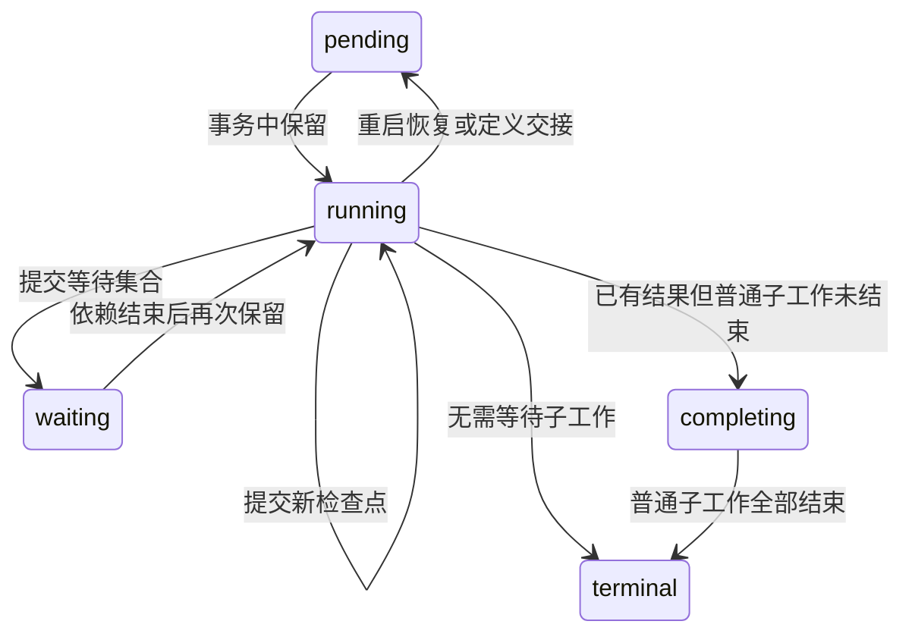

# 第二十六章 任务调度、工具意图与副作用恢复

本章解释 `packages/durable/src/harness/`。这里的 Harness 是建立在 Durable Session 上的代理运行器，不是第八章的 `AgentSession`。两者都能调用模型和工具，但恢复所依赖的数据结构不同：前者保存任务阶段和执行意图，后者主要依赖会话日志与应用状态。

首先考虑一个具体问题：代理调用工具追加一行文件内容，追加成功后进程崩溃，还没有保存工具结果。重启后直接重做，会追加两次；直接宣称成功，又不知道第一次是否真的写入。任务日志必须保存“已经准备执行”，并保留这种不确定性。日志不能把普通文件写入和数据库提交变成同一个事务。

## 26.1 从一个异步函数到可恢复的任务

普通函数把中间状态保存在局部变量和调用栈中，进程退出后这些状态消失。Durable 任务把需要继续执行的信息保存为 JSON 检查点。

例如生成任务不是一个永远运行的 `while` 循环，而是几个阶段：

```text
prepare：选择模型、渲染提示词、保存请求边界
request：发送请求、保存部分响应、分类最终响应
retry：等待已保存的时间，再进入 prepare
poll：等待时间，查询已保存的异步请求句柄
tools：等待工具，或启动顺序执行的下一项
```

阶段名是 `checkpoint.phase`，不是 TypeScript 枚举。`defineTask()` 提供类型约束，任务记录保存 `kind`、`version`、`input` 和 `state`。重启时重新查找对应的任务定义，用记录中的阶段继续执行。

恢复保存的是业务检查点，不是 JavaScript 调用栈。阶段里已经执行过而尚未记录完成的外部操作，需要各自决定能否重做。

## 26.2 核心模块与责任

| 源码 | 主要责任 |
| --- | --- |
| [harness/harness.ts](https://github.com/earendil-works/pi/blob/11449730c8a733953ce1bcce70e066bccaa778a5/packages/durable/src/harness/harness.ts) | 在 Session 上增加会话句柄、配置、环境构造和生命周期 |
| [harness/scheduler.ts](https://github.com/earendil-works/pi/blob/11449730c8a733953ce1bcce70e066bccaa778a5/packages/durable/src/harness/scheduler.ts) | 任务保留、阶段调用、状态门禁、所有权、取消和收尾 |
| [harness/registry.ts](https://github.com/earendil-works/pi/blob/11449730c8a733953ce1bcce70e066bccaa778a5/packages/durable/src/harness/registry.ts)、[define.ts](https://github.com/earendil-works/pi/blob/11449730c8a733953ce1bcce70e066bccaa778a5/packages/durable/src/harness/define.ts) | 发布任务和扩展定义；提供有类型的定义辅助函数 |
| [harness/types.ts](https://github.com/earendil-works/pi/blob/11449730c8a733953ce1bcce70e066bccaa778a5/packages/durable/src/harness/types.ts) | 代理、工具、钩子、调用 API 和观察接口的契约 |
| [harness/submissions.ts](https://github.com/earendil-works/pi/blob/11449730c8a733953ce1bcce70e066bccaa778a5/packages/durable/src/harness/submissions.ts)、[inbox.ts](https://github.com/earendil-works/pi/blob/11449730c8a733953ce1bcce70e066bccaa778a5/packages/durable/src/harness/inbox.ts) | 输入接纳、请求标识去重、排队、边界放置和回执 |
| [harness/generation.ts](https://github.com/earendil-works/pi/blob/11449730c8a733953ce1bcce70e066bccaa778a5/packages/durable/src/harness/generation.ts)、[prompt.ts](https://github.com/earendil-works/pi/blob/11449730c8a733953ce1bcce70e066bccaa778a5/packages/durable/src/harness/prompt.ts) | 模型请求、提示词增量、重试、延迟响应和工具轮次 |
| [harness/tool.ts](https://github.com/earendil-works/pi/blob/11449730c8a733953ce1bcce70e066bccaa778a5/packages/durable/src/harness/tool.ts)、[output.ts](https://github.com/earendil-works/pi/blob/11449730c8a733953ce1bcce70e066bccaa778a5/packages/durable/src/harness/output.ts) | 参数检查、意图保存、工具恢复、进度和最终结果 |
| [harness/compaction.ts](https://github.com/earendil-works/pi/blob/11449730c8a733953ce1bcce70e066bccaa778a5/packages/durable/src/harness/compaction.ts) | 选取历史前缀、总结、重试及摘要放置 |
| [harness/events.ts](https://github.com/earendil-works/pi/blob/11449730c8a733953ce1bcce70e066bccaa778a5/packages/durable/src/harness/events.ts)、[task-graph.ts](https://github.com/earendil-works/pi/blob/11449730c8a733953ce1bcce70e066bccaa778a5/packages/durable/src/harness/task-graph.ts) | 从已提交状态推导事件和任务图 |
| [harness/util.ts](https://github.com/earendil-works/pi/blob/11449730c8a733953ce1bcce70e066bccaa778a5/packages/durable/src/harness/util.ts) | 按标识登记等待者、分页读取和关闭错误 |

第 25 章已解释 `agent.ts`、`live.ts`、`usage.ts`、`context.ts`、`view.ts` 与 Session 事务。这里沿着它们如何支持调度继续阅读。

## 26.3 五种状态为什么不能合并



`terminal` 保存最终回执，例如 `completed`、`failed`、`aborted`、`faulted`、`orphaned`。`failed` 是任务代码决定的失败；`faulted` 是调度器判断代码无法继续；`orphaned` 是取消一个缺少可用定义的任务时，调度器代为结束它。

`completing` 解决一个容易遗漏的问题：父任务已经返回结果，但它创建的普通子任务或子会话还在运行。此时让父任务立即从存活集合消失，会丢失监督关系。调度器暂存其结果，等普通子工作排空，再写入终态。

这并不要求所有父任务都显式调用 `waitForTask()`。提交终态时，调度器会检查同一事务创建的子工作，必要时自动改成 `completing`。

## 26.4 Session 串行线与阶段并发

`TaskScheduler` 的重要不变量是：每次任务状态转换都在 Session 串行提交线上决定。第 25 章的 Promise 队列因此同时保护调度状态。

调度器维护两个不同的表：

- `#live`：所有已提交的非终态任务，包括等待和收尾中的任务。
- `#invocations`：当前进程正在执行的调用，带取消控制器、结束标记和完成 Promise。

`#reserve()` 在一个事务中扫描候选任务，检查没有现存调用、没有未完成的等待，再把记录置为 `running`，登记调用对象。提交成功后，`#start()` 才在串行线外执行阶段函数。

因此不会有两个正常调度调用同时占用同一任务；不同任务的阶段函数可以并发等待模型、工具或网络。这里没有为全部任务设置固定的并发上限。模型请求和文件修改的资源限制，仍要由对应模块实现。

提交失败时，已创建但尚未启动的保留调用会从内存表删除，完成其等待 Promise。`#kick()` 用 `dirty`、`draining` 和微任务合并唤醒，避免从同步提交监听器中直接再次提交。

## 26.5 阶段必须取得“持久进展”

考虑一个错误阶段：

```ts
// 教学简化代码：此函数没有推进检查点。
async function prepare(task, runtime, context) {
  await fetchSomething();
}
```

函数返回并不意味着任务完成。调度器再次进入 Session 线，比较阶段开始时的检查点和最新已提交检查点。如果仍在 `running`、没有取消、没有异常，而且两者结构相等，就写入 `faulted`，错误包含 `returned without durable progress`。

只提交文档、输出或 memo，而不改变检查点，也不能让这个阶段无限重入。对象键顺序不影响检查点相等判断；仅仅创建一个内容相同的新对象也不算进展。

阶段返回后的处理顺序是：先看任务是否已离开 `running`，再看 Harness 是否关闭，再看持久取消标记，然后看阶段异常，最后检查进展和定义交接。如果阶段已经提交 `waiting` 或终态，之后才抛错，下一步会先按已提交状态结束调用。不能假设“最后抛出的异常必定覆盖已提交结果”。

## 26.6 调用门禁怎样挡住迟到的提交

工具可能启动异步回调，在阶段结束后还试图更新文档。仅检查一次取消信号不够，因为回调可能已经排进 Session 队列。

`#gated()` 先检查调用未结束；真正轮到提交回调时，再检查：调用是否结束、Harness 是否关闭、任务是否存在并且仍为 `running`、普通运行是否已有持久取消标记。只有通过这些检查，才允许执行修改函数。

`#step()` 在决定结束的那次串行回调中调用 `#end()`。所以一个此前排队的运行时提交，要么排在结束决定前并正常提交，要么排在其后被拒绝。这里保护的是运行时提交顺序，不是操作系统层面的外部副作用。

`#end()` 还会停止登记的文档 watch，取消调用信号，并释放任务的调用占用。读接口一般检查调用在进入时是否有效，并不是统一在每个异步读取完成后再次检查。工具输出另有“调用已结算”检查，不能把所有 API 都理解成同一个全面的取消屏障。

## 26.7 所有权把任务和会话连成树

一个任务的父节点是拥有它的任务，否则是所在会话；一个会话也可以由某个任务拥有。因此树可以穿过两种节点：

```text
根会话
  生成任务
    工具任务
      工具创建的会话
        子会话生成任务
```

调度器按需读取会话所有者和任务父节点，缓存到 `#edges`、`#settled` 等结构中。即使某个会话的所有者已经终态，也可能仍需保留其所有权字段，才能继续向上追踪关系。

`#ownedLive()` 判断一个任务还有哪些普通子工作。它沿父链向上计数，在遇到后台任务边界后停止继续向上。`#inScope()` 判断一个任务是否属于某个会话的普通所有权范围。

`background` 是监督范围边界，不是另开线程。后台任务本身通常不阻止上层普通空闲，但它自己的普通子任务仍然属于它，应由它监督。全 Harness 的 `waitForIdle()` 检查所有无主会话的普通范围，并不等待全部后台任务。

## 26.8 等待策略与收尾固定点

任务可以提交 `waiting`，保存要等待的任务标识和策略。`allSettled` 等待集合中全部存活任务结束；`failFast` 在某个成员产生非 `completed` 结果后，标记其他存活成员取消。

调度器验证：等待对象必须存在，不能是自己或自己的所有者；`failFast` 只能等待自己直接拥有的任务；取消处理函数不能再进入等待状态。检查会考虑同一事务中的候选记录，因此允许创建子任务后立刻等待它。

这些限制避免明确的所有者死锁，但源码没有进行任意任务等待图的完整环检测。根据实现可推导：两个互不属于父子关系的任务，若彼此等待，不能指望这里自动解开。

`#finalize()` 反复计算同一事务候选状态：先结束没有普通子工作的 `completing` 任务，再继续寻找被它们释放的上层所有者，直到没有新节点可结束。这就是“固定点”：继续应用同一规则，直到结果不再变化。

## 26.9 取消先记录意图，再传递信号

`abortTask()` 先提交 `abortRequested`，提交监听器再取消当前普通运行的信号。它会等待看到的运行调用结束，但返回 `marked` 不等于目标已经终态；取消处理调用还可能尚未执行。这个方法本身没有调用 `resume()`，不能把它和会话级的进度接口混为一谈。

取消处理从下往上进行：一个取消标记任务仍有普通子工作时，先等待子工作结束，再启动它的 `abort` 函数。取消函数成功提交终态后，正常结束；如果仍为 `running` 却返回，就由调度器写入 `faulted`。

`Conversation.abort()` 会启用调度，在同一个事务中撤回范围内排队的输入、标记任务，再等待普通范围空闲。排队的被动写入保留。指定 `background: true` 会跨过后台边界，并额外等待接纳取消那一刻已经到达的任务；后来新建的后台工作不自动加入这次等待集合。

取消标记是持久意图，AbortSignal 是当前调用的通知。它们分工不同：进程崩溃会丢失信号对象，但不会丢失已提交的取消意图。

## 26.10 重启后的级联补偿

`open()` 登记提交和关闭监听，读取四种存活状态，把遗留 `running` 记录改成 `pending`。它不直接派发阶段，Harness 初始仍可以处于暂停调度状态。

随后调度器安排一次 reconcile，即根据已提交记录补齐派生状态：

- 把活着的取消所有者的意图传递给普通子任务。
- 撤回取消范围内仍排队的输入。
- 重新检查 `failFast` 集合。
- 将可以结束的 `completing` 记录变成终态。

即使崩溃发生在“父任务取消已提交，子任务取消尚未提交”之间，这些关系仍可从记录重新推导。后来在取消所有者下面创建的普通工作，也会再次触发级联检查。终态所有者不再发起新的级联。

reconcile 提交失败会保留待处理标记，等后续提交再次唤醒。源码没有在失败时立即启动一个无休止的紧密重试循环。

## 26.11 定义缺失、版本迁移与热替换

任务记录保存版本，registry 保存当前代码定义。版本相同可以直接接管；当前代码版本更低时显示 `task_too_old`；版本更高时，需要同步 `migrate(input, checkpoint, oldVersion)` 转换输入和检查点。

迁移抛错会记录 `migration_failed`。调度器按“任务标识＋具体定义对象”记住失败，同一个定义不会反复迁移；安装另一个定义对象后才再次考虑。检查点和输入经过 JSON 复制，防止迁移输出带入不支持的值。

缺少可用定义时，普通任务停在派生的 blocked 状态，而不是伪造成功。取消这种任务且没有普通子工作时，调度器可以将其结束为 `orphaned`。

已经进入阶段的函数不会被热替换中断。取得持久进展后，调度器刷新 registry 快照：如果新的定义可以接管，把记录交回 `pending`，结束旧调用，再保留新调用。如果替代定义不兼容或已卸载，旧调用继续使用原定义，并报告一次对应替换失败。

registry 的 `install()` 同名替换保留安装位置，`uninstall()` 后重新安装会追加。它先构造完整下一状态、验证任务名称冲突，再同步发布。三个内置任务不能被扩展替换。扩展对象本身是应用提供的引用，所谓“快照不可变”依赖所有权约定，并不是深冻结每个函数和对象。

## 26.12 输入接纳和重复请求

`Submissions.submit()` 在一个事务中接纳输入或被动写入。`requestId` 在该会话范围中查找已有 submission；找到相同类型就返回原标识，不再写入。类型不同则抛错。

这里不会比较重复请求的内容是否相同。例如第一次 `requestId: "r1"` 的输入是 A，第二次同标识输入是 B，第二次会拿到 A 的原回执。调用方应把请求标识当作稳定的业务标识，而不是每次随意复用。

忙碌判断来自 `pi.live.run`。忙时输入默认进入 `followUp`，指定 `steer` 才进入转向队列；指定 `reject` 则抛 `ConversationBusy`。空闲但已经有队列时，新输入仍接在已有队列后，再执行最终边界。空闲且没有队列时，用户条目、`placed` submission 和新生成任务一次提交。

被动写入空闲时可以直接落成条目并结算 `done`；忙时排队。携带的历史 head 已经早于当前活动范围时，写入结算为 `stale`，避免迟到摘要把会话退回旧上下文。

`wait()` 在 Session 线内检查回执并登记等待者，避免“检查还没结束—恰好结束—再登记，永远漏掉通知”的竞态。取消等待只移除当前等待者，不能把已接纳 submission 撤回。

## 26.13 一次请求怎样固定上下文

`prepare` 解析当前代理和设置，渲染提示词段落，计划 `pi.system` 条目，再提交 `request` 检查点，其中保存：模型引用、思考级别、流选项、最新纳入请求的条目 `cutoff`。

`request` 从这个 cutoff 构造上下文。恢复重发时仍使用已经记录的模型、选项和上下文边界，避免把后来排队的输入悄悄混入旧请求。环境是在使用时构建的，并未持久化成原对象。

`beforeRequest` 钩子每次尝试都运行，可以替换本次消息。它的替换本身不作为完整请求体持久化，因此恢复后钩子可以产生不同输出。运行时也会按阶段重新解析代理。源码中的“请求固定”有明确字段范围，不能延伸为对所有宿主代码和外部环境的冻结。

模型请求已经发送但最终响应未提交时，恢复可能重新发送请求。任务日志没有提供商端通用的“恰好一次模型请求”保证；可能产生第二次计算和费用。异步句柄已经提交为 `poll` 时则走已保存句柄的查询路径。

## 26.14 提示词为何记录增量和顺序

`prompt.ts` 从历史系统消息重放段落：设置已有键保留位置，`null` 删除，再次增加已删除键会追加到末尾。

若最小段落补丁无法得到期望顺序，就先删除全部旧段落，再按期望顺序重加。工具声明同理：声明改变会先移除再添加；保留和新增混排无法得到正确顺序时，全部移除重加。工具声明不携带执行函数，只保存模型需要看到的字段。

新 head 后没有新的系统条目时，会生成完整基线，并省略活动范围内保留的早期系统条目。这使重置或压缩后的上下文有一个明确的新提示词起点。

某段落渲染抛错时，如果当前上下文未取消，会报告错误并保留此前已显示的该段落；没有旧内容则省略。返回 `undefined` 表示有意省略。失败和省略不是同一种行为。

## 26.15 流式部分响应怎样提交

`streamResponse()` 接收提供商流，保存最新 partial 引用。约 100 ms 的尾部节流触发时，先同步复制 partial，因为提供商还会继续修改原对象，再通过运行时事务写入 `pi.live.generation.message`。

同时最多一个部分响应提交正在进行。其间新响应合并成下一次最新值，而不是为每个 token 创建事务。结束时停止定时器并等待正在提交的 Promise；尚未触发的最后 pending partial 可以不再单独提交，因为最终 AssistantEntry 才是权威结果。

重启后发现旧 partial，`convertPartial()` 把它转换为 `stopReason: "aborted"` 的助手条目，再开始本次请求。它保留已经持久化的观察结果，但不会假装残缺输出是最终答案。调用取消或关闭后，普通阶段不能再通过门禁把迟到结果写进去。

助手条目和 usage 在同一个事务中写入。使用量是已观察到的消息用量；这不是提供商账单核对协议，也无法知道尚未收到的响应消耗了多少。

## 26.16 响应分类、重试与延迟查询

`deferred` 响应保存句柄和下一次 `pollAt`，默认等待 5 秒；再次延迟时保证新的查询时间至少晚于上次时间。取消 `poll` 任务时会尝试取消提供商异步请求，失败报告后仍继续本地取消收尾。

正常 `stop`、`length` 或没有实际调用的 `toolUse` 进入答案处理。实际工具调用进入工具轮次。普通可重试错误先保存错误助手条目、重试时间，再进入 `retry` 阶段；恢复不会丢掉已决定的等待时间。

重试策略在分类时读取，决定下一次尝试；提供商 SDK 在一次请求内部的重试参数来自已保存流选项。两层重试必须区分。`attempt <= maxRetries` 表示在初始尝试之外，还可以进行规定次数的重试。

上下文溢出不走普通重试。能压缩且尚未进行本轮阻塞压缩时，创建子压缩任务并等待；摘要成功后重新准备。压缩没有实际产出或已经尝试后仍不能解决，就以模型错误结束。

## 26.17 一轮工具如何并发或顺序执行

`startToolRound()` 用已提交请求上下文中的工具声明判断是否曾提供该名称。模型调用未提供的工具，会立即得到 `tool_unavailable` 结果。已提供并不保证当前实现仍存在，工具任务执行时还要解析当前阶段代理。

设置为顺序执行，或者本轮任一已提供工具的当前实现指定 `executionMode: "sequential"`，整轮按顺序运行。顺序模式先创建第一个可执行任务，把后续 callId 保存在 `pending`；每次子任务终态后，再创建下一项。并行模式一次创建所有可执行任务。

助手条目、工具槽和子任务在同一个事务中出现，生成任务提交 `waiting`，使用 `allSettled` 等待工具。本轮完成后，`afterTools` 得到调用顺序中的结果标识，而不是依赖真实完成顺序。

工具控制也按调用顺序汇总：全部工具槽都请求 `terminate` 才终止；最后一个 `handoff` 生效；`addTools` 改变后续工具选择。失败、取消或没有任务的槽，不能算作主动要求终止。

普通继续执行会创建后继生成任务，把 `pi.live.run.taskId` 交给它，原输入回执仍属于同一个 run。最终答案边界才结算输入并处理下一批用户输入；转向输入在工具后边界进入当前 run，follow-up 通常等最终边界。

## 26.18 工具调用的三段边界

`ToolTask` 把调用拆成三个逻辑边界，但首次执行的 `call` 阶段连续完成整个过程：

```text
读取原调用、解析工具
  → prepareArguments
  → schema 验证
  → beforeTool（可修改参数或阻止）
  → 再验证
  → 提交 execute 意图：最终参数＋重放策略
  → 执行当前选定的工具
  → afterTool、结果截断
  → 提交结果条目和任务结算
```

提交 execute 检查点后，首次执行不会先退出阶段再让调度器重新解析工具；它直接使用已经选好的实现执行。这样意图和首次实现选择之间不会插入一次正常任务定义交接。

`prepareArguments` 必须是纯函数，不能修改原参数；进入意图前的恢复可能再次执行它。`beforeTool` 抛错按阻止处理；修改后的参数再次验证。参数错误、工具不可用或被阻止，保存模型可见错误结果，但任务仍可按 `completed` 结算。

## 26.19 崩溃窗口与 safe/unsafe

| 崩溃位置 | 已保存状态 | 恢复处理 |
| --- | --- | --- |
| 意图提交前 | `call` | 重新解析、修复和验证；按契约尚未执行工具 |
| 意图已提交，执行尚未开始 | `execute` | 无法与“已经部分执行”区分，按重放策略处理 |
| 外部效果已发生，结果未提交 | `execute` | 同样按重放策略，不能根据日志猜测外部效果 |
| 结果和任务已提交 | 终态回执 | 返回已保存结果，不再执行 |

恢复执行需要两个条件同时成立：保存的 `replay` 是 `safe`，当前工具也明确声明 `safe`。默认是 `unsafe`。双重检查允许新实现收紧策略，也避免用新声明追认过去的危险调用。

安全重放使用保存的最终参数，不再次运行 `beforeTool` 或参数修复过程；会清空先前运行进度，从头报告。当前工具和环境可能已经变化，`safe` 是实现者承担的语义承诺，不是调度器证明出的属性。

不安全或工具已不可用时，保存 `interrupted` 诊断，说明工具“可能已经部分运行”，任务结算为 `failed`。读取通常较容易声明安全；追加、发送、扣费、任意 shell 命令通常需要明确的幂等设计才能安全重做。具体内置工具声明见第 27 章。

幂等是多次执行产生同一业务结果，例如用固定业务标识创建一次资源。它比“执行成功过一次”更强。即使工具自行实现幂等，这里仍没有把外部操作和 Session 日志合成一个跨系统事务。

## 26.20 memo、调用作用域和子工作

`runtime.memo(name, candidate)` 在运行时门禁事务中实行“第一个已提交候选获胜”。已有 memo 就返回原值。memo 保存在任务记录内，可以跨阶段和重启读取，任务进入结果状态时清除。按自有属性查找，避免把 `toString` 等名字误当成继承值。

它可以记录稳定业务标识或选择结果，但不能自动保证一次外部操作只执行一次。若外部效果完成而 memo 尚未提交，仍有相同崩溃窗口。

工具 API 暴露文档读写、memo、子任务和调用绑定的会话句柄。绑定的会话及其返回 submission 操作都先检查调用未结束，并附加调用取消信号。已接纳的工作仍然持久；绑定句柄过期不会撤销接纳。

普通 `runtime.commit()` 可以在事务中创建子工作，然后由调度器监督。工具抛异常或构造环境失败会以 `failed` 结算，形成对子工作的取消意图；普通返回 `isError: true` 则仍然 `completed`，不自动取消其拥有的工作。模型可见失败和监督失败是两个维度。

## 26.21 进度、输出和结果为什么分开

工具的 `output()` 累积有界文本，默认 2000 行、50 KiB，保留头部；工具可以改为尾部。字节输入使用流式 UTF-8 解码，防止跨 chunk 的中文被拆坏。超长单行按字符边界裁切；有换行时优先保留完整行。

`OutputBuffer` 统计全部流的字节和行数，头部填满后停止保存新增文本，尾部丢弃已经不可能进入窗口的旧块。快照移除会破坏显示的控制字符，保留制表和换行。截断计数按原输入计算，移除控制字符本身不增加“截断字节”。

`Progress` 最多一个提交进行中。空闲后的首个变化立即提交，之后间隔至少 100 ms，并按写入增量的 100 KiB/s 目标增加间隔。进度写入通过 Chord 叶级修改，滑动尾部尽量表达为删除前缀加追加，避免每次保存整个槽。

`details()` 复制最新结构并等待包含它的进度提交。取消这个等待不撤回更新。最终执行结束时停止节流、等待在途提交，再把尚未提交 details 等待者交给最终结算处理。这避免旧进度覆盖终态。

最终结果显式 `content` 优先于 output，显式 details 优先于最后报告的 details；`afterTool` 可以替换结果，随后文本统一再次限长。诊断作为结构化列表保存在条目 data，也以 `<harness>` 文本追加到模型内容。图片不按这套文本字节限制裁切；诊断文本在内容限长之后追加，不能把限制误解为最终消息所有字节的绝对上限。

## 26.22 压缩本身也是可恢复任务

Durable 压缩与第 14 章传统 coding-agent 压缩实现不同。它保存 `select`、`summarize`、`retry` 三类检查点。

选择范围时，从尾部按 token 估算保留最近内容，切点必须以用户或助手贡献开始，不能切在工具结果上；若某个用户条目后面还有前一助手调用的结果，也不能以这个用户条目作为切点。这样摘要和保留部分不会把工具调用关系随意劈开。

总结请求固定 `tail` 和 `firstKept`，后续重建的是选择时的历史范围。序列化时忽略系统消息，转成带角色标签的文本，工具结果单项最多保留 2000 个字符。总结请求禁用缓存保留和 deferred，并设置回答预算。

只有干净 `stop`、有文本且没有工具调用的响应才算完整摘要。`length` 是不完整摘要，不会直接采用；普通可重试模型错误按已保存时间重试。摘要用量与结果放置在一次事务中记录。

阻塞压缩由生成任务拥有，它直接追加摘要，让等待的生成继续。会话拥有的压缩通过 write submission 放置：空闲直接进入上下文，忙时等边界，过时则结算 stale。其 requestId 使用压缩任务标识，避免重复放置同一摘要。

自动后台压缩设为 background，普通空闲无需等它；手动压缩虽然可以与生成并行总结，但本身不是 background。阈值压缩还检查是否有可选切点，并在事务中检查已有压缩，避免仅根据阶段开始时的旧状态重复创建。

## 26.23 事件是已提交状态的投影

`watchEvents()` 在 Session 线中同时取得会话视图快照和后续提交监听，消除订阅空隙。每次提交形成一批事件，来源是视图操作和条目、任务、submission 的提交变化。

它不是原始提供商流的逐 token 重播。被节流合并的 partial 只形成合并后的变化；工具开始、进度、结束、消息、submission、run 和 turn 按预定顺序翻译。完成结果进入 `completing` 时就可以结束 turn，真正终态时不会再重复结束同一 turn。

pending 批次溢出会替换成最新 snapshot。消费者必须能处理快照，不能假设永远收到每条中间事件。watch 的串行交付、停止和取消边界见第 25 章；停止不等待正在执行的用户回调结束。

任务图是另外一个按需挂载的 Chord 状态：存活任务按十进制 ID 建键，保存阶段、等待集合、所有权和 owned conversations，不保存完整检查点。终态任务从图中删除；历史回执仍在 storage。

`inspect()` 返回当前记录和派生调度状态，包括缺少定义、版本过旧或迁移失败，读取不运行任务代码，也不启用调度。`usage()` 逐会话累加各自快照，不是跨全部会话的单一原子时刻。

## 26.24 关闭、取消等待与保证边界

Harness 关闭先封住接纳入口，再取消活动调用信号，拒绝任务和空闲等待者，等待已登记调用全部结束，最后关闭 storage。关闭不会为每个活动任务自动写入 aborted 结果，遗留记录留给下次打开恢复。

join 使用调用完成 Promise，不能强制杀死忽略取消信号的 JavaScript 函数。根据实现可推导：如果工具永远不返回，关闭也可能永远等待。取消关闭调用方的等待，不等于底层关闭已经停止。

读到这里，应能区分四个保证：Session 事务保护持久记录的一致性；调用门禁保护阶段结束后的状态写入；所有权保护普通子工作的监督和收尾；工具重放策略处理外部副作用的不确定性。任何一个单独的机制，都不能替代其余三个。

## 26.25 阅读检查与练习

1. 工具已经写入文件但结果尚未提交，记录仍在 execute。分别推演 safe/unsafe 两种策略；解释为什么 unsafe 在“实际上还没执行”时也不重做。
2. 任务只修改文档和 memo，检查点内容没变，随后正常返回。追踪为什么会 faulted。
3. 父任务在同一事务创建普通子任务并提交 completed。说明为什么记录先变成 completing。
4. 画出含后台任务和任务拥有会话的所有权树，分别标出普通 idle 和 `abort({ background: true })` 的范围。
5. 用同一 requestId 连续提交不同内容，说明第二次获得的是哪份回执。
6. 在 request 阶段崩溃后重启：哪些请求字段复用，哪些钩子和环境会重新执行？

下一章把这些恢复约束落到 Node 文件系统和 shell 环境，并比较 Durable 工具与传统 coding-agent 工具的实际并发保证。

## 26.26 实际调度代码：先保留调用，再运行任务

问题：两次唤醒可能同时发现同一个 pending 任务，关闭也可能恰好发生在任务开始之前。只在普通内存循环里调用阶段函数，会让“记录正在运行”和“关闭需要等待哪些函数”之间出现空隙。

下面是 `#reserve()` 的完整实现。Session line 指同一个 Session 上串行执行的提交队列；在这条队列内检查状态并登记调用，才能让后续取消和保留看到一致的决定。

源码定位：[harness/scheduler.ts](https://github.com/earendil-works/pi/blob/11449730c8a733953ce1bcce70e066bccaa778a5/packages/durable/src/harness/scheduler.ts#L699)，第 699—742 行。

<!-- source-lines: packages/durable/src/harness/scheduler.ts:699-742 -->
```ts
	async #reserve(): Promise<Reservation[]> {
		const reservations: Reservation[] = [];
		try {
			await this.#session.commitWith(async (tx) => {
				if (!this.#enabled || this.#closing) return;
				await this.#loadScopes(false);
				const owned = this.#ownedLive();
				// Taken once per pass, and only when some task is a candidate.
				let snapshot: RegistrySnapshot | undefined;
				for (const record of [...this.#live.values()]) {
					if (this.#invocations.has(record.id) || this.#waitingOn(record, owned).length > 0) continue;
					if (record.state.status === "completing") continue;
					const runnable = record as RunnableTaskRecord;
					const mode = record.abortRequested ? "abort" : "run";
					snapshot ??= this.#registry.snapshot();
					const resolution = this.#resolve(runnable, snapshot);
					if (resolution.kind === "blocked") {
						if (mode === "abort") {
							await this.#terminate(tx, record, { status: "orphaned", reason: resolution.reason });
						}
						continue;
					}
					if (resolution.record !== runnable || record.state.status !== "running") {
						tx.setTask(
							withState(resolution.record, {
								status: "running",
								checkpoint: resolution.record.state.checkpoint,
							}),
						);
					}
					// Registered on the line, so marks and later reservations see it and close joins it.
					const invocation = this.#createInvocation(record, mode);
					reservations.push({ invocation, task: resolution.task, snapshot });
				}
			}, this.#context);
		} catch (error) {
			for (const { invocation } of reservations) {
				this.#invocations.delete(invocation.taskId);
				invocation.finish();
			}
			throw error;
		}
		return reservations;
	}
```

用 task 42 的短轨迹观察：

```text
已提交：42 是 pending，检查点为 call
reserve 进入 Session line
  → 排除已有 invocation、等待对象与 completing
  → 解析当前 task 定义和版本
  → 暂存状态 running，保留原检查点
  → 在内存 invocation 表登记 42
commitWith 完成
  → #drain 才对 reservation 调用 #start
```

`#invocations.has(record.id)` 排除本机已占有的调用；`#waitingOn()` 排除还在等待受监督工作或依赖的任务；`completing` 等派生收尾，不进入普通阶段。持久 abort 标记决定进入 `abort` 还是 `run`。一轮最多取得一次 registry 快照，保证本轮解析基于同一套已安装定义；这不意味着之后每个异步阶段都永远使用这份实现。

`tx.setTask()` 暂存持久状态，`#createInvocation()` 是进程内登记，不是另一个数据库条目。登记发生在 Session line 内，但提交仍可能失败，所以 catch 必须删除本轮已建的调用并完成它们的 finish Promise。否则数据库没有成功接纳运行，内存却留下一个关闭会等待的假调用。

`#drain()` 在 `await #reserve()` 返回之后才启动 reservation。这样任务用户代码不会在保留事务中运行。Session line 管持久状态决定，异步阶段在其外执行；把长网络请求放在事务里等待，会阻塞其他取消、输入接纳和提交。

这个约束是同一 Harness/Session 的调度设计，不是多个进程共享一份存储时的分布式租约。源码没有在此函数创建跨主机锁、租约到期或领导者选举。

## 26.27 实际提交门禁：为什么同一个状态要检查两遍

问题：工具请求提交进度时，调用看起来还活着；它在 Session line 排队期间，取消、关闭或阶段结束却可能先执行。只在排队前检查，就会让过期调用在终态之后写回旧进度。

源码定位：[harness/scheduler.ts](https://github.com/earendil-works/pi/blob/11449730c8a733953ce1bcce70e066bccaa778a5/packages/durable/src/harness/scheduler.ts#L1190)，第 1190—1212 行，完整 `#gated()`。

<!-- source-lines: packages/durable/src/harness/scheduler.ts:1190-1212 -->
```ts
	#gated<T>(
		invocation: Invocation,
		change: (tx: Transaction, current: ErasedRunningTask) => T | Promise<T>,
		context: Context,
	): Promise<T> {
		if (invocation.ended) return Promise.reject(endedError(invocation));
		return this.#session.commitWith(
			async (tx) => {
				if (invocation.ended) throw endedError(invocation);
				if (this.#closing) throw closedError();
				const found = this.#live.get(invocation.taskId);
				if (found === undefined) throw new Error(`Task ${invocation.taskId} is terminal`);
				if (found.state.status !== "running") throw new Error(`Task ${invocation.taskId} is ${found.state.status}`);
				const current = found as ErasedRunningTask;
				if (invocation.mode === "run" && current.abortRequested) {
					throw new Error(`Task ${invocation.taskId} has a durable abort mark`);
				}
				return change(tx, current);
			},
			context,
			{ conversationId: invocation.conversationId, taskId: invocation.taskId },
		);
	}
```

| 检查 | 排除的情况 |
| --- | --- |
| 排队前 `invocation.ended` | 明确已结束的句柄，立即拒绝，避免无意义排队 |
| 进入提交回调后再次检查 ended | 等待队列期间已结束的句柄 |
| `#closing` | Harness 已关闭接纳，不能再接受普通运行提交 |
| 重新读取 live 且必须 running | 已终态、waiting 或 completing，不能用阶段开始时的旧记录覆盖 |
| run 模式且 `abortRequested` | 持久取消已先提交；即使当前信号尚未处理，也不能提交普通工作 |

具体交错：A 的工具持有旧调用 → A 请求 progress commit 并排队 → B 先提交 abort 标记 → A 进入回调 → 门禁读取最新标记并抛错 → A 的 change 没有执行。没有回调内重读，A 可能在 B 之后继续追加成功进度。

abort 模式没有被最后一项拦截，因为取消阶段本来就需要在持久取消标记存在时提交收尾。门禁同时把 conversationId、taskId 传给提交上下文，给事务内监督规则提供当前任务作用域。

门禁只能阻止通过它提交的 Session 状态。普通 JavaScript 仍能持有文件句柄或发出外部请求；源码没有把所有外部能力撤回。一个忽略 AbortSignal 的工具可以继续产生外部效果，即使后续日志提交被拒绝。这正是 replay 策略仍然必要的原因。

## 26.28 阶段结束为什么先使旧调用失效

问题：阶段 Promise 已返回，但它先前启动的异步回调可能晚到。任务进入 waiting 或终态时，必须立即封住旧调用，不能等所有派生清理结束后才失效。

源码定位：[harness/scheduler.ts](https://github.com/earendil-works/pi/blob/11449730c8a733953ce1bcce70e066bccaa778a5/packages/durable/src/harness/scheduler.ts#L937)，第 937—959 行，完整 `#step()`。

<!-- source-lines: packages/durable/src/harness/scheduler.ts:937-959 -->
```ts
	async #step(
		invocation: Invocation,
		decide: (tx: Transaction, current: ErasedRunningTask) => Decision,
	): Promise<ErasedRunningTask | undefined> {
		try {
			return await this.#session.commitWith(async (tx) => {
				const found = this.#live.get(invocation.taskId);
				const current = found?.state.status === "running" ? (found as ErasedRunningTask) : undefined;
				const decision = current !== undefined && !this.#closing ? decide(tx, current) : false;
				if (decision === true) return current;
				this.#end(invocation);
				if (decision !== false) {
					const message = decision.fault instanceof Error ? decision.fault.message : String(decision.fault);
					await this.#terminate(tx, current!, { status: "faulted", error: { message } });
				}
				return undefined;
			}, this.#context);
		} catch (error) {
			this.#end(invocation);
			if (!this.#closing) this.#report(error);
			return undefined;
		}
	}
```

`decide` 在 Session line 中收到最新 running 记录。返回 true 表示这次 invocation 继续；返回 false 表示结束而不写故障；返回 fault 对象则结束并进行 faulted 收尾。`#end(invocation)` 在故障清理之前执行，所以清理过程中到达的旧句柄已被 26.27 的 ended 检查挡住。

若提交准入或回调抛错，catch 也调用 `#end()`，随后在非关闭状态报告错误并返回 undefined。它没有继续拿阶段开始时的旧 checkpoint 盲目重试。任务状态如何持久收尾仍由相关提交和后续 reconcile 决定；内存调用结束不能自动替数据库故障制造一个成功终态。

把 26.26—26.28 连起来，调度周期是：提交前在队列内保留 → 提交后运行用户阶段 → 每次进展重新过门禁 → 阶段结束在队列内做一次最新状态决定并封住旧调用。这里每个顺序都有对应的竞态，不是为了复杂而增加的多层包装。

## 26.29 真实 SQLite 中断恢复的可复现证据

运行命令见 [labs](labs/README.md)，可以只执行 Durable：

```sh
node labs/run-integration.mjs durable
```

该命令运行现有 [harness-tools-recovery.test.ts](https://github.com/earendil-works/pi/blob/11449730c8a733953ce1bcce70e066bccaa778a5/packages/durable/test/harness-tools-recovery.test.ts) 的 9 个命名测试。它使用实际 Harness、Node SQLite 临时数据库和工具恢复流程，模型回复来自 faux provider。关闭再重开使用同一个数据库路径；没有把存储换成对象数组，也没有实际发送模型请求。

第一个测试的固定过程是：work 增加 runs → 输出 `run 1` → `api.details({run:1})` 等待进度持久化 → 工具等待取消 → close → 重开。此时数据库保存 `phase:"execute"`、最终参数 `{}` 和 `replay:"unsafe"`。原 submission 继续到 done，但 work 的 runs 仍为 1；模型可见结果是错误，并附带保存的部分输出与“可能已经部分运行”的诊断。

策略组合由第二个测试真实循环执行：

| 原意图 replay | 当前工具 replay | runs | 结果 |
| --- | --- | ---: | --- |
| safe | safe | 2 | 从头重做，得到第二次输出 |
| safe | unsafe | 1 | interrupted 错误，不重做 |
| unsafe | safe | 1 | interrupted 错误，不重做 |

其他断言覆盖：safe 恢复采用重开时 cwd、工具取消选择后不重做、意图提交前 beforeTool 运行两次而 execute 一次、afterTools 未提交时重跑但不重复已有历史、持久取消带部分输出、非法 JSON 结果使任务 faulted 后上下文补足缺失结果、旧进度在 safe 重跑前清空。

还有一个真实本地 bash 用例：`echo started; sleep 30` 先将 `started` 保存到 LiveDoc，再关闭 Harness。关闭取消本地进程；重开后保留 `started` 并形成 interrupted 结果，再完成模型 run。本次不会等 sleep 正常结束，也不会重新执行这项 unsafe bash。

这些测试证明合作式 close/reopen 的持久边界和恢复决策。它们没有使用 SIGKILL、断电、磁盘损坏或远程服务重复收费的故障注入，因此不能扩大为对这些故障的已测试保证。本章练习的参考解答见 [第 36 章](36-exercise-solutions.md)。
