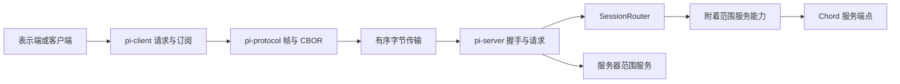

# 第二十八章 远程协议、字节帧与会话路由

本章解释 `packages/protocol`、`packages/client` 和 `packages/server`。它们为实验性客户端与服务端提供统一的远程服务通道，与第 21 章 stdin/stdout JSON RPC、第 22 章 MCP 是不同协议，不能互换客户端。

先考虑三个问题：一个 socket data 事件可能只有半条消息；用户切换会话后，旧请求可能迟到；请求取消时，远端可能已经写入文件。实现分别用字节帧、附着身份和协作取消处理它们，没有用一个笼统的“连接锁”包办。

## 28.1 三个包的分工



| 源码 | 责任 |
| --- | --- |
| [protocol/protocol.ts](https://github.com/earendil-works/pi/blob/11449730c8a733953ce1bcce70e066bccaa778a5/packages/protocol/src/protocol.ts) | 版本、消息 schema 和目标身份 |
| [protocol/framing.ts](https://github.com/earendil-works/pi/blob/11449730c8a733953ce1bcce70e066bccaa778a5/packages/protocol/src/framing.ts) | 长度前缀、碎片缓冲和帧上限 |
| [protocol/cbor](https://github.com/earendil-works/pi/blob/11449730c8a733953ce1bcce70e066bccaa778a5/packages/protocol/src/cbor/index.ts)、[codec.ts](https://github.com/earendil-works/pi/blob/11449730c8a733953ce1bcce70e066bccaa778a5/packages/protocol/src/codec.ts) | CBOR 子集编解码和协议值验证 |
| [client/connection.ts](https://github.com/earendil-works/pi/blob/11449730c8a733953ce1bcce70e066bccaa778a5/packages/client/src/connection.ts) | 连接代次、握手和终端状态 |
| [client/client.ts](https://github.com/earendil-works/pi/blob/11449730c8a733953ce1bcce70e066bccaa778a5/packages/client/src/client.ts) | 请求对应、取消、服务订阅、附着通知 |
| [client/types.ts](https://github.com/earendil-works/pi/blob/11449730c8a733953ce1bcce70e066bccaa778a5/packages/client/src/types.ts)、[transport.ts](https://github.com/earendil-works/pi/blob/11449730c8a733953ce1bcce70e066bccaa778a5/packages/client/src/transport.ts) | 客户端接口和字节传输契约 |
| [client/unix.ts](https://github.com/earendil-works/pi/blob/11449730c8a733953ce1bcce70e066bccaa778a5/packages/client/src/unix.ts) | 本地 socket、发送队列、服务发现 |
| [server/server.ts](https://github.com/earendil-works/pi/blob/11449730c8a733953ce1bcce70e066bccaa778a5/packages/server/src/server.ts) | 接收、握手、派发、错误与关闭 |
| [server/session-router.ts](https://github.com/earendil-works/pi/blob/11449730c8a733953ce1bcce70e066bccaa778a5/packages/server/src/session-router.ts) | 会话打开共享、附着切换和调用监督 |
| [server/types.ts](https://github.com/earendil-works/pi/blob/11449730c8a733953ce1bcce70e066bccaa778a5/packages/server/src/types.ts)、[connection.ts](https://github.com/earendil-works/pi/blob/11449730c8a733953ce1bcce70e066bccaa778a5/packages/server/src/connection.ts)、[listener.ts](https://github.com/earendil-works/pi/blob/11449730c8a733953ce1bcce70e066bccaa778a5/packages/server/src/listener.ts) | 宿主、附着能力和监听器契约 |
| [server/transports/unix/listener.ts](https://github.com/earendil-works/pi/blob/11449730c8a733953ce1bcce70e066bccaa778a5/packages/server/src/transports/unix/listener.ts) | socket 路径所有权、发布、发送和清理 |

服务方法的 schema 和业务实现属于 Chord 与宿主应用。服务器只需要理解路由目标和通用 service call，不硬编码全部业务方法。

## 28.2 协议版本和消息种类

源码基准的 `PROTOCOL_VERSION` 是 8。客户端第一帧必须是 `{ type: "hello", version: 8 }`；服务端返回 hello，包含同一版本和 serverId，或返回 hello_error 后关闭。

客户端后续消息是 request 或 cancel。request 包含 id、target 和 call。服务端消息还有 response、service_update 和 attachment。

response 成功可省略 result；失败必须有 code/message。服务更新按 subscriptionId 寻址。attachment 是带外通知，告诉表示端当前会话路由，null 表示无附着。

消息外壳是严格对象，拒绝多余字段。call/result/update 在 schema 上是 opaque，但整个消息还要通过 Chord 的 JSON 值检查，再由内层服务解析器检查具体结构。TypeScript 类型不会替代这些运行时检查。

## 28.3 三个身份各自防止什么

服务器范围 target 只有 serverId；会话范围 target 还包含 sessionId 和 attachmentId。

serverId 是配置提供的稳定逻辑服务器身份，必须是规范的小写 UUIDv4。客户端握手验证实际返回身份等于预期身份，服务端请求也验证 target.serverId。这可以发现物理地址指向了另一个逻辑服务器。

sessionId 表示持久会话；attachmentId 是一次表示端附着时生成的 UUID。同一持久会话重新附着，也会生成新的 attachmentId。

```text
旧附着：server S / session A / attachment X
脱离并重新附着
新附着：server S / session A / attachment Y
迟到旧请求携带 X：拒绝
```

这类身份围栏防止把旧调用送入新附着，但身份本身不是密码或签名。`ServerListener` 契约要求提供已经授权的连接；本地 Unix 实现主要依赖文件系统权限，没有另加一套登录口令握手。

## 28.4 一个 data chunk 不等于一条消息

每条 CBOR payload 前面是四字节、无符号大端长度：

```text
00 00 00 03 | 11 22 33
长度为 3       三个 payload 字节
```

socket 可能一次给出前两个头字节，下一次给剩余头和部分 payload；也可能一次给出多条完整帧。`FrameDecoder` 保存 headerLength、expectedPayloadLength 和已收到 payloadLength，在 push 中循环解析。

默认单帧 payload 上限为 16 MiB，头读完就检查长度，不等超大内容到齐后再拒绝。payload 分成最多 64 KiB 的块，收到多少分配多少；多块完成时再合并，避免只凭声明长度立即分配整块大内存。

incoming chunk 的有效字节复制进内部块，后续传输重用或修改原缓冲不会改变已接收前缀。默认限制是单帧大小，不是一次 data 调用产生的全部帧数量上限。

## 28.5 半帧结束与失败状态

正常 end 必须没有半个头或未完成 payload，否则报 Truncated frame。解码器进入 failed 后拒绝继续 push/end；正常 end 后也拒绝新数据，不能用同一个对象开启第二条连接。

低层 FrameDecoder 可以返回空 payload，但空字节没有完整 CBOR 值，进入消息 codec 后仍会失败。因此“帧长度合法”和“协议消息合法”是两层判断。

`ValidatedMessageDecoder` 依次进行分帧、CBOR 解码、消息 schema 和 JSON 值检查。任一错误会让消息解码器永久失败。错误文本最多保留有限长度，避免把极大错误内容直接拼进协议错误。

如果一次 push 包含好帧后紧接坏帧，调用整体抛错，不保证把前面的好消息单独返回。连接层因此按整次解码失败处理，而不是跳过坏帧继续猜边界。

## 28.6 CBOR 子集如何映射 JavaScript

CBOR 是一种带类型标记和长度的二进制表示。这里自行实现的是确定长度子集，支持 null、布尔、有限数字、字符串、字节数组、普通数组和普通对象。

安全整数采用正负整数类型；负整数使用 `-1 - value` 关系。非整数和负零用 64 位浮点。拒绝 NaN、Infinity、超出 JavaScript 安全整数范围的整数。字节数组在独立 CBOR 接口可用，但协议消息整体的 JSON 检查不会因此自动允许任意 Uint8Array。

字符串先编码 UTF-8，再反向解码确认与原字符串一致，拒绝孤立 surrogate。解码使用 fatal UTF-8，并保留实际 BOM 字符。字节长度、容器元素数和深度分别受限制：默认 16 MiB、100 万和 64 层，配置深度最大 512。

数组不能有空洞或 undefined；普通对象的 undefined 值在独立编码器中省略。对象只接受普通或空原型，拒绝可枚举 symbol 键。循环引用通过当前祖先集合检查；同一对象在不同枝条出现不等于循环，可以分别编码。

## 28.7 解码怎样避免歧义和原型污染

CBOR map 只接受字符串键，重复键报错，不能由后值静默覆盖前值。解码用 Object.defineProperty 添加属性，`__proto__` 仍是普通自有属性，不触发对象原型 setter。

只允许一个完整顶层值，后面多出的字节报 trailing data。拒绝 tags、无限长度容器、break marker，以及未支持的浮点宽度和简单值。这里不是通用 CBOR 库，不能期待它接受所有其他实现可能产生的 CBOR。

协议层在编码前先验证消息，所以独立 CBOR 编码器的“省略对象 undefined”并不代表协议调用可以依赖随意省略非法结构。消息层、CBOR 层和帧层各自有明确输入集合。

## 28.8 客户端连接代次挡住迟到事件

`Connection` 保存 disconnected、connecting 或 connected 生命周期。每次 connect 增加本地 sequence，传输回调捕获本次 id，只处理仍为当前代次的回调。

异步 transportFactory 如果在本次连接已经被关闭后才返回，新返回 transport 会立即关闭，不装进当前生命周期。旧 socket 的 error/close/data 也不能把已建立的新连接误关掉。

握手期间先取得 transport，再发送客户端 hello；第一条服务端消息必须是 hello 或 hello_error，身份必须匹配。回调可能同步触发 disconnect，因此握手通知后会再次检查生命周期对象身份，才发布 connected 并完成 Promise。

这里的 `reconnect()` 是再次调用 connect，不会自动重发请求、重新附着或重新订阅。已经 connecting/connected 时调用 connect 会被拒绝。普通客户端没有为任意 transportFactory 设置统一连接超时；本地服务发现另有超时。

## 28.9 请求对应可以并发，不靠回应顺序

`Client.#request()` 为调用生成递增 request-N，先登记 pending，再编码和发送。response 按 id 找到等待者，不要求按发出顺序返回。

Connection.send 并不等待整个写入结束后才允许下个请求，传输契约负责保持发送调用顺序。编码失败移除本项；发送同步或异步失败关闭连接，拒绝所有 pending 请求。

收到没有匹配 id 的 response 会使连接失败。未知 subscriptionId 的 service_update 则忽略。这两种行为不同：请求回应必须严格对应，已释放订阅可能存在迟到更新。

请求层没有默认执行超时或自动重试，也没有按业务 requestId 保存结果。服务端只拒绝当前仍 active 的重复 id，完成后同 id 可以再次使用。因此丢失 response 后重发同一服务调用，仍可能重复副作用；与第 26 章持久 submission 的 requestId 去重不同。

## 28.10 取消为何保留 pending 记录

客户端 signal 取消时，立即拒绝调用方 Promise；若已经发送且连接仍活着，则发 cancel，包含同一 id 和 target。

它没有立刻从 pending Map 删除本项。远端仍会返回一条正常或 cancelled response，保留本项才能接住这条迟到回应，避免被判断为未知 response 而关闭连接。收到回应或断线时才清理取消监听。

```text
客户端取消等待
  → 发 cancel
  → 服务端取消目标调用的 AbortSignal
  → 远端函数自行观察并结束
  → 返回 response
  → 客户端移除仍保留的 pending
```

服务端 cancel 必须同时匹配服务器、请求 id 和完整目标身份。它不会立刻释放 active id，也不会强制结束 JavaScript 调用。若函数忽略信号并成功返回，仍可能返回成功；客户端 Promise 早已拒绝。

根据实现可推导：远端永不返回且连接一直不关闭时，已取消请求仍可能保留 pending 记录。这里没有以取消为由主动安排一个后续超时清理，也没有远端副作用回滚。

## 28.11 服务端握手与并发派发

服务端默认给握手 5 秒。建立连接时记录 awaitingHello，收到 hello 后转 handshaking，异步取得服务器服务能力并发送 hello，成功后 ready。

握手完成前已经到达的后续 request/cancel 通过 handshake Promise 延后派发。第二次 hello 直接失败。ready 后每个 request 独立异步处理，不使用全局请求队列，也没有统一的业务调用并发上限。

每个 active 请求有自己的 AbortController。call 结构先由 Chord 解析，服务器范围调用送到 serverServices；会话范围送到 SessionRouter。请求结束时按 active 对象身份清理，避免误删别的调用占位。

未知内部错误只跨线返回 Internal server error，详细错误交给 onError；明确 ServerError、RemoteServiceError 可以返回允许的 code/message。错误观察回调失败被隔离，不破坏服务器状态。

## 28.12 SessionRouter 为什么只串行接纳

Router 按表示端 client 对象建立 Promise 队列，串行处理附着、脱离和服务调用的接纳。`startServiceCall()` 返回一个包着业务 Promise 的对象，而不是直接等待业务 Promise 完成。

这个包装很重要：

```text
客户端队列：检查路由并启动 A → 检查路由并启动 B → 接纳脱离
实际执行：A 和 B 可以并发；脱离等待 A、B 排空
```

如果接纳队列直接 await A 的完整业务结果，同一个客户端的所有服务调用都会变成顺序执行。当前实现保留并发，同时用 attachment.operations 跟踪已经启动的业务 Promise。

队列失败分支转换成完成的 tail，避免一次附着失败污染以后操作；清理也检查当前 Map 尾部身份，与文件队列的生命周期原则相同。

## 28.13 打开共享与附着切换

相同请求 sessionId 正在打开时，`openingSessions` 共享一个 Promise，避免相同路径的并发接纳重复调用 openSession。已 hosted 的会话复用 handle，不因最后一个客户端脱离就自动关闭。

切换会话先 acquire 新会话，成功后释放旧附着，再取得新 lease。新会话打开失败时，旧附着仍保留；但旧附着已经释放之后，取得新 lease 再失败，就没有一个统一的“回滚回旧附着”事务。

附着等待期间会检查服务器关闭、客户端断线、hosted 实例是否仍当前，以及 attachment 是否仍在集合中。失败的晚到 lease 要释放，避免只因 await 期间状态改变就遗留能力。

成功后登记 attachmentsByClient，并发布包含新 attachmentId 的通知。对同一会话的当前附着重复 attach 是直接返回，不会每次都生成新身份。

## 28.14 脱离会话为什么要 join

释放一个 attachment 只创建一次 releasing Promise。它先等待 operations 集合中已经启动的业务 Promise 全部 settle，再 release lease，最后清除当前附着并按需要发布 null。

它不会因为某个请求被取消就假设副作用已经停止。请求必须真正结束，才能释放其能力。正常客户端切换和脱离与调用接纳共用队列，后面的调用在切换完成后才检查新路由。

因此，一个忽略取消且永远不返回的服务调用可以拖住脱离和服务关闭。socket 层的 5 秒优雅关闭超时，不等于会话调用也会在 5 秒内结束。

删除会话和宿主异常终止还经过另外的路径。`removeSession()` 并行释放附着并关闭 handle，源码没有在这里建立每会话的全局新调用拒绝锁；并发删除的完整边界还要结合第 29 章宿主实现判断。不能把普通切换队列的保证扩大成所有管理操作的全局事务。

## 28.15 快照和订阅增量的衔接

Chord 订阅可能在 invoke 返回快照前就产生更新。服务端为 subscribe 暂存更新，取得并验证快照后，为 subscriptionId 安装一个独立 state encoder，先发送 response，再排空暂存更新。

客户端也提前建立 listener 项：在快照 response 到来前，暂存原始 wire update；快照 decode 后再 decode 暂存帧。返回的 ServiceSubscription 包含 snapshot，调用方安装基线后显式 start，才开始按顺序交付。

这是“双阶段订阅”：先获得和安装基线，再激活交付。状态词典属于该订阅，不能拿其他订阅的压缩路径词典来解码。第 24 章已解释 Chord state codec 和 sequence 约束。

服务端和客户端这几层暂存数组没有统一的数量上限；客户端的 deliveryTail 也会为慢 listener 排队。不能仅凭 socket 的字节上限，就宣称订阅端到端的所有内存队列都有背压。

## 28.16 dispose 与断线不总是等待回调

每个服务 listener 的 deliveryTail 串行 await 用户回调，并捕获其失败交给 onListenerError，后续更新仍可继续。不同订阅分别有自己的 tail。

单个 subscription.dispose() 先移除 listener，当前目标仍有效时发 unsubscribe，再 await 已排入 deliveryTail 的回调。因此 dispose 可能等待用户回调很久，也可能等不到没有超时的 unsubscribe。

整个 Client.dispose() 则同步标记 disposed、拒绝请求、断开连接、清空 listener 集合，返回已完成的 dispose Promise，并不统一 join 已排入的用户回调。断线也不取消已经排入 tail 的 Promise 函数。

所以“订阅对象 dispose”和“客户端 dispose”具有不同等待边界。Chord 消费端还能按自身代次忽略旧更新，但直接使用低层 Client listener 的调用方不能假设回调永远不会在断线后继续运行。

## 28.17 Unix 字节传输的发送队列

客户端和服务端发送都复制 Uint8Array，防止调用方发送后修改缓冲。两者都有 Promise writeTail 和 pendingBytes，超过上限就拒绝发送；上层发送失败随后关闭连接。

客户端默认上限为默认帧上限的四倍，实际 socket.write 返回 false 时，还等待 drain 与写回调都完成，才释放该写入。服务端默认上限按配置帧大小四倍派生，并验证至少能容纳一帧加四字节头；它的 write Promise 主要等待写回调，不能照搬客户端的 drain 双条件描述。

字节发送顺序被队列保护，但 request 执行可以并发、response 完成顺序可以不同。发送背压控制待写字节，不限制模型请求数量或业务调用执行时间。

服务端 close 标记 closing，等待 writeTail 后尝试发送 finalChunk 和 socket.end，并安排默认 5 秒后 destroy。已排队但尚未开始的普通 write 可能因为 closing 被拒绝，不能把优雅关闭理解成保证全部排队消息一定交付。

## 28.18 Unix socket 路径也有并发问题

默认目录创建权限 0700，socket mode 为 0600。公开路径由 serverId 生成，形如 `<uuid>.sock`。Windows 不支持这套 Unix 传输。

监听器先探测公开路径和由路径哈希生成的临时 bind 路径。已有非 socket 文件拒绝删除；socket 可以连接或探测超时时，按仍活跃处理，不冒然清理。

真正绑定临时路径后取得 dev/ino，再用 hard link 发布公开路径。link 遇到已有公开路径会失败，避免无条件覆盖另一个监听器的入口；随后设置权限并删除临时入口。

清理陈旧 socket 时，先记录身份，再把路径 rename 到随机保留名，重新检查移动后的 dev/ino；发现路径已经换成别人的文件，就尝试恢复或保留，而不是直接 unlink 检查后可能已替换的路径。

正常关闭也只清理与自己记录身份一致的公开 socket。二次身份检查是为了处理检查与删除间的竞争，不是一个覆盖所有文件系统操作的跨进程事务锁。临时绑定路径和宿主目录生命周期还需要按具体代码理解。

## 28.19 本地发现的限流和遗漏规则

discoverUnixServers 读取目录中合法 UUIDv4 的 `.sock` 名称，再 lstat 确认是 socket，最多 16 个 worker 并发探测，默认每个探测 1 秒。

探测会进行实际协议握手并核对 serverId。路径不存在、连接拒绝、部分连接中断、协议不符或版本不符等可以跳过；其他错误向调用方抛出。结果按 serverId 排序。

发现结束会 dispose 探测客户端并等待对应 socket 关闭。它不是订阅服务器目录变化的长期监控，也不会为已连接 Client 自动重连。

## 28.20 服务端关闭和错误收尾

Server.close() 可重复调用，先标记 draining，等启动过程结束，关闭 listeners 和连接，再关闭路由会话。多个清理错误用 AggregateError 汇总。

断线会取消 active 请求信号并清空占位，清除状态 encoder，异步释放会话附着和服务器服务能力。释放失败交给 onError。服务端并没有把所有业务请求 Promise 放进一个统一的关闭 join 集合；会话范围操作还有 Router 的跟踪，服务器范围能力如何停止运行取决于其 release 实现。

启动多个 listener 时按顺序启动；某项失败，会关闭已经启动的 listener 并清理服务器状态。初始化和清理都失败时同时保留错误，不用“清理成功”掩盖原始启动错误。

## 28.21 保证矩阵

| 问题 | 已实现机制 | 边界 |
| --- | --- | --- |
| 半包、粘包 | 四字节长度＋增量分帧 | 不自动修复损坏帧 |
| 非法 payload | CBOR 限制＋外壳 schema＋JSON 检查 | 业务参数还要由服务验证 |
| 旧连接回调 | 本地连接代次 | 不复用旧连接 decoder |
| 请求回应乱序 | request id 对应 Map | 无持久请求去重 |
| 旧会话附着调用 | server/session/attachment 三重目标 | 不代替传输授权 |
| 正常切换与在途调用 | 接纳队列＋attachment.operations join | 忽略取消的调用可拖住切换 |
| 订阅基线衔接 | 快照、缓存、显式 start、独立 codec | 存在未设统一上限的中间队列 |
| 慢 socket 写入 | 发送队列、pending byte 上限 | 不限制业务任务并发 |
| RPC 取消 | 本地拒绝＋远端 AbortSignal | 无文件副作用回滚或通用恰好一次 |
| 公开 socket 清理 | 文件身份核验、移动后再核验 | 不是完整跨进程锁协议 |

## 28.22 实验、测试辅助与练习

直接运行实际分帧、CBOR、SessionRouter 和仓库 TestServerHost，七组实验通过：逐字节分帧；跨 64 KiB 的输入复制；帧上限、半头 EOF 与失败锁定；Unicode/负零/安全整数/自有 proto 键；非法 CBOR 拒绝；打开 Promise 共享与失败切换保留旧路由；并发调用、脱离 join 和旧 attachment 拒绝。

这些实验没有运行需要 TypeBox 依赖的完整 Client/Server 消息集成路径，也没有建立真实远程服务器。Unix 监听器的全部竞争场景没有因此得到实验验证。书中相应结论来自完整源码阅读。

仓库 [server/testing](https://github.com/earendil-works/pi/blob/11449730c8a733953ce1bcce70e066bccaa778a5/packages/server/src/testing/index.ts) 提供 ProtocolTestClient、可阻塞打开/调用/关闭的 TestServerHost 和确定性服务端配置，用于有依赖环境下的协议一致性测试。它们与生产 host 接口一致，但不会调用真实模型。

1. 为什么响应必须按 id 对应，而不能用“第一个回来的是第一个请求”？
2. 客户端取消后若立即删除 pending，远端迟到回应会触发什么行为？
3. 只检查 sessionId，为何无法挡住同一会话重新附着后的旧调用？
4. 解释 SessionRouter 为什么返回 `{ result: Promise }`，而不是直接返回业务结果。
5. 描述从 snapshot 到 start 的订阅顺序，指出哪些缓存可能等待慢消费者。
6. socket 已关闭但远端写入已完成、response 丢失。说明重试为何需要业务层去重，而不是重新连接本身就能保证正确。

下一章把这些通用包连接到项目的实验性 server、worker、客户端界面和 Durable 应用，检查宿主如何实际管理进程与会话。
