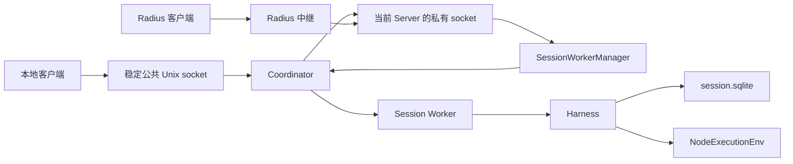

# 第二十九章 实验性应用：把任务、服务、进程和界面装配起来

前五章已经分别解释 Chord 服务、Durable 事务、任务调度、执行环境和字节协议。本章回答一个装配问题：这些库如何成为一个能启动、接收提示词、恢复会话并显示输出的应用？

这里有两种应用。`experimental/durable` 与 `experimental/vacation` 在一个进程里运行界面和 Harness；`experimental/server`、`session-worker` 与 `client-tui` 把界面、连接管理和任务执行分到不同进程。它们都是实验路径，不能把这里的 SQLite、跨进程所有权锁和服务协议描述成第八章经典 `AgentSession` 的默认行为。

## 29.1 先区分三种“会话”

用户可以在服务器中创建一个持久会话目录，其中存放 `meta.json` 和 `session.sqlite`。一个 Worker 在取得目录所有权后打开数据库；数据库里的 Durable Session 可以含根 Conversation 和若干子 Conversation。客户端又可以暂时附着到这个服务器会话。

例如客户端附着 `work-a`，根 Conversation 接收提示词，工具创建子 Conversation。关闭客户端会解除附着，却不等于删除 `work-a`，也不等于所有子任务立即终止。

| 名称 | 保存在哪里 | 谁管理生命周期 |
| --- | --- | --- |
| 服务器会话目录 | 文件系统，元数据和 SQLite | 会话目录服务、Worker 管理器 |
| Durable Session、Conversation | SQLite 加进程内 Harness | Worker 或独立 Durable 应用 |
| 客户端 attachment | 客户端、路由器和 Worker 的内存 | 每次附着取得的新标识 |

本章用“附着”表示客户端与会话的临时连接关系，用“所有权”表示允许某个 Worker 打开会话数据库的资格。

## 29.2 代码地图

以下文件均位于 `packages/coding-agent/src/experimental/`，除表中明确列出的 CLI 目录外。

| 功能 | 文件 | 主要对象或入口 |
| --- | --- | --- |
| 实验命令选择 | `commands.ts`、`../cli/experimental/command.ts` | `runExperimentalCommand`、命令与选项解析 |
| 内部进程启动 | `process.ts`、`source-resolver.ts` | `spawnInternalProcess`、源代码模块解析 |
| 稳定本地入口 | `coordinator.ts` | `ensureCoordinator`、`CoordinatorConnection` |
| 可替换服务器 | `server.ts` | `startServer`、`activateServer`、`ServerLifetime` |
| Worker 记录和请求转发 | `session-worker-manager.ts` | `SessionWorkerManager` |
| 数据库所有权与执行 | `session-worker.ts` | `runSessionWorkerWithHarness`、`WorkerLifecycle` |
| 会话元数据 | `session-catalog.ts` | `createSession`、`readSession`、`listSessions` |
| 服务提供与绑定 | `services/server.ts`、`worker.ts`、`connection.ts` | 服务器服务、会话服务和客户端绑定 |
| 远程界面 | `client-runtime.ts`、`client-tui.ts`、`client-tui-chat.ts` | 发现服务器、附着、显示 ConversationView |
| 插件 | `plugins/package.ts`、`bundled.ts` | 选择档案、构建与 Facet 加载 |
| Radius 中继 | `radius-auth.ts`、`radius-relay.ts` | 鉴权解析、中继连接和重连 |
| 单进程编程应用 | `durable/runtime.ts`、`harness-setup.ts`、`tui.ts` | `openDurable` 与控制器 |
| 子代理示例 | `durable/subagent.ts`、`vacation/vacation.ts` | 前台工具与后台持久任务 |

阅读本章后，可沿这些入口进入完整文件，再回到第二十四至二十八章分析底层机制。

## 29.3 命令行解析为什么要先于进程启动

`runExperimentalCommand` 在实验开关启用时识别 `server` 和 `client`。源代码实验入口先执行 CLI 设置；无法匹配实验命令时转入普通主入口。发布入口与开发入口的区分由装配代码决定，不能因为存在 `experimental/cli.ts` 就认为所有安装形态都能直接运行它。

命令解析器会累计重复选项、缺值和命令校验错误。选项扫描遇到第一个未知参数或位置参数便结束，因此提示词后面的 `--model` 不一定还会被解析成选项。需要多个单词的提示词应作为一个参数传入；这是此解析器的具体行为。

客户端会校验 `radius://<server UUID>` 和本地 Unix 地址，并约束会话选择选项。`--provider` 必须与 `--model` 配套。客户端运行时进一步规定：认证参数只用于 Radius；显式连接不能同时要求“冷启动时指定模型”；插件包路径只能配置本地服务器。

非交互客户端没有会话 ID 且没有提示词时列举会话；有提示词而无会话 ID 时，必须恰好发现一个服务器才能创建会话。指定的会话在多个服务器中同名会被拒绝，避免任意挑一个。交互界面的 continue/resume 在当前实现中选择发现会话中创建时间最新的一项；这条路径没有经典会话树选择器。

## 29.4 进程模型：稳定入口与可替换执行者



Coordinator 的公共 socket 地址绑定逻辑服务器 ID；每次 Server 启动使用带随机后缀的私有 socket。Coordinator 把本地客户端字节双向 `pipe` 到当前私有端点。它还维护独立控制 socket，转发 Server 与 Worker 的 JSON 行消息。

因此它并不保存工具检查点，也不解析模型消息。任务记录由 Worker 的 Harness 保存。协议也有两个版本号：控制路由协议为 3，第二十八章客户端业务协议为 8；它们解决不同问题。

## 29.5 内部启动参数与 TypeScript 模块解析

`spawnInternalProcess` 使用当前 `process.execPath`，把 coordinator、server 或 session-worker 的角色放入内部环境变量。入口验证并消费该变量，消费后删除，防止普通后代进程误用同一个角色。角色标识属于进程装配约定，不能作为用户身份认证。

子进程采用 `detached`、忽略标准输入输出并 `unref`，可以脱离启动它的 CLI 存活。退出操作发送的 SIGKILL 针对这个子进程本身；不能据此推导它会杀掉所有 Shell 后代。

源代码运行时用 `--import` 加载 `source-resolver.ts`。它读取根 TypeScript 路径配置，把工作区包导入定位到源码，并为 `.js` 等引用尝试对应的 TypeScript 文件。Node 的类型擦除不会自动执行 `tsconfig` 的路径映射，所以这个解析器是源代码进程能运行的重要装配步骤。解析器校验候选路径位于仓库的词法路径内；这里不是对不可信包实现的文件系统沙箱。

内部控制消息使用 JSON 加 LF，编码时限制单条消息大小为 128 MiB。接收器先检查当前缓冲区字节数再拆行，已拆出的等待处理消息仍可能累积。这个上限不能理解为进程全部控制消息内存的总上限。

## 29.6 冷启动：两个锁分别解决两个竞争

假设两个客户端同时发现没有服务器。若它们都直接启动 Server，就会竞争公共 socket，并可能各自生成不同的默认服务器身份。

`acquireServerProfile` 首先读取 `default-server-id`。首次创建使用 `flag: "wx"`，只允许一个创建者；另一方收到 EEXIST 后读取获胜者写入的 ID。随后以 `launcher-<serverId>` 为目标取得 `proper-lockfile` 锁。该锁序列化同一逻辑服务器的启动装配，使用 30 秒 stale 时间并定期更新。

自动激活另有 `activation-<serverId>` 锁。持锁后再次连接现有端点，只有确实不可达才拉起 Server。前台启动也取得这个激活锁，所以前台启动与客户端冷启动共享同一竞争边界。

两把锁的分工是：launcher 锁保护服务器装配，activation 锁保护“检查可达性并决定是否启动”的整段过程。它们不会序列化会话里的编辑工具。

启动等待默认最多 10 秒，轮询间隔 10 毫秒；失败会终止自动启动的子进程。但连接尝试自身仍受具体传输行为影响，外层截止时间不是每个底层 await 都有独立超时的保证。

## 29.7 Coordinator 如何替换 Server

Server 在后端监听就绪后注册 `{serverConnectionId, endpoint}`。`serverConnectionId` 是本次服务器进程的代次标识；逻辑 `serverId` 可以保持不变。

新 Server 注册时，Coordinator 切换当前服务器，关闭旧的公共代理连接，向 Worker 通知旧服务器断开，向旧 Server 发送 `server_replaced`，再通知新服务器连接。旧 Server 的运行时调用 `workers.detach()`：忘记 Worker 记录、拒绝待完成操作，却不终止 Worker。这样新 Server 可以广播发现消息，重新接管仍连接 Coordinator 的 Worker。

替换不保持原客户端连接，也不自动重放断连前的请求。客户端服务状态要通过新连接重新取得。

Coordinator 启动后若一直没有任何参与者，初始空闲宽限为 30 秒；完全空闲后的退出宽限为 250 毫秒。它同时统计控制连接、Worker peers、当前 Server 和公共代理连接。没有注册角色的启动控制连接也可以暂时持有它，`ensureCoordinator` 返回的 startup lease 正是这个用途。

控制 socket 只做本地路由。注册 peer 防止重复 ID，只有当前 Server 可以广播；Worker 返回消息还会在管理器里核对 peer、token 和会话路径。目录及 socket 权限是本地访问边界，控制协议本身没有远程登录流程。

## 29.8 服务器空闲不等于任务空闲

`ServerLifetime` 有四种持有条件：前台操作员要求 keepAlive、启动宽限、客户端连接数、Worker 数量。

自动启动的服务器默认获得 10 秒启动宽限，首次有客户端便取消这个启动持有。在连接数与 Worker 数都为零后，等待 1 秒再退出；期间新增连接或 Worker 会取消退出定时器。前台 keepAlive 服务器不会仅因空闲而自动退出。

Worker 数包含已经启动的 Worker 和待启动记录。因此“客户端已经关闭”不足以让 Server 退出：一个执行后台研究任务的 Worker 仍会持有 Server。Worker 自己是否退休由另一套生命周期决定。

## 29.9 会话目录与数据库所有权

目录服务创建 `<sessionDir>/<id>/meta.json`，保存创建时间与 cwd。ID 使用受约束的单段名称，避免把任意路径作为会话 ID。创建目录成功后才写元数据；若元数据写入失败，当前代码没有整个操作的目录回滚。列举时无法读出合法元数据的目录会被略过。

真正打开数据库的 Worker 先连接 Coordinator，再对会话目录取得 `proper-lockfile` 所有权锁：`realpath: true`、stale 2 秒、每 1 秒更新，重试预算约 8 秒。持锁期间打开 `session.sqlite`，构建 Harness、任务图和 Chord 服务。

这个锁与 SQLite 的事务锁互补。SQLite 负责数据库提交；目录锁表达“这一应用会话由一个 Worker 执行”，避免两个 Harness 同时调度同一批持久任务。它依赖锁库的更新与 stale 判定，不是不可过期的内核所有权证明。

启动失败时按顺序清理服务、Harness、执行环境并释放所有权，累计清理错误。正常关闭也保持这个顺序。Harness 关闭要等待相关任务调用退出；不合作的执行可能延长关闭，管理器另有最终强制终止路径。

删除会话的正常服务路径先解除路由与停止 Worker，再递归删除目录及插件选择档案。文件系统删除本身没有实现独立的数据库所有权协议；调用者负责生命周期顺序。

## 29.10 Worker 启动如何合并并发请求

`SessionWorkerManager` 按会话绝对路径维护已就绪记录和 pending 启动 Promise。

```text
客户端 A 请求打开 work-a
  → 建立 pending[path]，启动一个 Worker
客户端 B 请求打开同一路径
  → 等待同一个 pending Promise
Worker 返回 ready
  → 核对路径、peer、token、PID 和插件选择
  → 记录 Worker，解决两方等待
```

启动超时默认 15 秒，会移除 pending 记录并终止该子进程。已运行 Worker 与待启动 Worker 都有插件清单选择检查；同一会话正在用另一组插件时，不能暗中用新选择继续附着。

服务器替换后的发现广播等待最多 5 秒。不存在 pending 启动记录时，管理器可以接受原有 Worker 的 ready 宣告，恢复其记录；若同一个路径已有另一 Worker，则通知后来者关闭。跨进程唯一执行资格仍由目录所有权锁约束，内存 Map 本身不是跨进程锁。

## 29.11 附着需求、请求持有和任务持有

Worker 的存活条件由 `WorkerLifecycle` 汇合：

| 条件 | 目的 | 解除方式 |
| --- | --- | --- |
| 初始需求宽限，默认 10 秒 | 防止 Worker 刚就绪、附着消息尚未到达便退出 | 接到需求或宽限结束 |
| attachment demand | 有客户端正在使用会话 | 收到 detach，或旧 Server 断开后宽限结束 |
| retirement hold | 服务请求、需求确认仍在进行 | 请求或确认的 finally 释放 |
| Harness 存活任务 | 模型运行、压缩、后台任务仍需执行 | 任务图变为无存活任务 |

旧 Server 断开时，该代次 demand 保留默认 30 秒宽限，便于替换期间继续存活。旧需求一旦挂上断开计时器，就不能接纳该附着的新请求。新 Server 到达不会把旧附件改造成新附件；它要提交自己的 demand。

`beginRequest` 同时校验当前 `serverConnectionId` 和活动 `attachmentId`，然后取得一个可重复安全释放的 retirement hold。它避免一个已经接纳但尚未结束的服务调用让 Worker 在中途退休。任务图持有包括 background 任务，这与“conversation.abort 默认排除后台任务”是不同的判断。

只有需求初始化结束、没有需求、没有请求持有、没有存活任务时才调用退休回调。退休决定一旦作出，新需求会被拒绝，不会把即将清理数据库的 Worker 再复活。

## 29.12 Demand 超时为什么需要补偿

管理器向 Worker 发送 attached=true 后，可能只丢失确认，Worker 实际已经记住需求。直接超时报错并遗忘它，会留下没有对应客户端的 demand。

因此默认 5 秒超时后，管理器再发送 attached=false 做补偿。若原操作是 attach，即使补偿成功，也报告原 attach 超时；若原操作是 detach，补偿成功可以视为 detach 已完成。补偿也失败时，会尝试停止 Worker，并组合超时、补偿和停止错误。

这是一段显式补偿流程，不是把网络与 Worker 内存放进同一个原子事务。需求请求的 Context 在管理器此处没有用于中断等待，所以不能把调用者取消等同于需求已经撤回。

## 29.13 业务调用的并发、作用域与取消

Worker 操作携带 `{serverConnectionId, attachmentId}` 作用域，管理器用新的 UUID 关联待完成请求。响应必须同时匹配 requestId、peer、token、会话路径和作用域；不匹配会拒绝相应等待，迟到且已无 pending 的响应被忽略。

Worker 读命令循环会等待 demand 应用，但普通 operation 启动后不等待它执行完才读下一条。多个业务调用可以并发执行。Durable 的数据变更仍由其提交线序列化，不能把操作级并发理解为 SQLite 事务内任意交错。

普通 Worker 操作没有墙钟超时，结束条件是完成、取消、断连、替换或关闭。管理器收到取消信号时发送 `operation_cancel`，立即删除本地 pending 并拒绝等待；Worker 只向对应请求的 Context 发取消信号。

这里有一条贯穿各章的边界：上层等待结束，不证明底层副作用结束。若插件忽略取消，Worker 的服务方法仍可能继续。第二十八章路由器等待的是管理器返回的 Promise；这个 Promise 可以已经因取消结束。detach demand 会禁止该附着的新请求并移除订阅，但不把已经开始的任意 Node 操作变成可回滚操作。

停止 Worker 默认等待 10 秒，之后对记录的 PID 发送 SIGKILL 并结束管理器记录。强制停止记录与确认进程所有后代均已退出仍是不同的保证。

## 29.14 服务层怎样划分功能

Chord 服务是客户端可调用的契约；Durable 文档是会话数据的来源。

| 服务 ID | 所在进程 | 功能 |
| --- | --- | --- |
| `pi.session-directory` | Server | 发布可见会话列表与修订号 |
| `pi.session-management` | Server | 创建、删除、附着、脱离会话 |
| `pi.presentation-plugins` | Server | 准备会话插件、提供界面插件制品、重新构建 |
| `pi.agent-controller` | Worker | prompt、steer、follow-up、取消队列、abort、compact、等待答案 |
| `pi.models` | Worker | 可用模型、会话选中模型、thinking 配置与刷新状态 |
| `pi.transcript` | Worker | 发布根 ConversationView |
| `pi.session-plugins` | Worker | 重载会话插件 Facet |
| `pi.local.presentation-ui` | Client | 选择框和状态文字，本地能力 |
| `pi.local.slash-commands` | Client | 本地命令贡献与订阅 |

`AgentController.prompt` 以 busy=reject 提交输入，返回的是持久 submission ID。steer/follow-up 的 `entryId` 字段在这个接口中也承载 submission ID，不能据字段名把它当成已写入的聊天条目 ID。`waitForPrompt` 等 submission settled 后读取答案条目并连接文字块；未得到答案时返回 unanswered。

Models 服务以 `pi.agent` 文档中的持久配置发布状态。模型选择先更新会话文档，再保存全局默认并 flush；两次持久化不是同一个事务。如果后者失败，会话模型可能已经改变。并发目录刷新也不能仅靠一个 refreshing 字段推导出刷新请求都被串行化。

服务器的 create/remove/attach/detach 和插件管理使用一条共享 mutationTail 排队，失败会被消费以便后续操作继续。这串行化正常管理入口；普通会话业务调用不都经过这条队列，所以不能把它扩张成整个远程应用的全局互斥锁。

## 29.15 订阅路由为什么需要复合键

两个客户端可能各自使用 subscriptionId=1。若 Worker 仅以数字或字符串 1 为键，它们就会相互覆盖。

因此会话服务端点按 Server 代次与 attachment 创建，管理器的订阅键再加上 subscriptionId：

```text
serverConnectionId + NUL + attachmentId + NUL + subscriptionId
```

订阅记录在发送 subscribe 操作前建立，让提前到达的更新有接收者。若订阅失败，管理器删除本地记录，并尽力发 unsubscribe。每个订阅有自己的 deliveryTail，序列化更新回调；回调失败在这里被消费，不会永久毒化队列。

删除记录不会加入已经排入 deliveryTail 的回调，也不等待它们结束。结合第二十四章服务实例代次与第二十八章附着校验，读者应分别判断：新调用是否被禁止、旧订阅是否被删除、已开始的回调是否真的停止。这三个问题没有一个共同的“已关闭”布尔值自动解决。

## 29.16 客户端 ready 为什么不是 socket connected

`createServerServiceSource` 根据客户端连接状态重新绑定服务；它用一条 transition Promise 链排列连接状态变化。`createSessionServiceSource` 根据 attachment 变化重新绑定会话服务，并维护 attachmentRevision。

例如先附着 A，状态订阅仍在加载，此时又附着 B。A 的旧加载 Promise 最后结束时，代码检查 revision 和完整附件身份；不匹配便不会把 B 的界面标成“A 已就绪”。`whenAttached` 要等待所有当前绑定的服务 ready，再确认仍是同一个附件代次。`whenDetached` 则等待释放旧绑定，并确认途中没有新附着。

附着状态有 detached、attaching、attached、degraded。连接成功只是传输存在；服务副本加载失败可以导致 degraded。客户端目录还可以保留过去取得的 catalogue，以便暂时未附着时判断已知服务形状，这不等于过去的会话服务仍可调用。

## 29.17 插件选择、构建与重载

逻辑 Server 的默认插件选择可以存成版本为 1 的 JSON 档案；各会话也有独立选择档案。`undefined` 表示恢复或继承选择，显式空数组表示不使用插件，不能用相同的真值判断合并这两种意图。

包路径规范化为绝对路径并拒绝重复。会话选择档案按会话路径哈希定位，内容仍保存原路径并校验，减少把哈希路径误当成完整身份的风险。档案直接写 JSON；这里没有另一个原子替换与跨进程写锁协议。

一个插件包构建对象用自己的 tail 串行化构建。不同包可以并行构建。默认入口分别为会话 `src/session.ts` 和界面 `src/tui.ts`；没有界面入口时没有相应界面制品。服务器返回 Chord bundle artifact，客户端用受约束的外部模块表加载，但加载后的 JavaScript 仍具有本地代码能力。制品哈希检查内容一致性，不提供发布者身份签名，也不构成沙箱。

Worker 和客户端都在 Chord FacetHost 之外加 reloadTail，让重复重载排队。一次重载先加载候选，再请求 host 替换对应 Facet；host 成功后切换持有的 loaded generation，再清理退休 generation。内置 Facet 不因候选只含插件而被整体删除，第二十四章解释了按既有 ID 和形状替换的规则。

`/reload` 的顺序是：服务器重新构建界面制品，Worker 重载会话插件，客户端重载界面插件。三步跨越不同进程，没有全局事务；后一步失败时，前一步可以已经完成。退休资源清理失败也可能发生在新 Facet 已经生效之后。

## 29.18 SlashCommands 的 replace 是排队接替

`SlashCommandRegistry.register` 拒绝同名活动项。`replace` 将新贡献加入该名称的列表，但 `list()` 始终暴露第一项。旧 Facet 正在退出前，新 Facet 可以先注册候选；旧贡献的释放函数关闭队首后，跳过连续已关闭项，下一项才成为可见命令。

这解释了热重载时为什么不会先出现一个没有 `/model` 的空窗。它也意味着 `replace` 不等于注册瞬间覆盖旧命令。贡献释放可重复调用，非队首关闭不会立即发状态更新。

命令订阅同步发布，监听器抛错不会自动撤回刚刚登记的命令。界面选择框同时只允许一个活动项；当前服务桥接并没有把 Context 自动转成选择框超时或取消。

## 29.19 远程界面显示的是持久视图

`ExperimentalChatView.apply` 接收根 ConversationView，从 entries 追加最终聊天条目，从 `pi.live` 显示模型 partial、重试、延迟响应、工具输出和压缩，从 `pi.inbox` 显示排队消息。

它保存已经渲染的 entry ID 前缀。压缩或 reset 使前缀不同，就重建聊天区；partial 消失却没有对应最终条目时，也重建，移除失败尝试留下的临时内容。最终 assistant 条目可以接管之前创建的流式卡片，而不是再显示一份重复答案。

模型的 toolCall ID 可以跨轮重复，因此卡片 Map 只保存每个 ID 的最新卡片，同时 cards 数组保留所有已显示卡片。新的轮次通过 fresh 参数创建新卡片。丢弃卡片时补最终空结果，以结束工具渲染器持有的计时器。

普通 Enter 根据当前复制视图判断 prompt 还是 steer；这只是客户端决策，服务器提交时仍需处理状态已经变化的竞争。界面并不靠一个本地 busy 字段获得整个会话互斥。

## 29.20 Radius：复用字节协议，增加中继层

Radius 客户端仍运行第二十八章 Pi 协议，只是底层 ByteTransport 换成 WebSocket。Server 使用 host 子协议，一个 WebSocket 承载多个逻辑客户端；每个二进制中继块有 18 字节头：版本、类型各 1 字节，加 16 字节连接 UUID，再跟 Pi 字节数据。客户端侧接收自己的原始 Pi 字节，无需解析 host 的复用头。

认证解析每次连接尝试重新读取显式 token 或 token 文件；未提供时从模型运行时取得 Radius 凭据，并要求 OAuth 剩余有效期。设置 PI_OFFLINE 时，必需连接报错，可选 Server 中继返回未认证状态。教材分析的是本地代码，不能由这些文件推导云端中继的租户权限策略。

`OrderedWebSocketWriter` 复制待发送的二进制数据，用 tail 保持顺序，并限制待处理字节约 64 MiB。调用 send 后，如果 WebSocket bufferedAmount 超过 1 MiB，以 5 毫秒间隔等待下降。它是发送缓冲压力控制，不证明另一端应用已收到或提交数据。

Host 断连会丢弃所有逻辑连接，按 1 秒起步、倍增至 30 秒重试；缺少认证时每 30 秒检查一次。客户端的 `RadiusClientReconnect` 共享一个重连 Promise，恢复最后希望使用的 sessionId；显式在线 detach 会清除这个目标，断连导致的附件丢失则保留目标。

恢复连接后还要重新调用 attach 并加载状态。它不重放普通业务调用。WebSocket 打开没有独立的固定握手超时，客户端传输工厂也未把重连管理器的取消信号贯穿到所有打开步骤，所以不能把 dispose 的等待保证写成一个固定时长。

## 29.21 单进程 Durable 应用的装配

`openDurable` 先对 cwd 做 realpath，再用 cwd 哈希选择 `experimental/durable-sessions` 下的目录。新会话目录名包含时间戳与 UUID；continue 选择该 cwd 下名称排序最新的合法目录，然后取得目录锁。这里没有远程 Coordinator。

装配顺序如下：

```text
会话目录及所有权锁
  → ModelRuntime 与 SettingsManager
  → HTTP dispatcher 和动态 Harness settings getter
  → CodingTools、Pi 提示词、Subagent 注册
  → SQLite storage → Harness.open
  → root Conversation、ConversationView、TaskGraph
  → 安装观察与通知 → Harness.resume
  → TUI
```

`ExecutionEnvs` 按 cwd 字符串缓存 NodeExecutionEnv，同目录 Conversation 可以共享环境。环境拥有相同的 `node:local` 标识，文件队列边界见第二十七章；该环境不是限制访问 cwd 外文件的沙箱。

Pi 提示词扩展把工具规则、项目上下文、skills 和 cwd 分节构造。每个 cwd 的资源读取缓存一次；同一次 PromptInput 通过 WeakMap 共享构造结果，避免每个 section 重读文件。缓存意味着编辑项目上下文文件后，不会仅因下一次请求便自动刷新该应用已缓存的资源。

UI 控制器用 Promise 队列排列提交、切换 Conversation、模型配置和任务面板切换，但等待答案在队列外运行。abort 也在队列外，以免必须排在正在等待的操作之后。状态通知用 setImmediate 合并同一段提交产生的刷新，让渲染在 Session 提交线之后执行。

关闭不写入“运行已经完成”的假结局；下一次 continue 可以恢复持久任务。关闭 Harness 仍需处理正在执行的调用，随后清理执行环境并释放目录锁。关闭与用户 abort 的意图不同。

## 29.22 前台子代理为什么可以声明安全重放

`Subagent` 工具的父任务 ID 是稳定的。它在一个提交中寻找由自身任务拥有的子 Conversation；已有就复用，没有才创建，并移除 Subagent 扩展，避免示例无界递归委派。子会话继承父会话的 agent 配置，聊天历史则没有自动复制。

然后它用 `requestId: subagent:<taskId>` 提交任务，在子会话中等待答案。这两步使崩溃后的重执行能找到同一个子会话，并复用同一个持久 submission。于是工具可以声明 replay=safe，而不靠“模型不会重复调用”来避免重复提交。

```text
创建子会话并提交成功
  → 进程崩溃，父工具结果还未提交
  → 恢复父工具
  → 按 ownerTaskId 找到原子会话
  → 按稳定 requestId 找到原 submission
  → 等原答案，返回父工具结果
```

这个声明针对编排步骤。子会话中的文件编辑仍遵守各自的重放规则，不能因外层 Subagent 安全就推导文件写入恰好执行一次。父任务的所有权把前台子工作纳入等待与取消范围；子 Conversation 的记录本身仍保留，用户可切换到它继续对话。

## 29.23 Vacation：后台任务可以在主对话结束后继续

Vacation 是另一个 Harness 应用，安装 Vacation 与 Search 扩展，没有 CodingTools、Pi 项目提示词或 NodeExecutionEnv。它仍可能请求真实模型；其中 search 的天气、博物馆和火车信息只是代码里的固定示例结果，不能当成联网查询。

research 工具在一次提交中创建 background=true 的 Research 任务及其拥有的子 Conversation，子会话只启用 Search。工具立即返回“研究已启动”；主对话不等待研究结束，可以继续接收用户输入。

Research 有两个持久阶段。deliver 用 `research:<taskId>` 提交子任务，答案取得后把报告写入 checkpoint 并切到 report。report 用 `research-report:<taskId>` 向主会话提交 follow-up，然后将 Research 标为完成。

如果 report 提交后、任务终态提交前崩溃，恢复时仍在 report 阶段，但相同 requestId 会复用先前提交，避免再次排入同一报告。这是持久幂等键解决的具体窗口。固定 search 只读示例数据并支持取消，因此可安全重跑；research 工具本身没有声明 replay=safe，不能把所有示例工具的恢复策略混成一种。

background 边界让普通主对话 idle 和默认 abort 可以排除研究任务；Worker 的存活条件却仍包含它。需要停止全部工作时，必须明确选择覆盖后台任务的操作，不能从“主对话已结束”推导数据库可以关闭。

## 29.24 从按钮到数据库的一条完整轨迹

以远程界面提交“修改 README 标题”为例：

1. 客户端从复制的 `pi.live` 判断当前是否已有运行，调用 prompt 或 steer。
2. Chord 把调用编码为 ServiceCall，Pi Client 给请求分配 ID 和当前 SessionTarget。
3. Server 校验附件，路由器接纳调用，管理器再分配 Worker requestId 与内部作用域。
4. Coordinator 转发 JSON 行；Worker 校验当前 Server 代次和 demand，取得请求持有。
5. AgentController 提交 Durable 输入，返回 submission ID；任务调度不要求界面等待整轮完成。
6. Harness 请求模型；工具意图、检查点、文本修改和结果按第二十六、二十七章的边界执行。
7. SQLite 提交更新 ConversationView；Chord 发布状态，Worker、管理器、Server、Client 逐层转发。
8. 界面用 entries 与 `pi.live` 更新卡片。最终是否有答案，以 submission settled 为准。

每一层都增加身份、状态或顺序约束，却没有把远程网络、SQLite 和用户文件合成一个事务。修改故障时，要找到出问题的那一层，避免用“再加一把全局锁”掩盖不同资源的保证差异。

## 29.25 练习与源码定位

1. 两个客户端同时冷启动同一个逻辑服务器，分别列出默认 ID、activation 锁与 launcher 锁防止的竞争。
2. Server 被替换，但 Worker 仍在跑后台任务。画出旧 demand、新 demand、目录锁和请求 Context 的变化。
3. 解释管理器取消 Promise 后，为什么 detach 完成仍不能证明忽略取消的插件文件写入已停止。
4. 在 Subagent 创建子会话后，以及 Research 提交报告后各放一个崩溃点，说明重执行凭什么避免重复创建或重复报告。
5. `/reload` 的 Worker 阶段成功、客户端阶段失败，此时有哪些组件可能已经使用新代码？

本章依据前述实验应用完整源码。下一章转向遥测：执行信息怎样采集、筛选、发送，以及它与用户会话日志和模型 usage 的区别。

已运行四组不联网的实际源码实验：Worker 生命周期、Server 空闲生命周期、SlashCommandRegistry 接替、中继帧编码。实验提取完整相关定义并擦除 TypeScript 类型，生命周期使用可控定时器；全部断言通过。它们没有运行真实进程交接、锁库、Unix socket、WebSocket、SQLite 应用集成或付费模型请求，不能替代这些集成测试。

## 29.26 与经典规划和多代理示例对照

本章的 Subagent 指 Durable 扩展，恢复依赖持久化 task/conversation/request 身份。经典 `examples/extensions/subagent` 则启动独立 Pi 子进程，提供 single、parallel、chain；Plan Mode 保存模式与 todo。三者的提示交接、文件共享、完成判断与恢复边界见 [第三十四章](34-planning-and-multi-agent.md)，不能由相同工具名称推导相同实现。
