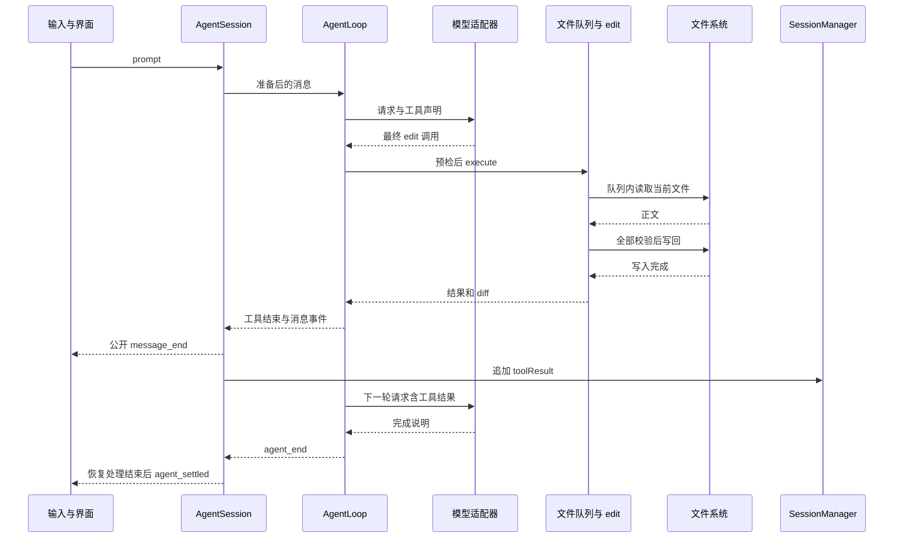

# 第三十三章 从一次输入追踪到文件、日志与下一轮请求

前面的章节分别解释了模块，本章把它们放回同一条执行链。问题是：用户说“把配置中的重试次数改为 3”，到底由谁改文件，谁阻止并发覆盖，谁保存结果，失败后又从哪里继续？下面使用一个教学场景；工具消息是人为指定的轨迹，不表示已经向真实模型发送过请求。

## 33.1 先规定输入和成功条件

工作目录为 `/work/demo`，文件 `src/config.ts` 是：

```ts
export const retries = 1;
export const timeout = 10;
```

用户要求把 retries 改为 3、timeout 改为 30，保留其他内容。成功至少要分别检查：磁盘中两处值正确；编辑结果对应本次调用；模型后续能看到结果；会话日志可以重建这段对话；界面最终退出运行状态。

这五项并非同时完成。仅看到模型说“已完成”，不足以证明磁盘正确；只看到磁盘正确，也不足以证明日志已经保存。

## 33.2 启动先决定属于哪个项目

[main.ts](https://github.com/earendil-works/pi/blob/11449730c8a733953ce1bcce70e066bccaa778a5/packages/coding-agent/src/main.ts) 解析 CLI，选择 `SessionManager`，确定最终 cwd，处理项目信任，再创建绑定该目录的服务。[sdk.ts](https://github.com/earendil-works/pi/blob/11449730c8a733953ce1bcce70e066bccaa778a5/packages/coding-agent/src/core/sdk.ts) 装配 Agent、AgentSession、工具与模型请求函数。

在本例中，新会话 cwd 为 `/work/demo`。若恢复的是另一个项目的会话，必须在资源加载前按第四章重新确定 cwd，否则工具路径、AGENTS 文本、项目设置与扩展可能来自不同项目。

注册的 `edit` 包含 execute 和参数 schema，但发送给模型的工具声明不包含 execute 函数。模型看到的是“允许请求什么操作”，本地运行时才持有“怎样执行”。这个边界从系统工具声明一直延伸到真实文件写入。

## 33.3 输入不是原样直接变成 HTTP 请求

交互模式把文本交给 [AgentSession.prompt](https://github.com/earendil-works/pi/blob/11449730c8a733953ce1bcce70e066bccaa778a5/packages/coding-agent/src/core/agent-session.ts)。它先处理扩展命令、input 钩子、模板、技能、队列与模型选择，再准备消息和提示词变化。

本例假设没有扩展改写输入、会话空闲、模型已配置且无需先压缩。用户消息进入底层 Agent；底层设置 activeRun 后开始循环。会话订阅者在消息结束事件中保存 user，首次真实对话触发 JSONL 排他创建。

每次模型请求之前，又从 SessionManager 获取当前分支的投影。若先前有 compaction 或 context_edit，它们在这里改变模型可见消息，而不是简单把文件中所有行拼给模型。

请求边界再获取有效认证，选定实际物理模型和思考级别，将通用消息交给提供商适配器。不同协议可以改写角色、工具 ID、严格 schema 和图片位置；第六章逐项说明，不能假设通用消息对象直接就是服务端 JSON。

## 33.4 第一次回答请求读取文件

为便于分析，指定模型第一次回答包含：

```json
{
  "type": "toolCall",
  "id": "call-read",
  "name": "read",
  "arguments": { "path": "src/config.ts" }
}
```

这是 assistant 内容块的局部示例，不是完整 assistant 消息。流式阶段可能先到工具名，再到参数字符；界面可以显示进度，但 [agent-loop.ts](https://github.com/earendil-works/pi/blob/11449730c8a733953ce1bcce70e066bccaa778a5/packages/agent/src/agent-loop.ts) 等最终消息后才执行工具。若整个回答因为长度限制截断，包含的工具不会仅凭“JSON 看起来能解析”就执行。

准备阶段按顺序找工具、准备参数、验证 schema、运行调用前钩子和检查取消。[read.ts](https://github.com/earendil-works/pi/blob/11449730c8a733953ce1bcce70e066bccaa778a5/packages/coding-agent/src/core/tools/read.ts) 将路径相对于执行 cwd 解析，读取并按行数与字节上限裁切文本。

本例很小，得到完整文件文字。read 不为后续 edit 保留文件锁，也不产生一个强制写入版本号。用户在这两次调用之间保存文件，下一次编辑会面对实际新内容。

## 33.5 第二次回答请求一次批量局部编辑

read 的结果成为 toolResult，通过 `call-read` 关联原调用。下一轮模型看到 user、assistant 调用与 toolResult 后，我们指定它提出：

```json
{
  "type": "toolCall",
  "id": "call-edit",
  "name": "edit",
  "arguments": {
    "path": "src/config.ts",
    "edits": [
      {
        "oldText": "export const retries = 1;",
        "newText": "export const retries = 3;"
      },
      {
        "oldText": "export const timeout = 10;",
        "newText": "export const timeout = 30;"
      }
    ]
  }
}
```

比仅替换 `1` 和 `10` 多给出声明上下文，是为了减少重复片段。它不是编辑器根据 AST 找变量：当前工具仍使用文本匹配。文件中相同声明重复出现时，仍需扩大唯一上下文。

`prepareEditArguments` 可修复特定输入形状，结构验证确认字段类型，工具再确认 edits 非空。这三步还没有证明 oldText 与磁盘一致；文件内容检查必须进入队列以后完成。

## 33.6 进入队列后才读取当前版本

[file-mutation-queue.ts](https://github.com/earendil-works/pi/blob/11449730c8a733953ce1bcce70e066bccaa778a5/packages/coding-agent/src/core/tools/file-mutation-queue.ts) 先经 registrationQueue 解析规范路径并登记，再等待当前文件队列的前项。

轮到本次调用后，[edit.ts](https://github.com/earendil-works/pi/blob/11449730c8a733953ce1bcce70e066bccaa778a5/packages/coding-agent/src/core/tools/edit.ts) 才访问和读取文件。随后分离 BOM、归一换行，用 [edit-diff.ts](https://github.com/earendil-works/pi/blob/11449730c8a733953ce1bcce70e066bccaa778a5/packages/coding-agent/src/core/tools/edit-diff.ts) 定位所有 edits，检查重复和区间重叠，再从后向前替换，恢复换行和 BOM，写回完整结果。

```text
call-edit 申请位置
→ 同文件前项完成
→ 读取执行时文件
→ 两个 oldText 都匹配且唯一
→ 区间不重叠
→ 内存生成完整结果
→ writeFile 完成
→ 返回 diff/patch
→ finally 交接位置
```

若第二项找不到，第一项不会提前写到磁盘。若两项都通过但 writeFile 在实际写出中失败，这条路径没有磁盘事务回滚。把“全部计算后再写”说成“任何失败都完全没有副作用”是不正确的。

## 33.7 两个同文件 edit 可以怎样安全交错

假设模型换成同时请求两个独立 edit：A 改 retries，B 改 timeout。底层并行模式仍先顺序完成整批预检，之后才用 Promise.all 启动执行。它们共用文件队列：

| 时刻 | A | B | 文件 |
| --- | --- | --- | --- |
| 1 | 登记并取得位置 | 登记后等待 A | 1 / 10 |
| 2 | 读取并改 retries | 等待 | 1 / 10 |
| 3 | 完成写回并交接 | 获得位置 | 3 / 10 |
| 4 | 已结束 | 重新读取并改 timeout | 3 / 10 |
| 5 | 已结束 | 完成写回 | 3 / 30 |

这里的关键是 B 在 A 写完后读取，而不是仅让 B 的最后写入等到 A 之后。两个不同文件的业务修改不共用执行队列，但路径登记仍可能相互等待。

如果 A 和 B 都修改 retries，B 的 oldText 仍为 `retries = 1`，B 轮到时发现不存在而失败。队列提供串行，文本前置条件发现冲突；没有自动三方合并。

如果 B 是 write，携带早已生成的完整旧文件，它仍可以在 A 之后覆盖。顺序正确和内容新鲜是两个条件；默认 write 只保证前者的队列参与，不提供旧全文版本校验。

## 33.8 三种取消时机产生不同事实

| 取消到达位置 | 本次工具可能的结果 | 磁盘事实 |
| --- | --- | --- |
| 尚未开始执行 | 预检或执行入口拒绝 | 本次写入尚未开始 |
| 已读取、尚未写回 | 在后续检查点拒绝 | 通常尚未调用写入；外部写入另算 |
| writeFile 已启动 | 等实际 Promise 结束，再报取消 | 文件可能已经修改 |

不能在第三种情况下立即释放队列。旧写入如果稍后完成，会覆盖下一项的结果。文件工具因此优先维持实际副作用完成与队列交接的关系。

AbortSignal 是合作协议。它不自动终止用户自定义函数、不让普通文件系统写入回滚，也不终止其他进程。底层操作不返回时，当前队列位置可能持续占用；放弃等待不能替代证明副作用停止。

## 33.9 文件、工具结果、日志与界面的完成点

正常编辑成功后，execute 返回内容与 details。代理运行工具后钩子，产生 tool_execution_end；所有结果再按调用声明顺序追加为 toolResult 消息。两项并行工具即使 B 先结束，结果消息仍为 A、B。

应用的 message_end 顺序尤其重要：扩展可以修改消息，公开监听器先看到消息，随后 SessionManager 追加。因此在公开 message_end 回调里去检查日志，不能假设这条消息已经落盘。



图省略了 read 轮次、部分输出和重试分支，用于展示完成点，不表示各层合成一笔事务。UI 的 diff 解释已计算的修改，不是由 UI 自己把 patch 应用到文件。

## 33.10 写文件成功但保存结果失败怎么办

这是本链路最重要的失败窗口之一：

```text
文件已经改为 3 / 30
→ 工具成功返回
→ 追加 toolResult 时磁盘错误
→ 用户后来恢复会话
```

文件工具没有把源码文件和 JSONL 放进同一个数据库事务。恢复时不能凭“日志没有成功结果”断言文件仍是 1 / 10，也不能盲目重放旧编辑。合理诊断应重新读取文件、检查日志和原始错误，再决定下一步。

正常 SessionManager 追加先改变内存数组与 leaf，再同步写文件；写入失败没有回滚这些内存变化。故障分析还要区分当前进程看到的状态与重启后从磁盘恢复的状态。

会话分支也只改变对话投影。回到编辑之前的消息，不会把 `src/config.ts` 自动恢复；Git 工作区、日志分支与 Durable conversation fork 各有自己的状态空间。

## 33.11 应用结束之后可能仍有别的工作

没有工具和新输入时底层循环结束，发 agent_end；底层运行还需等订阅者处理，再完成自身 finishRun。AgentSession 还可能分析错误、退避重试、压缩、处理边界草稿或新排队输入，最后发 agent_settled。

经典 `Agent.waitForIdle()` 与应用 `AgentSession.waitForIdle()` 的覆盖范围不同。应用的独立用户 bash、脱离返回 Promise 的后台保存和某些监听器工作不都包含在一个统一空闲屏障里。宿主编程时必须等待自己启动的工作，不能仅轮询一个 isIdle 字段就宣布全部资源释放。

缓存预热又有自己的 ActiveRun 身份和定时器。旧请求返回时是否可以写用量，取决于它是否仍属于当前上下文；这与当前聊天回合结束并不是相同条件。

## 33.12 新运行时如何改变这条链

Durable Harness 把输入提交、生成、工具调用和总结组织成持久任务，Session 事务可以共同提交 entry、task、submission 和 typed document。工具意图先保存，执行结果及检查点可用于重启恢复，详见第二十五、二十六章。

但外部文件写入仍通过 ExecutionEnv，存储事务不包住操作系统文件。一次崩溃若发生在“文件写成功、工具结果提交前”，仍要根据 replay 策略、可恢复意图和外部幂等能力判断。Durable 提供更明确的恢复状态，不会凭名字让任意副作用恰好发生一次。

远程 UI 通过 Client、Protocol、Server 与 Chord service 观察复制状态。消息到达、服务调用完成、状态提交、订阅更新和重连是不同事件。远程请求取消也不能直接等同于 Session worker 已经撤销副作用。

## 33.13 用一张表检查所有“安全”说法

| 机制 | 保护单位 | 得到的保证 | 不应推导的保证 |
| --- | --- | --- | --- |
| 经典文件 Promise 队列 | 同模块实例的规范路径 | 参与者的单文件读改写顺序 | 跨进程锁、bash 参与、硬链接统一、崩溃回滚 |
| oldText 匹配与区间检查 | 一次 edit 的执行时正文 | 目标满足文本条件才生成结果 | 全文版本 CAS、AST 定位、自动合并 |
| 配置/凭据文件锁 | 对应文件的参与更新者 | 锁内重读后合并或更新 | 锁外任意程序配合、所有文件一起事务 |
| 经典会话 JSONL | 一份日志和内存树 | 追加历史并投影当前分支 | 与源码文件共同提交、任意多进程共同维护 |
| Durable Storage commit | 一笔存储写集合 | adapter 契约中的原子提交 | 外部文件、网络、进程副作用一同回滚 |
| 任务检查点和 replay 策略 | 某个持久任务 | 根据已保存状态决定恢复 | 任意外部动作恰好一次 |
| generation/对象身份检查 | 一次异步结果归属 | 旧结果不能更新新的所属状态 | 旧请求没有收费或旧动作已撤销 |
| 管理安装 update 锁与指针 | 一处受管理安装 | 协调更新并在验证后激活 | 发布到所有服务的一笔事务、断电保证 |

CAS 是 compare-and-swap，即“当前值仍等于预期值时才写入”；默认 edit 没有全文 CAS。幂等表示重复执行同一请求不会增加额外效果；本地请求 ID 或任务 ID 只有被外部系统实际用于去重时，才能保护外部动作。

## 33.14 怎样开始修改项目中的一个功能

先把要改变的行为写成小轨迹，而不是先改大类。例如“取消慢文件写入后，下一项必须等慢写入结束”对应第十一章；“未知参数应显示错误而不启动请求”对应参数和前置处理；“重载后旧扩展 ctx 不可再调用”对应扩展生命周期。

随后沿六个点找代码：入口、数据类型、状态持有者、真正副作用、失败处理、已有测试。对文件编辑，这组定位为：

| 点 | 代码与检查内容 |
| --- | --- |
| 入口 | [edit.ts](https://github.com/earendil-works/pi/blob/11449730c8a733953ce1bcce70e066bccaa778a5/packages/coding-agent/src/core/tools/edit.ts)：工具定义与 prepareArguments |
| 类型 | TypeBox schema、EditToolInput、EditOperations |
| 状态 | [file-mutation-queue.ts](https://github.com/earendil-works/pi/blob/11449730c8a733953ce1bcce70e066bccaa778a5/packages/coding-agent/src/core/tools/file-mutation-queue.ts)：队列 key、登记与尾部身份 |
| 算法 | [edit-diff.ts](https://github.com/earendil-works/pi/blob/11449730c8a733953ce1bcce70e066bccaa778a5/packages/coding-agent/src/core/tools/edit-diff.ts)：匹配、唯一性、重叠和行块保留 |
| 副作用 | execute 中实际 access/readFile/writeFile 的等待关系 |
| 测试 | [file-mutation-queue.test.ts](https://github.com/earendil-works/pi/blob/11449730c8a733953ce1bcce70e066bccaa778a5/packages/coding-agent/test/file-mutation-queue.test.ts) 与 [tools.test.ts](https://github.com/earendil-works/pi/blob/11449730c8a733953ce1bcce70e066bccaa778a5/packages/coding-agent/test/tools.test.ts) |

不要通过缩小功能绕过类型错误，也不要为了一个局部需求同时改变队列、协议和界面。先判断新需求是修复既有保证，还是新增更强保证。例如跨进程协同锁属于额外设计，需要讨论所有参与者、锁 key、失效、取消与恢复；它不是在最后一次 writeFile 周围增加一个 Promise 就能完成的修补。

按仓库规则，代码变更后运行 `npm run check`，不把 docs-only 编辑当作必须构建的理由；新增或修改测试要运行对应测试。完整非 e2e 测试使用根 `./test.sh`，指定测试按 AGENTS.md 的包级方式执行。阅读教材不会自动授权安装、发布或调用付费模型。

## 33.15 综合练习

1. 把本例的 timeout 旧文本改为不存在的 `timeout = 20`。标出哪一步失败、retries 是否已经写回、模型下一轮能看到什么。
2. 在 read 完成后由外部编辑器增加一行，说明 edit 为什么可能保留它；再让外部编辑器在 edit 读完后保存，说明为何仍可能丢失。
3. 给 A 的 writeFile 加一个可手动结束的 Promise，在结束前取消。画出 B 什么时候可以读取，以及 A 返回取消时文件是否可能已变。
4. 令 toolResult 日志写入失败，列出恢复前必须重新核对的两种磁盘数据。
5. 同样需求经 Durable 任务执行，指出哪个状态更容易恢复，哪个外部副作用窗口依然存在。
6. 在源码覆盖清单里任选一个模块，按“调用者、输入、状态、副作用、错误、测试”做一页自己的阅读记录。

完成这些练习后，应能将“Pi 会编辑文件”解释为一条可核验的实现链，并明确每一项并发与恢复保证由哪段代码承担。

## 33.16 把规划与委派接回完整执行链

如果输入是“先规划，再审查并实施”，加载的 Plan Mode 先改变工具集合并注入隐藏上下文；模型提出列表，扩展在 agent_end 将执行指令放入 follow-up；随后模型可调用经典 subagent，让独立进程完成探索、审查或实施。chain 只把前一步选出的文字嵌入下一步 task，并不复制父历史或自动回滚文件。子结果作为父工具结果返回，再由本章原有循环继续请求、持久化和显示。

第 34 章逐项解释这条新增路径；若使用 Durable Subagent，则改为持久化子会话与稳定输入请求。最终验收仍应检查工具证据和真实结果，不能只检查 todo 是否全部 completed。配套 planning/subagents/loop 用例验证这些局部边界，完整应用恢复与真实进程行为仍需对应集成测试。
